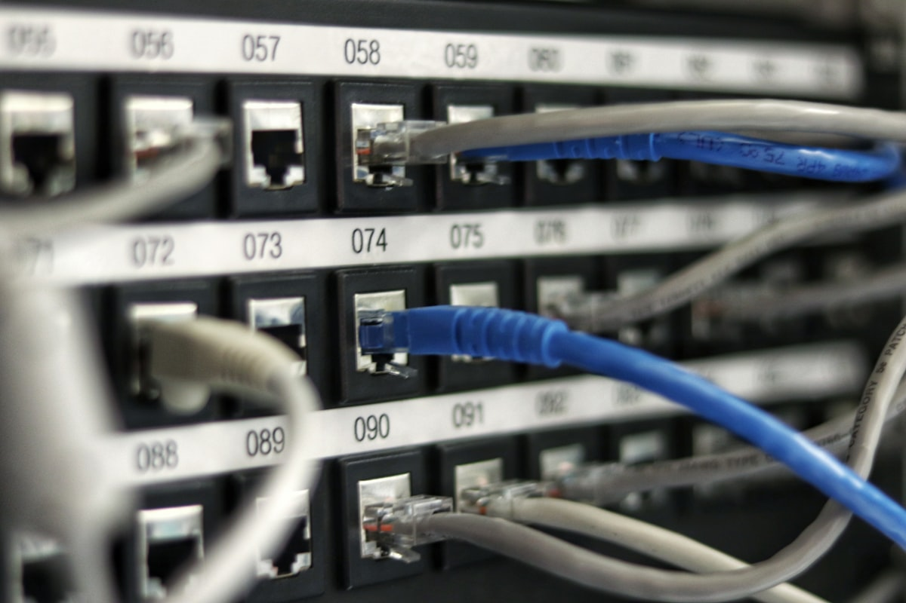
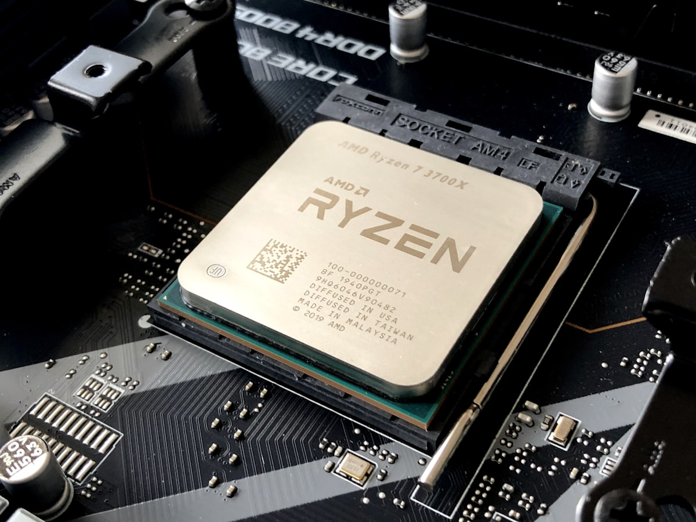

# 📰 AI KABOOM TECHNOLOGY MAGAZINE

---

## 📖 Digital Flipbook Reader

Experience our digital issue directly in your browser with interactive page spreads, photography, and high-impact editorial design.

    

        <!-- Page 1: Cover Spread -->
        

            

                

                    
                    

                        
AI KABOOM

                        
TECHNOLOGY MAGAZINE

                        
THE ERA OF LOSSLESS FABRICS & LIQUID-COOLED SUPERPODS

                        

                            • Spectrum-X vs InfiniBand 800Gbps Teardown 
                            • 120kW+ Direct-to-Chip Liquid Cooling 
                            • Custom ASICs (TPU v5p, Trainium2) vs NVIDIA GPUs 
                            • Top 10 Enterprise Open LLM Benchmark Matrix
                        

                        
ISSUE 01 • AUGUST 2026 • OFFICIAL EDITION

                    

                

            

        

        <!-- Page 2: Table of Contents & Editorial Letter -->
        

            

                

                    EDITOR'S LETTER
                    <h2>Engineering the Next Trillion-Parameter Scale</h2>
                    
A

                    
s artificial intelligence models scale from billions to trillions of parameters, datacenter design has ceased to be a simple exercise in server rack density. Today, the bottlenecks of AI performance are governed by physical heat dissipation, sub-microsecond interconnect bisection bandwidth, and custom silicon efficiency.

                    
In this inaugural edition of <strong>AI Kaboom Technology Magazine</strong>, our editorial team brings you four fact-checked, deep-dive teardowns based on real-world datacenter engineering and vendor documentation.

                    

                        <strong>Editorial Board</strong> 
                        <em>AI Kaboom Technology Magazine</em>
                    

                

                

                    <h3>IN THIS ISSUE</h3>
                    

                        01
                        

                            <h4><a href="issue-01/spectrum-x-vs-infiniband/">Spectrum-X vs. InfiniBand Quantum-X</a></h4>
                            
Lossless Ethernet (RoCEv2, Adaptive Routing) vs InfiniBand in 100K+ GPU fabrics.

                        

                    

                    

                        02
                        

                            <h4><a href="issue-01/liquid-cooling-teardown/">DGX SuperPOD Liquid Cooling Teardown</a></h4>
                            
120kW+ rack thermal physics, direct-to-chip copper cold plates, and CDU loops.

                        

                    

                    

                        03
                        

                            <h4><a href="issue-01/custom-silicon-vs-gpus/">Custom Silicon vs. Commodity GPUs</a></h4>
                            
TPU v5p, Trainium2, Gaudi3 vs NVIDIA H100/B200 architectural teardown.

                        

                    

                    

                        04
                        

                            <h4><a href="issue-01/top-10-open-llms/">Top 10 Open Enterprise LLMs</a></h4>
                            
Llama 3.1 405B, DeepSeek-V3/R1, Qwen 2.5 72B VRAM & deployment matrix.

                        

                    

                

            

        

    

    <!-- Flipbook Toolbar Controls -->
    

        <button class="mag-nav-btn" id="mag-prev-btn">◀ Previous Page</button>
        Page 1 of 2
        <button class="mag-nav-btn" id="mag-next-btn">Next Page ▶</button>
        <a href="issue-01/" class="mag-spread-link">View Full Issue 01 Spreads ➔</a>
    

---

## 🏷️ Feature Article Directory

Filter features by core engineering category:

    <button class="magazine-filter-btn active" data-filter="all">All Articles (4)</button>
    <button class="magazine-filter-btn" data-filter="nvidia-infra">🟢 NVIDIA Infrastructure (50%)</button>
    <button class="magazine-filter-btn" data-filter="broader-ai">🔵 Broader AI Systems (50%)</button>

    <!-- Feature 1 -->
    

        

            
        

        

            
🟢 NVIDIA Infrastructure

            
Issue #1 • Aug 2026 • Real Photography & Teardown

            <h3 class="card-title"><a href="issue-01/spectrum-x-vs-infiniband/">Spectrum-X vs. InfiniBand Quantum-X: The Interconnect Battle</a></h3>
            

                Fact-checked technical comparison between 800Gbps Spectrum-X RoCEv2 (Adaptive Routing, Out-of-order reordering, DDP) and InfiniBand Quantum-2 / Quantum-X800 for 100K+ GPU AI superclusters.
            

            

                By AI Network Architecture Team
                <a href="issue-01/spectrum-x-vs-infiniband/" class="read-link">Read Feature →</a>
            

        

    

    <!-- Feature 2 -->
    

        

            
        

        

            
🟢 NVIDIA Infrastructure

            
Issue #1 • Aug 2026 • Real Thermal Physics Teardown

            <h3 class="card-title"><a href="issue-01/liquid-cooling-teardown/">DGX SuperPOD Liquid Cooling Teardown: 120kW+ Racks</a></h3>
            

                Engineering deep dive into direct-to-chip copper cold plates, secondary PG25 loops, facility CDUs, fluid dynamics, UQD couplings, and NVML/DCGM leak protection.
            

            

                By Thermal Engineering Team
                <a href="issue-01/liquid-cooling-teardown/" class="read-link">Read Feature →</a>
            

        

    

    <!-- Feature 3 -->
    

        

            
        

        

            
🔵 Broader AI Systems

            
Issue #1 • Aug 2026 • Silicon Teardown

            <h3 class="card-title"><a href="issue-01/custom-silicon-vs-gpus/">Custom Silicon vs. Commodity GPUs: ASICs vs H100/B200</a></h3>
            

                Architectural breakdown comparing NVIDIA GPUs against Google TPU v5p/v6e, AWS Trainium2, Meta MTIA, and Intel Gaudi 3. Analyzing memory bandwidth, SIMT vs Systolic arrays, and TCO.
            

            

                By Silicon Systems Arch
                <a href="issue-01/custom-silicon-vs-gpus/" class="read-link">Read Feature →</a>
            

        

    

    <!-- Feature 4 -->
    

        

            
        

        

            
🔵 Broader AI Systems

            
Issue #1 • Aug 2026 • Enterprise Model Matrix

            <h3 class="card-title"><a href="issue-01/top-10-open-llms/">Top 10 Open LLM Models for Enterprise Networks</a></h3>
            

                Rigorous evaluation of Llama 3.1 405B/70B, DeepSeek-V3/R1, Qwen 2.5 72B, Mistral Large 2, and Command R+ with VRAM sizing equations, FP8 quantization, and enterprise licensing.
            

            

                By Enterprise AI Team
                <a href="issue-01/top-10-open-llms/" class="read-link">Read Feature →</a>
            

        

    

---

## 🏛️ Monthly Issues Archive
Looking for past editions? Visit our [Monthly Issues Archive](archive.md) to explore all published issues and download executive PDF bundles.
