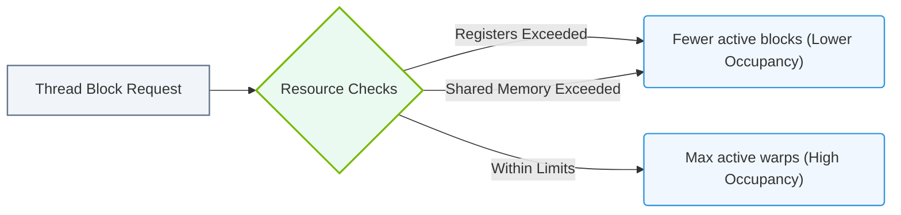

# 10.2d Occupancy: the ratio of active warps to maximum warps — why it matters

#### 🏷️ The Nvidia GPU Architecture — The Silicon at the Heart of AI Infrastructure > 10 GPU Microarchitecture — Inside an NVIDIA Data Center GPU > 10.2 The Streaming Multiprocessor (SM) — The Fundamental Execution Unit

---

## 🧭 Context Introduction

When you run a workload on an NVIDIA GPU, the **Streaming Multiprocessor (SM)** is where the actual computation happens. Each SM can handle many threads simultaneously, but it has a **limited number of hardware resources** (registers, shared memory, warp schedulers).  

**Occupancy** is a metric that tells you how well you are using those resources. It is defined as the **ratio of active warps to the maximum possible warps** that the SM can support. Understanding occupancy helps you tune your application to keep the GPU busy and avoid idle cycles.

---

## ⚙️ What Is a Warp?

- A **warp** is a group of **32 threads** that execute together on an SM.
- The GPU schedules work at the warp level, not at the individual thread level.
- Each SM has a **maximum number of warps** it can hold at once (e.g., 64 warps on an A100 SM).

---

## 📊 What Is Occupancy?

- **Occupancy** = (Number of active warps) ÷ (Maximum warps supported by the SM)
- It is expressed as a percentage.
- Example: If an SM can hold 64 warps and your kernel only uses 32, occupancy is **50%**.

---

## 🕵️ Why Does Occupancy Matter?

- **Higher occupancy** means more warps are available for the SM to switch between.
- When one warp is waiting for memory (a **stall**), the SM can instantly switch to another warp — this is called **latency hiding**.
- **Low occupancy** means fewer warps to hide stalls, so the SM may sit idle while waiting for data.

### Key Points:
- Occupancy is **not the only factor** — a very high occupancy can sometimes hurt performance if it causes register spilling or shared memory contention.
- The goal is **balanced occupancy** — enough warps to hide latency, but not so many that resources are overcommitted.

---

### 📊 Visual Representation: Active Warps and SM Occupancy Constraints
This flowchart demonstrates how hardware resources (registers, shared memory) limit maximum active warps per Streaming Multiprocessor (SM).



## 🛠️ Factors That Limit Occupancy

| Limiting Factor | Description |
|----------------|-------------|
| **Registers per thread** | Each thread uses a number of registers. If each thread uses many registers, fewer warps can fit. |
| **Shared memory per block** | Each thread block uses shared memory. If blocks use a lot, fewer blocks (and thus warps) fit. |
| **Threads per block** | Larger block sizes can reduce the number of blocks that fit in an SM. |
| **Block count limit** | Each SM has a maximum number of blocks it can hold (e.g., 32 blocks on A100). |

---

## 🔍 How to Measure Occupancy

NVIDIA provides tools to check occupancy:

- **NVIDIA Nsight Compute** — GUI profiler that shows achieved occupancy.
- **NVIDIA Visual Profiler** (legacy) — also shows occupancy metrics.
- **CUDA Occupancy Calculator** — a spreadsheet or online tool to estimate occupancy before running code.

### Example (for reference):

You can query device properties in CUDA to see limits:

```
cudaDeviceGetAttribute(&maxWarpsPerSM, cudaDevAttrMaxWarpsPerSM, device);
cudaDeviceGetAttribute(&maxRegistersPerSM, cudaDevAttrMaxRegistersPerMultiprocessor, device);
```

📤 **Output:** On an A100, max warps per SM is typically **64**, and max registers per SM is **65536**.

---

## 🧪 Practical Example: Tuning for Occupancy

Imagine a kernel where each thread uses **48 registers** and the SM has **65536 registers**:

- Maximum warps = 64
- Registers per warp = 48 × 32 = 1536
- Warps that fit = 65536 ÷ 1536 ≈ 42 warps
- Occupancy = 42 ÷ 64 = **65.6%**

If you reduce registers per thread to **32**:

- Registers per warp = 32 × 32 = 1024
- Warps that fit = 65536 ÷ 1024 = 64 warps
- Occupancy = 64 ÷ 64 = **100%**

---

## ✅ Summary

- **Occupancy** = active warps ÷ maximum warps.
- It helps you understand how well the SM can hide memory latency.
- **Too low** → GPU stalls. **Too high** → may cause resource pressure.
- Use **Nsight Compute** or the **Occupancy Calculator** to find the sweet spot.
- Always balance occupancy with other performance factors like memory bandwidth and instruction throughput.

> 💡 **For new engineers:** Start by aiming for **50–75% occupancy** as a baseline. Then profile and adjust based on your specific workload.