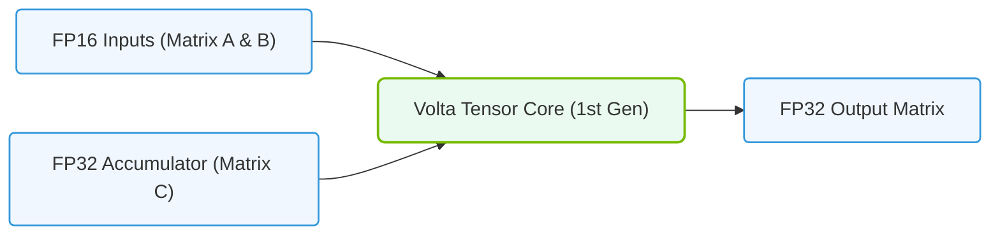

# 10.4b First-gen Tensor Cores (Volta V100): FP16 accumulation

#### 🏷️ The Nvidia GPU Architecture — The Silicon at the Heart of AI Infrastructure > 10 GPU Microarchitecture — Inside an NVIDIA Data Center GPU > 10.4 Tensor Cores — Hardware Accelerated Matrix Multiplication

## 🌱 Context Introduction

When the NVIDIA Volta V100 GPU launched in 2017, it introduced a revolutionary new hardware unit called **Tensor Cores**. These specialized processing elements were designed specifically to accelerate the matrix multiplication operations that form the backbone of deep learning workloads. For new engineers entering AI infrastructure, understanding how first-generation Tensor Cores work—especially their use of **FP16 accumulation**—is essential to grasping why modern AI training and inference is so much faster than it was just a few years ago.

Before Tensor Cores, matrix multiplications were performed using standard CUDA cores, which were general-purpose but relatively slow for the massive matrix operations required by neural networks. Tensor Cores changed this by providing dedicated hardware that could perform a matrix multiply-and-accumulate operation in a single clock cycle.

---

## ⚙️ What Are Tensor Cores?

Tensor Cores are specialized hardware units that perform **D = A × B + C**, where:
- **A** and **B** are 4×4 matrices in FP16 (half-precision)
- **C** is a 4×4 matrix in either FP16 or FP32 (single-precision)
- **D** is the output matrix in FP16 or FP32

The key innovation for first-gen Tensor Cores was that they could perform this entire operation in **one clock cycle**, whereas doing the same operation with standard CUDA cores would require many cycles.

### Key Characteristics of First-gen Tensor Cores (Volta V100):
- **Input precision**: FP16 (16-bit floating point)
- **Accumulation precision**: FP32 (32-bit floating point) — this is the "FP16 accumulation" feature
- **Output precision**: FP16 or FP32
- **Throughput**: 4×4×4 matrix multiply per clock cycle per Tensor Core
- **Number of Tensor Cores per SM**: 8
- **Total Tensor Cores on V100**: 640 (80 SMs × 8 Tensor Cores)

---

## 🧠 Why FP16 Accumulation Matters

The term "FP16 accumulation" refers to the fact that while the input matrices (A and B) are stored in FP16 format, the intermediate sums during multiplication are accumulated in **FP32 precision**. This is critical for two reasons:

### 🎯 The Precision Problem
- **FP16** has a limited range and precision (approximately 3.3 decimal digits)
- When multiplying many FP16 numbers and adding them together, rounding errors can accumulate rapidly
- Without FP32 accumulation, results would lose accuracy for large matrix operations

### ✅ The Solution: Mixed Precision
First-gen Tensor Cores implement a **mixed-precision** approach:
- **Input**: FP16 (saves memory and bandwidth)
- **Accumulation**: FP32 (maintains numerical accuracy)
- **Output**: FP16 or FP32 (flexible for different use cases)

This design allows engineers to get the **speed benefits of FP16** (2× throughput vs FP32) while maintaining the **accuracy of FP32** for the critical accumulation step.

---

## 📊 Performance Comparison: Tensor Cores vs. CUDA Cores

| Feature | Standard CUDA Cores | First-gen Tensor Cores |
|---------|-------------------|------------------------|
| **Operation** | General-purpose | Matrix multiply-accumulate |
| **Input precision** | FP32 or FP64 | FP16 |
| **Accumulation precision** | Same as input | FP32 |
| **Throughput (per clock)** | 1 FMA operation | 64 FMA operations (4×4×4) |
| **Peak TFLOPS (V100)** | 7.8 TFLOPS (FP32) | 125 TFLOPS (FP16 with Tensor Cores) |
| **Memory bandwidth savings** | None | 2× (FP16 uses half the memory of FP32) |

---

### 📊 Visual Representation: Volta 1st Gen Tensor Core Pipeline
This diagram maps the first-generation Tensor Core introduced in Volta, supporting FP16 matrix inputs and FP32 accumulation.



## 🛠️ How Engineers Use First-gen Tensor Cores in Practice

For engineers working with AI infrastructure, using Tensor Cores is typically automatic through deep learning frameworks. Here's how it works in practice:

### Framework Integration
- **TensorFlow**: Automatic when using `tf.float16` and enabling mixed precision
- **PyTorch**: Automatic with `torch.cuda.amp` (Automatic Mixed Precision)
- **MXNet**: Automatic with `mxnet.contrib.amp`

### Manual Control (Advanced Use)
Engineers can also control Tensor Core usage directly through CUDA:

**For reference:**
```
#include <cuda_fp16.h>

// Define FP16 matrices
half *A, *B;
float *C, *D;

// Launch Tensor Core operation
mma_sync(D, A, B, C);
```

**📤 Output:** The `mma_sync` instruction executes a single Tensor Core matrix multiply-accumulate operation in hardware.

---

## 🕵️ Common Misconceptions for New Engineers

### ❌ "Tensor Cores replace CUDA cores"
Tensor Cores are **supplementary** to CUDA cores, not replacements. They handle specific matrix operations, while CUDA cores handle everything else (element-wise operations, convolutions, etc.).

### ❌ "FP16 accumulation means all operations are FP16"
Only the **input** matrices are FP16. The accumulation (addition) happens in FP32, which is why the results remain accurate.

### ❌ "All Tensor Cores are the same"
First-gen Tensor Cores (Volta) only support FP16 input. Later generations (Turing, Ampere, Hopper) added support for:
- INT8, INT4, INT1 (for inference)
- BF16 (bfloat16)
- TF32 (TensorFloat-32)
- FP8 (in Hopper)

---

## 📈 Practical Impact on AI Infrastructure

For engineers managing AI infrastructure, the implications of first-gen Tensor Cores include:

- **2-4× faster training** for deep learning models compared to using only CUDA cores
- **Reduced memory footprint** because FP16 weights use half the memory of FP32
- **Lower power consumption** per operation due to smaller data movement
- **Compatibility requirements**: Models must be designed or converted to use FP16 operations

### Example: Training a ResNet-50 on V100
- **Without Tensor Cores**: ~200 images/second
- **With Tensor Cores (FP16 accumulation)**: ~800 images/second
- **Memory savings**: ~40% reduction in memory usage for the same batch size

---

## 🎯 Key Takeaways for New Engineers

1. **First-gen Tensor Cores** are specialized hardware for matrix multiplication, introduced with Volta V100
2. **FP16 accumulation** means inputs are FP16 but intermediate sums use FP32 precision
3. **Mixed precision** (FP16 input + FP32 accumulation) gives both speed and accuracy
4. **Frameworks handle Tensor Core usage automatically** in most cases
5. **Tensor Cores are not a replacement** for CUDA cores—they work together
6. **Understanding Tensor Cores** helps engineers optimize AI workloads for maximum throughput

---

## 🔍 Further Exploration

As you continue learning about AI infrastructure, you'll encounter:
- **Second-gen Tensor Cores** (Turing): Added INT8 and INT4 support
- **Third-gen Tensor Cores** (Ampere): Added TF32, BF16, and sparsity support
- **Fourth-gen Tensor Cores** (Hopper): Added FP8 and Transformer Engine

Each generation builds on the FP16 accumulation concept introduced in Volta, expanding precision options and throughput capabilities.

