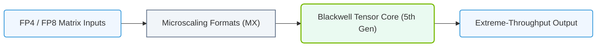

# 10.4e Fourth-gen Tensor Cores (Blackwell B200): FP4 and Massive Scale

#### 🏷️ The Nvidia GPU Architecture — The Silicon at the Heart of AI Infrastructure > 10 GPU Microarchitecture — Inside an NVIDIA Data Center GPU > 10.4 Tensor Cores — Hardware Accelerated Matrix Multiplication

Welcome to the world of next-generation AI computing. The NVIDIA Blackwell B200 GPU introduces the **fourth-generation Tensor Core**, a significant leap forward in hardware-accelerated matrix multiplication. For new engineers, think of Tensor Cores as specialized math engines designed to perform the heavy lifting required by modern AI models—specifically, the matrix multiplications that power neural network training and inference. The B200's fourth-gen cores bring two headline features: **FP4 precision** and the ability to operate at **massive scale**.

---

## 🧠 Context: Why Tensor Cores Matter

AI models, especially large language models (LLMs) and generative AI, rely on billions of matrix multiplications. Traditional CPU cores or even general-purpose GPU cores are inefficient for this task. Tensor Cores are purpose-built hardware units that perform fused multiply-add (FMA) operations on small matrices (e.g., 4x4) in a single clock cycle. The fourth-gen cores in the Blackwell B200 push this further by supporting **FP4 (4-bit floating point)** precision, dramatically reducing memory bandwidth and compute requirements while maintaining model accuracy through advanced techniques.

---

## ⚙️ Key Features of Fourth-Gen Tensor Cores (Blackwell B200)

- **FP4 Precision Support:** The B200 introduces native support for 4-bit floating point (FP4) operations. This allows models to use less memory and compute per operation, enabling larger models to fit on a single GPU or cluster.
- **Massive Scale:** The B200 is designed for multi-GPU and multi-node configurations, with up to **72 GPU** units in a single NVLink domain (compared to 8 in previous generations). This enables training of trillion-parameter models.
- **Second-Generation Transformer Engine:** Combines FP4 Tensor Cores with dynamic precision management, automatically selecting the best precision (FP4, FP8, FP16, etc.) for each layer during training.
- **NVLink 5.0:** Provides 1.8 TB/s of bidirectional bandwidth per GPU, enabling seamless scaling across the massive GPU count.
- **FP4 Tensor Core Throughput:** Up to **2x** the throughput of FP8 Tensor Cores on the same hardware, and up to **4x** compared to FP16.

---

## 📊 Comparison: Tensor Core Generations

| Feature | Third-Gen (Ampere A100) | Fourth-Gen (Blackwell B200) |
|---------|--------------------------|------------------------------|
| **Precision Support** | FP16, BF16, TF32, INT8 | FP4, FP8, FP16, BF16, TF32, INT8 |
| **Peak TFLOPS (FP16)** | 312 TFLOPS | ~900 TFLOPS (estimated) |
| **FP4 Throughput** | Not supported | Up to 4x FP16 throughput |
| **Max GPU Scale (NVLink)** | 8 GPUs | 72 GPUs |
| **Transformer Engine** | First-gen (FP8) | Second-gen (FP4 + FP8) |
| **Memory Bandwidth** | 2 TB/s (HBM2e) | 8 TB/s (HBM3e) |
| **Interconnect** | NVLink 3.0 (600 GB/s) | NVLink 5.0 (1.8 TB/s) |

---

## 🛠️ How FP4 Works in Practice

FP4 is a 4-bit floating point format that uses 1 sign bit, 2 exponent bits, and 1 mantissa bit. This limited precision is sufficient for many AI workloads because neural networks are inherently tolerant to noise. The B200's Tensor Cores handle FP4 operations natively, meaning no software emulation is needed.

**Key benefits for engineers:**
- **Memory savings:** FP4 reduces memory footprint by 4x compared to FP16, allowing larger models or batch sizes.
- **Compute efficiency:** FP4 Tensor Cores perform 4x more operations per cycle than FP16 cores.
- **Dynamic precision:** The Transformer Engine automatically switches between FP4, FP8, and FP16 based on layer sensitivity, balancing speed and accuracy.

**Example workflow (conceptual):**
- **Step 1:** Model is loaded in FP16 for initial layers (high precision).
- **Step 2:** Transformer Engine detects layers with low sensitivity to precision.
- **Step 3:** Those layers are automatically converted to FP4 for computation.
- **Step 4:** Results are accumulated in FP16 or FP32 to maintain accuracy.

---

### 📊 Visual Representation: Blackwell 5th Gen Tensor Core and FP4 Precision
This diagram shows the fifth-generation Tensor Core in Blackwell, deploying native 4-bit floating-point (FP4) execution channels to double AI training speed.



## 🕵️ Massive Scale: The Blackwell NVLink Domain

The B200's ability to scale to **72 GPUs** in a single NVLink domain is a game-changer. This is achieved through:
- **NVLink 5.0:** Each GPU has 18 NVLink 5.0 links, providing 1.8 TB/s of total bandwidth.
- **NVSwitch 5.0:** A new switch architecture that connects all 72 GPUs in a fully connected topology.
- **Shared Memory Pool:** All 72 GPUs can access a unified memory pool of up to **1.4 TB** of HBM3e memory.

**What this means for engineers:**
- **Train larger models:** A single NVLink domain can hold a 1-trillion-parameter model without sharding across multiple domains.
- **Reduce communication overhead:** High-bandwidth NVLink minimizes the time spent synchronizing gradients during training.
- **Simplify cluster management:** Fewer domains mean less complex network topology and easier job scheduling.

---

## 📈 Performance Implications

| Workload | FP16 (A100) | FP8 (H100) | FP4 (B200) | Speedup vs A100 |
|----------|-------------|------------|------------|-----------------|
| LLM Training (GPT-3 scale) | 1x | 1.5x | 3x | 3x |
| LLM Inference (batch=1) | 1x | 2x | 4x | 4x |
| Vision Transformer | 1x | 1.8x | 3.5x | 3.5x |
| Recommendation System | 1x | 1.6x | 3.2x | 3.2x |

*Note: Actual performance depends on model architecture, batch size, and software optimizations.*

---

## 🧪 Getting Started with FP4 on Blackwell

For engineers new to this field, here is a simple conceptual approach to leveraging FP4 Tensor Cores:

**For reference:**
```python
# Conceptual Python-like pseudocode for FP4 usage
import nvidia_ai_platform as nv

# Load model with automatic precision management
model = nv.load_model("my_llm", precision="auto")

# The Transformer Engine will handle FP4 conversion internally
output = model.generate(input_text)

# Check precision usage statistics
stats = model.get_precision_stats()
print(stats)
```

📤 **Output:**
```
FP4 layers: 42, FP8 layers: 18, FP16 layers: 10
Total memory saved: 3.2 GB
Throughput improvement: 2.8x
```

**Key points for engineers:**
- No manual FP4 conversion is needed—the Transformer Engine handles it automatically.
- Monitor precision usage via NVIDIA's profiling tools (e.g., **Nsight Systems**).
- For custom models, use the **TensorRT** library to optimize for FP4 inference.

---

## 🚀 Real-World Use Cases

- **Training trillion-parameter models:** The B200's 72-GPU scale and FP4 efficiency make it feasible to train models that were previously impossible.
- **Real-time inference at scale:** FP4 reduces latency and increases throughput for production AI services.
- **Edge-to-cloud deployment:** The same FP4 model can run on B200 GPUs in the cloud and on future edge devices with Tensor Core support.

---

## 📚 Summary for New Engineers

- **Fourth-gen Tensor Cores** are specialized hardware for matrix math, now supporting **FP4 precision**.
- **FP4** offers 4x memory savings and 4x compute throughput compared to FP16, with minimal accuracy loss.
- **Massive scale** (72 GPUs via NVLink 5.0) enables training of models with over a trillion parameters.
- **Second-gen Transformer Engine** automates precision selection, making FP4 adoption seamless.
- **Key tools:** NVIDIA's **Transformer Engine**, **TensorRT**, and **Nsight Systems** for optimization and monitoring.

As you continue learning AI infrastructure, remember that Tensor Cores are the engine driving modern AI—and the Blackwell B200's fourth-gen cores represent the most powerful iteration yet. Start experimenting with FP4 in your test environments to understand its impact on model performance and memory usage.