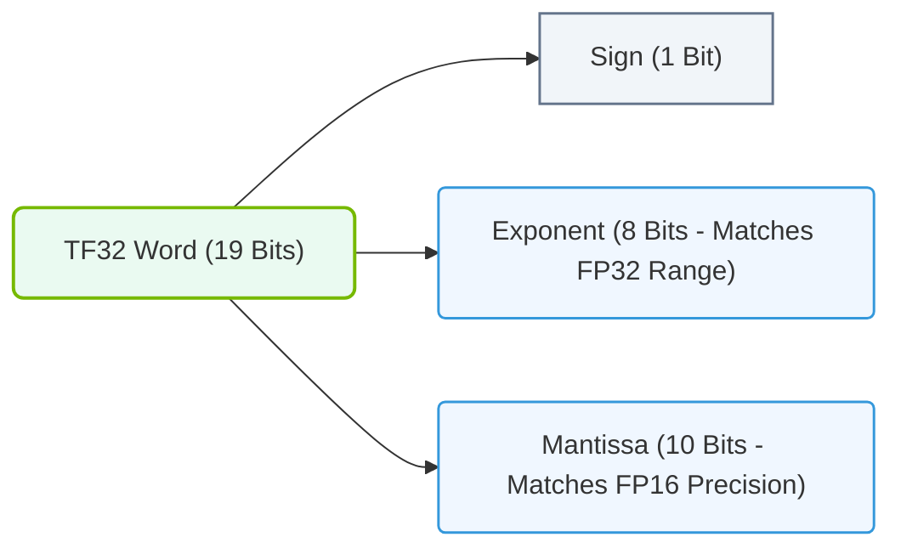

# 10.4f TF32: NVIDIA's training-optimized compromise between FP32 range and FP16 speed

#### 🏷️ The Nvidia GPU Architecture — The Silicon at the Heart of AI Infrastructure > 10 GPU Microarchitecture — Inside an NVIDIA Data Center GPU > 10.4 Tensor Cores — Hardware Accelerated Matrix Multiplication

## 🌐 Context Introduction

When training deep learning models, engineers face a fundamental trade-off: **FP32** (32-bit floating point) offers high precision and a wide numerical range but is slow and memory-intensive, while **FP16** (16-bit floating point) is fast and memory-efficient but suffers from limited range and precision. NVIDIA introduced **TF32** (Tensor Float 32) as a clever middle ground — it uses the same 8-bit exponent as FP32 (giving it the same wide range) but only 10 bits for the mantissa (like FP16), making it ideal for Tensor Core accelerated training without sacrificing numerical stability.

---

## ⚙️ What is TF32?

TF32 is a **19-bit** numerical format designed specifically for AI training on NVIDIA Ampere and later GPU architectures. It is not a storage format like FP32 or FP16 — instead, it is an **internal compute format** used exclusively by Tensor Cores during matrix multiplication operations.

- **Exponent**: 8 bits (same as FP32) → provides the same dynamic range as FP32
- **Mantissa**: 10 bits (same as FP16) → provides sufficient precision for training convergence
- **Total bits**: 19 bits (not stored in memory; computed internally)

> **Key Insight**: TF32 automatically converts FP32 inputs to this 19-bit format inside Tensor Cores, then accumulates results in FP32 precision. This means engineers get FP32-like range with FP16-like throughput — no code changes required.

---

## 📊 Comparison Table: FP32 vs. TF32 vs. FP16

| Feature | FP32 | TF32 | FP16 |
|---------|------|------|------|
| **Bit width** | 32 bits | 19 bits (internal) | 16 bits |
| **Exponent bits** | 8 | 8 | 5 |
| **Mantissa bits** | 23 | 10 | 10 |
| **Dynamic range** | ~3.4e38 | ~3.4e38 (same as FP32) | ~6.5e4 |
| **Precision** | High | Moderate | Moderate |
| **Tensor Core speed** | 1x (baseline) | ~8x faster than FP32 | ~16x faster than FP32 |
| **Memory usage** | High | Same as FP32 (input) | Half of FP32 |
| **Code changes needed** | None | None (automatic) | May need loss scaling |

---

## 🛠️ How TF32 Works in Practice

When an engineer runs a training workload on an NVIDIA Ampere or Hopper GPU, TF32 operates transparently:

1. **Input**: The engineer provides FP32 tensors (as usual)
2. **Conversion**: Tensor Cores automatically convert FP32 inputs to TF32 format internally
3. **Compute**: Matrix multiplication happens in TF32 precision
4. **Accumulation**: Results are accumulated in FP32 to maintain accuracy
5. **Output**: Final result is stored back as FP32

**For reference:**
```python
# Example: PyTorch training with TF32 enabled (default on Ampere+ GPUs)
import torch

# Enable TF32 (default is True on compatible GPUs)
torch.backends.cuda.matmul.allow_tf32 = True
torch.backends.cudnn.allow_tf32 = True

# Your model and training loop remain unchanged
model = MyModel().cuda()
input_tensor = torch.randn(64, 3, 224, 224).cuda()
output = model(input_tensor)  # Tensor Cores automatically use TF32
```

📤 **Output:** No visible change — training runs faster with same numerical stability.

---

### 📊 Visual Representation: TensorFloat-32 (TF32) Bit Format Structure
This diagram details the bit layout of TF32 (19 bits total), showing how it combines the 8-bit exponent of FP32 with the 10-bit mantissa of FP16.



## 🕵️ When to Use TF32 vs. Other Formats

| Scenario | Recommended Format | Reason |
|----------|-------------------|--------|
| **Standard training** (ResNet, BERT, etc.) | TF32 | Best balance of speed and accuracy |
| **Mixed precision training** | FP16/BF16 | Higher throughput with loss scaling |
| **Inference** | FP16/INT8 | Lower latency and memory footprint |
| **Scientific computing** | FP64 | Higher precision required |
| **Training with very small gradients** | FP32 | Avoid underflow issues |

---

## ✅ Key Takeaways for New Engineers

- **TF32 is automatic** — no code changes needed on Ampere+ GPUs
- **Same range as FP32** — no risk of overflow or underflow during training
- **~8x faster than FP32** on Tensor Cores for matrix multiply operations
- **Not a storage format** — only used internally during computation
- **Enabled by default** in PyTorch 1.7+, TensorFlow 2.4+, and JAX
- **Can be disabled** if you need full FP32 precision for debugging

---

## 🔍 How to Verify TF32 is Active

**For reference:**
```bash
# Check if TF32 is enabled in PyTorch
python -c "import torch; print(torch.backends.cuda.matmul.allow_tf32)"
```

📤 **Output:** `True` (on compatible GPUs)

**For reference:**
```bash
# Monitor Tensor Core usage with NVIDIA tools
nvidia-smi --query-gpu=tensor_core_active --format=csv
```

📤 **Output:** `tensor_core_active, Yes`

---

## 🧠 Summary

TF32 is NVIDIA's elegant solution to the precision-versus-speed dilemma in AI training. By combining FP32's wide exponent range with FP16's compact mantissa, it delivers **FP32-level numerical stability** with **FP16-level throughput** — all without requiring engineers to modify their code. For new engineers entering AI infrastructure, understanding TF32 means recognizing that modern GPU architectures handle precision optimization automatically, allowing you to focus on model architecture and data pipelines instead of numerical format tuning.