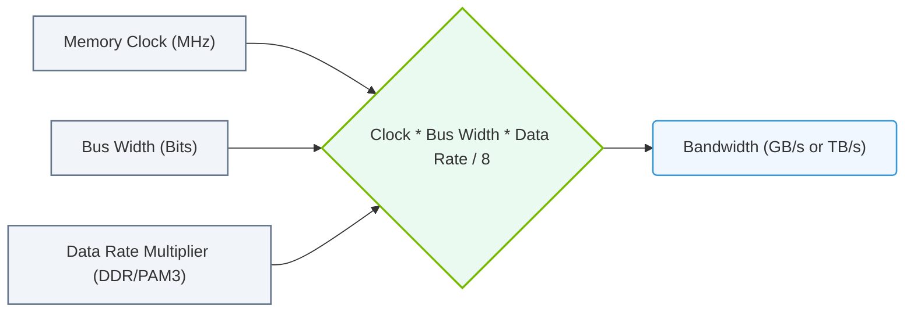

# 11.4a Calculating bytes per second: memory clock × bus width × data rate

#### 🏷️ The Nvidia GPU Architecture — The Silicon at the Heart of AI Infrastructure > 11 GPU Memory Subsystems — VRAM, Bandwidth, and the Capacity Crisis > 11.4 Memory Bandwidth Analysis — The Hidden Bottleneck

Welcome, new engineer! This topic is one of the most practical calculations you'll use when working with AI infrastructure. Memory bandwidth determines how fast data can move between the GPU's compute cores and its VRAM. If you've ever wondered why some models train faster on certain GPUs, memory bandwidth is often the answer. Let's break down the simple formula that reveals this critical performance metric.

---

## ⚙️ What Is Memory Bandwidth?

Memory bandwidth measures how much data the GPU's memory can transfer per second. Think of it as the width of a highway (bus width) multiplied by how fast cars can travel (memory clock) and how many lanes are used per cycle (data rate). The result is **bytes per second** — a raw speed limit for data movement.

The formula is straightforward:

**Memory Bandwidth (bytes/second) = Memory Clock (Hz) × Bus Width (bits) × Data Rate (transfers/clock)**

---

## 📊 Breaking Down the Three Components

| Component | What It Represents | Typical Values | Unit |
|-----------|-------------------|----------------|------|
| **Memory Clock** | The frequency at which the memory operates | 1000–2000 MHz (1–2 GHz) | Hertz (Hz) |
| **Bus Width** | The number of bits transferred simultaneously per cycle | 128, 192, 256, 384, 512 bits | Bits |
| **Data Rate** | How many transfers happen per clock cycle (DDR = 2, GDDR6 = 2, HBM = 2) | 2 (for GDDR6, HBM2e) | Transfers per clock |

**Key insight:** The data rate is almost always **2** for modern GPU memory (GDDR6, HBM2e, HBM3) because they use Double Data Rate (DDR) technology — transferring data on both the rising and falling edges of the clock signal.

---

## 🛠️ Step-by-Step Calculation Example

Let's calculate the memory bandwidth for an **NVIDIA A100 GPU**:

- **Memory Clock:** 1215 MHz (1.215 × 10⁹ Hz)
- **Bus Width:** 5120 bits (HBM2e uses a wide bus)
- **Data Rate:** 2 (double data rate)

**Step 1:** Convert memory clock to Hz  
1.215 × 10⁹ Hz

**Step 2:** Multiply by bus width  
1.215 × 10⁹ × 5120 = 6.2208 × 10¹² bits/second

**Step 3:** Multiply by data rate (2)  
6.2208 × 10¹² × 2 = 1.24416 × 10¹³ bits/second

**Step 4:** Convert bits to bytes (divide by 8)  
1.24416 × 10¹³ ÷ 8 = **1.5552 × 10¹² bytes/second**

**Final result:** Approximately **1.55 TB/s** (terabytes per second)

---

### 📊 Visual Representation: Memory Bandwidth Calculation Flow
This diagram displays how GPU memory bandwidth is calculated from memory clock speed, bus width, and data rate multiplier.

## 🕵️ Common Pitfalls for New Engineers

- **Mixing units:** Always convert MHz to Hz (multiply by 10⁶) before calculating. Forgetting this step gives you a result that's off by a factor of one million.
- **Forgetting the /8 conversion:** The formula gives you bits per second. Memory bandwidth is always quoted in **bytes per second**, so divide by 8 at the end.
- **Ignoring data rate:** Some engineers assume data rate = 1. Modern GPUs always use double data rate (2). Check the memory type (GDDR6, HBM2e, HBM3) — they all use 2.
- **Bus width in bits vs. bytes:** Bus width is always given in **bits** (e.g., 256-bit). Do not convert it to bytes before multiplying — keep it in bits until the final step.

---

## 📈 Why This Matters for AI Workloads

When you're training large language models or running inference on massive datasets, memory bandwidth becomes the bottleneck. Here's how different GPUs compare:

| GPU Model | Memory Clock (MHz) | Bus Width (bits) | Data Rate | Bandwidth (GB/s) |
|-----------|-------------------|------------------|-----------|------------------|
| NVIDIA A100 | 1215 | 5120 | 2 | ~1555 |
| NVIDIA H100 | 2000 | 5120 | 2 | ~2560 |
| NVIDIA RTX 4090 | 2100 | 384 | 2 | ~1008 |
| NVIDIA T4 | 1250 | 256 | 2 | ~320 |

**Practical takeaway:** If you're deploying a model that requires frequent memory access (like transformers with large sequence lengths), higher bandwidth GPUs (H100, A100) will significantly outperform lower-bandwidth options (T4, RTX 4090) — even if they have similar compute power.

---

## ✅ Quick Reference: The Formula in Plain English

**Memory Bandwidth (GB/s) = (Memory Clock in GHz × 1000) × Bus Width in bits × 2 ÷ 8 ÷ 1000**

Or more simply:

**Bandwidth (GB/s) = Memory Clock (MHz) × Bus Width (bits) × 2 ÷ 8000**

**Example for a GPU with 1750 MHz clock and 256-bit bus:**  
1750 × 256 × 2 ÷ 8000 = **112 GB/s**

---

## 🧠 Final Thought

As an engineer working with AI infrastructure, you'll use this calculation constantly — whether you're selecting hardware, debugging performance issues, or estimating how long a training job will take. Memorize the formula, watch your units, and always remember that **memory bandwidth is the hidden bottleneck** that can make or break your AI workloads.

