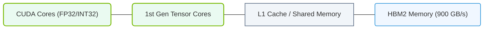

# 12.1a Volta (V100 — 2017): first Tensor Cores, HBM2, NVLink 2.0 — the AI pivot

#### 🏷️ The Nvidia GPU Architecture — The Silicon at the Heart of AI Infrastructure > 12 NVIDIA GPU Generations & Form Factors > 12.1 The Architecture Family Tree

---

## 🌍 Context Introduction

In 2017, NVIDIA released the **Volta architecture** with the **V100 GPU**. This was a turning point — the moment when GPUs stopped being just graphics cards and became dedicated **AI accelerators**. Before Volta, deep learning was possible but slow. After Volta, training large neural networks became practical for engineers everywhere. The V100 introduced three game-changing technologies: **Tensor Cores**, **HBM2 memory**, and **NVLink 2.0**. If you are new to AI infrastructure, understanding Volta is like understanding the foundation of modern AI computing.

---

## ⚙️ What Made Volta Special?

Volta was not an incremental update. It was a complete rethinking of what a GPU could do for AI workloads. Here are the key innovations:

- **First Tensor Cores** — Specialized hardware units designed specifically for matrix multiplication, the core operation in neural networks.
- **HBM2 (High Bandwidth Memory 2)** — A new memory technology that dramatically increased data throughput to the GPU.
- **NVLink 2.0** — A high-speed interconnect that allowed multiple GPUs to communicate directly without going through the CPU.

These three features together made the V100 the first GPU that was truly built for AI from the ground up.

---

## 🧠 Tensor Cores: The AI Engine

Tensor Cores are the heart of the V100. They perform **mixed-precision matrix multiply-and-accumulate** operations in a single clock cycle. Before Tensor Cores, engineers used standard CUDA cores for matrix math — which was slow. Tensor Cores made it **6x to 12x faster** for training.

Key points about Tensor Cores:

- They work with **FP16 (half-precision)** inputs and accumulate results in **FP32 (full-precision)**.
- They are not general-purpose — they only do matrix operations, but that is exactly what AI needs.
- Each Tensor Core performs **4x4 matrix multiplication** in one cycle.
- The V100 has **640 Tensor Cores** total across all Streaming Multiprocessors (SMs).

For engineers: When you see "mixed precision training" in modern AI frameworks, Tensor Cores are what make it possible.

---

## 📊 HBM2 Memory: The Data Highway

HBM2 was a massive leap over previous GDDR5 memory. It stacked memory dies vertically and connected them through a silicon interposer, giving much higher bandwidth in a smaller physical footprint.

| Feature | Previous GPU (Pascal P100) | Volta V100 |
|---------|---------------------------|------------|
| Memory Type | HBM1 | HBM2 |
| Memory Capacity | 16 GB | 16 GB or 32 GB |
| Memory Bandwidth | 720 GB/s | 900 GB/s |
| Memory Bus Width | 4096-bit | 4096-bit |
| Power Efficiency | Good | Better |

Why this matters for engineers:
- **Higher bandwidth** means the GPU spends less time waiting for data.
- **Larger capacity** (32 GB version) allows training bigger models without swapping to system RAM.
- HBM2 is also more power-efficient, which matters in data center environments.

---

### 📊 Visual Representation: Volta V100 GPU Architecture Layout
This diagram displays Volta V100 Silicon components, highlighting first-generation Tensor Cores and HBM2 memory connectivity.

## 🔗 NVLink 2.0: GPU-to-GPU Communication

NVLink 2.0 allowed engineers to connect multiple V100 GPUs directly. Each link provided **50 GB/s** bidirectional bandwidth — much faster than PCIe 3.0 (16 GB/s).

Key capabilities:
- **Direct GPU-to-GPU communication** — no need to go through the CPU or system memory.
- **Scalable to 8 GPUs** in a single node using NVSwitch.
- **Supports unified memory** across GPUs, making multi-GPU programming simpler.

For engineers: If you are training a model that requires more than one GPU, NVLink 2.0 is what keeps all GPUs working together efficiently.

---

## 🛠️ Practical Impact for Engineers

When you work with V100 GPUs today (or in legacy systems), here is what you need to know:

- **Mixed precision training** is the default recommendation — use FP16 inputs with Tensor Cores.
- **Memory management** matters — the 16 GB version can be tight for large models like BERT-Large.
- **Multi-GPU scaling** works best with NVLink — avoid using only PCIe for inter-GPU communication.
- **Power and cooling** — V100s consume up to 300W each, so plan your data center power and thermal budgets accordingly.

---

## 🕵️ Legacy and Relevance Today

Even though newer architectures (Ampere, Hopper, Blackwell) have surpassed Volta, the V100 remains important:

- Many cloud providers still offer V100 instances at lower cost.
- It is the baseline for understanding Tensor Core evolution.
- It introduced the concept of **AI-specific hardware** that all later GPUs built upon.

For engineers studying AI infrastructure, Volta is the **reference point** — everything before was pre-AI, everything after is post-AI.

---

## 📝 Summary Table

| Technology | What It Does | Why It Matters |
|------------|-------------|----------------|
| Tensor Cores | Fast matrix multiplication | 6-12x speedup for AI training |
| HBM2 Memory | High-bandwidth stacked memory | 900 GB/s throughput, larger models |
| NVLink 2.0 | Direct GPU-to-GPU links | Efficient multi-GPU scaling |

---

## 🔍 Key Takeaway

The Volta V100 was NVIDIA's **AI pivot**. It proved that dedicated AI hardware could deliver massive performance gains. For engineers new to AI infrastructure, remember this: **Tensor Cores = speed, HBM2 = capacity, NVLink = scalability**. These three pillars are still the foundation of every modern AI GPU today.