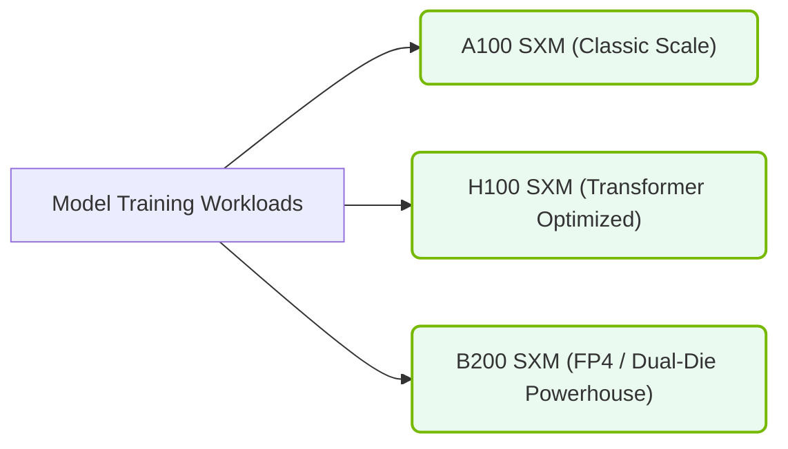

# 12.3b A100, H100, H200: training-class flagship GPUs

#### 🏷️ The Nvidia GPU Architecture — The Silicon at the Heart of AI Infrastructure > 12 NVIDIA GPU Generations & Form Factors > 12.3 The NVIDIA Product Portfolio for Data Centers

Welcome to the world of NVIDIA's flagship training GPUs. If you're new to AI infrastructure, think of these GPUs as the heavy-lifting engines behind modern artificial intelligence. The A100, H100, and H200 are designed specifically for training large neural networks — the kind that power chatbots, image generators, and scientific simulations. This guide will help you understand what makes each generation special and how they compare.

---

## ⚙️ What Makes These GPUs "Training-Class"?

Training-class GPUs are built for the most demanding phase of AI development: **training**. During training, the GPU processes massive datasets and adjusts millions (or billions) of model parameters. These GPUs excel at:

- **Parallel processing**: Thousands of cores work simultaneously on matrix math.
- **High memory bandwidth**: Fast data movement between GPU memory and compute units.
- **Scalability**: Multiple GPUs can be linked together for distributed training.
- **Precision flexibility**: Support for various numerical formats (FP32, FP16, BF16, INT8).

---

## 🕵️ The A100 — The Foundation (Ampere Architecture)

The **NVIDIA A100** (Ampere architecture) was the first GPU designed specifically for AI training at scale. It introduced several key innovations:

- **Tensor Cores**: Specialized hardware for matrix operations, delivering up to 312 TFLOPS (FP16).
- **Multi-Instance GPU (MIG)**: Allows one physical GPU to be split into up to 7 smaller, isolated instances.
- **Third-Generation NVLink**: High-speed interconnect for GPU-to-GPU communication.
- **40GB or 80GB HBM2e memory**: Fast memory with 2 TB/s bandwidth (80GB version).

**Typical use cases**: Training medium-sized models (e.g., BERT, GPT-2), inference for production workloads, and multi-tenant environments where MIG is beneficial.

---

## 🚀 The H100 — The Performance Leap (Hopper Architecture)

The **NVIDIA H100** (Hopper architecture) represents a major generational jump. It is optimized for the largest AI models and introduces transformative features:

- **Transformer Engine**: Automatically manages precision (FP8, FP16, BF16) for transformer-based models.
- **Fourth-Generation NVLink**: Up to 900 GB/s GPU-to-GPU bandwidth.
- **Second-Generation MIG**: Supports up to 7 instances with improved isolation.
- **80GB HBM3 memory**: 3.35 TB/s bandwidth — 50% faster than A100.
- **DPX Instructions**: Accelerates dynamic programming algorithms used in genomics and pathfinding.

**Key performance numbers**:
- Up to 9x faster training for large language models vs. A100.
- Up to 30x faster inference for some transformer models with FP8.

**Typical use cases**: Training GPT-3/4-scale models, large recommendation systems, and scientific computing (e.g., drug discovery, climate modeling).

---

## 💎 The H200 — The Memory Monster (Hopper Architecture + HBM3e)

The **NVIDIA H200** is an enhanced version of the H100 with a critical upgrade: **141GB of HBM3e memory**. This is the first GPU to break the 100GB memory barrier for a single GPU.

- **141GB HBM3e memory**: 4.8 TB/s bandwidth — 43% more than H100.
- **Same Hopper architecture**: Identical compute cores and Transformer Engine as H100.
- **Larger model capacity**: Can fit larger models entirely in GPU memory without splitting across GPUs.

**Why this matters**: For models that require massive memory (e.g., 175B+ parameter models), the H200 reduces the need for complex model parallelism. This simplifies infrastructure and improves training efficiency.

**Typical use cases**: Training the largest foundation models (e.g., Llama 3, GPT-4 scale), fine-tuning massive models, and memory-intensive scientific simulations.

---

### 📊 Visual Representation: Training GPU SXM Platform Hierarchy
This diagram shows the enterprise training GPU hierarchy (A100 SXM, H100 SXM, B200 SXM) connected via full high-speed NVLink baseboards.

## 📊 Comparison Table: A100 vs. H100 vs. H200

| Feature | A100 (80GB) | H100 (80GB) | H200 (141GB) |
|---------|-------------|-------------|--------------|
| **Architecture** | Ampere | Hopper | Hopper (enhanced) |
| **Memory Type** | HBM2e | HBM3 | HBM3e |
| **Memory Size** | 80 GB | 80 GB | 141 GB |
| **Memory Bandwidth** | 2 TB/s | 3.35 TB/s | 4.8 TB/s |
| **Tensor Cores** | 3rd Gen | 4th Gen | 4th Gen |
| **Transformer Engine** | ❌ No | ✅ Yes | ✅ Yes |
| **MIG Support** | 1st Gen (up to 7 instances) | 2nd Gen (up to 7 instances) | 2nd Gen (up to 7 instances) |
| **NVLink Generation** | 3rd Gen (600 GB/s) | 4th Gen (900 GB/s) | 4th Gen (900 GB/s) |
| **Max FP16 TFLOPS** | 312 | 1,979 | 1,979 |
| **Max FP8 TFLOPS** | N/A | 3,958 | 3,958 |
| **Typical Power** | 400W | 700W | 700W |

---

## 🛠️ Practical Considerations for Engineers

When choosing between these GPUs for a training infrastructure, consider these factors:

### 🔹 Model Size
- **Small models (<10B parameters)**: A100 is often sufficient and more cost-effective.
- **Medium models (10B–100B parameters)**: H100 provides significant speedups.
- **Large models (>100B parameters)**: H200's extra memory reduces complexity.

### 🔹 Training Speed
- H100 and H200 offer 3–9x faster training than A100 for transformer models.
- The Transformer Engine on H100/H200 automatically optimizes precision for maximum throughput.

### 🔹 Memory Constraints
- If your model fits in 80GB, H100 is ideal.
- If your model needs >80GB, H200 avoids splitting across multiple GPUs (saving NVLink bandwidth and complexity).

### 🔹 Power and Cooling
- A100: 400W — can use air cooling.
- H100/H200: 700W — typically requires liquid cooling in dense deployments.

### 🔹 Software Compatibility
- All three GPUs work with NVIDIA's **CUDA**, **cuDNN**, **TensorRT**, and **NCCL** libraries.
- Frameworks like **PyTorch**, **TensorFlow**, and **JAX** support all three out of the box.

---

## 🧪 Example: Training a Large Language Model

Here's a simplified comparison of how these GPUs handle a 70B parameter model:

**A100 (8x GPUs)**:
- Requires model parallelism across 8 GPUs due to 80GB memory limit.
- Training time: ~30 days for 1 trillion tokens.

**H100 (8x GPUs)**:
- Still requires model parallelism, but 3x faster compute.
- Training time: ~10 days for 1 trillion tokens.

**H200 (8x GPUs)**:
- Each GPU can hold a larger portion of the model, reducing communication overhead.
- Training time: ~7 days for 1 trillion tokens (memory advantage + compute speed).

---

## 🔮 Summary: Which GPU Should You Choose?

| If you need... | Choose... |
|----------------|-----------|
| Cost-effective training for smaller models | A100 |
| Maximum training speed for large models | H100 |
| Largest models without splitting across GPUs | H200 |
| A balance of speed and memory | H100 (or H200 if memory is critical) |

---

## 📚 Key Takeaways for New Engineers

1. **A100** is the proven workhorse — reliable, widely available, and great for getting started.
2. **H100** is the performance leader — use it when training speed is the top priority.
3. **H200** is the memory champion — ideal for models that push the boundaries of size.
4. All three use the same software stack, so code written for one can run on the others (with performance differences).
5. The **Transformer Engine** in H100/H200 is a game-changer for modern AI workloads — it automatically optimizes precision for maximum throughput.

As you build your AI infrastructure, start with understanding your model's memory requirements and training time budget. Then match those needs to the right GPU generation. The A100, H100, and H200 represent the best tools NVIDIA offers for training the next generation of AI.