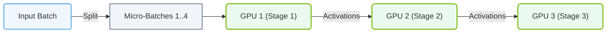

# 13.1d Pipeline Parallelism: assigning sequential model stages to different GPUs

#### 🏷️ The Nvidia GPU Architecture — The Silicon at the Heart of AI Infrastructure > 13 Multi-GPU Interconnects — Scaling Beyond One GPU > 13.1 Why Multi-GPU Communication Is Critical for AI Training

## 🧠 Context Introduction

When training very large neural networks, a single GPU often cannot hold the entire model in memory. Pipeline parallelism solves this by **splitting the model into sequential stages** and assigning each stage to a different GPU. Think of it like an assembly line: each GPU processes one part of the model, then passes the result to the next GPU in line. This allows engineers to train models that are far larger than what fits on one GPU.

---

## ⚙️ How Pipeline Parallelism Works

- The model is divided into **sequential chunks** (stages) along its depth (layers).
- Each stage is placed on a separate GPU.
- Data flows through the GPUs one after another: **GPU 0 → GPU 1 → GPU 2 → ... → GPU N**.
- Each GPU only stores and computes its assigned portion of the model.
- This is different from data parallelism (where each GPU has the full model) and tensor parallelism (where a single layer is split across GPUs).

---

## 🛠️ Key Concepts for New Engineers

### 📦 Model Stages
- A stage is a contiguous group of layers from the original model.
- Example: For a 12-layer transformer, you might assign layers 1–4 to GPU 0, layers 5–8 to GPU 1, and layers 9–12 to GPU 2.

### 🔄 Forward and Backward Pass Flow
- **Forward pass**: Input enters GPU 0, passes through stage 1, then moves to GPU 1, and so on until the output is produced.
- **Backward pass**: Gradients flow in reverse order (GPU N → GPU N-1 → ... → GPU 0).

### ⏳ Pipeline Bubbles (Idle Time)
- A major challenge: GPUs at the end of the pipeline must wait for earlier GPUs to finish their forward pass before they can start.
- This creates "bubbles" of idle GPU time.
- **Solution**: Use **micro-batching** — split each batch into smaller micro-batches to keep all GPUs busy.

---

### 📊 Visual Representation: Pipeline Parallelism with Micro-Batches
This diagram displays how Pipeline Parallelism divides a batch into micro-batches to overlap GPU executions, reducing inactive bubble time.

## 📊 Comparison: Pipeline Parallelism vs. Other Parallelism Types

| Feature | Pipeline Parallelism | Data Parallelism | Tensor Parallelism |
|---------|---------------------|------------------|-------------------|
| **Model split** | By depth (layers) | Full model on each GPU | By width (within a layer) |
| **GPU memory usage** | Low per GPU | High (full model) | Medium |
| **Communication pattern** | Sequential (GPU-to-GPU) | All-reduce across GPUs | All-to-all within a layer |
| **Best for** | Very deep models | Large batch sizes | Very wide layers |
| **Idle time risk** | Pipeline bubbles | Minimal | Minimal |

---

## 🕵️ Real-World Analogy

Imagine a **car assembly line**:
- **Station 1** (GPU 0): Builds the engine.
- **Station 2** (GPU 1): Attaches the chassis.
- **Station 3** (GPU 2): Adds the wheels.
- Each station works on one car at a time, then passes it to the next station.
- If Station 1 is slow, Station 2 and 3 sit idle — that's a **pipeline bubble**.

---

## 🛠️ Practical Implementation Notes

- **NVIDIA's Megatron-LM** and **DeepSpeed** are popular frameworks that implement pipeline parallelism.
- Engineers typically configure the number of pipeline stages (GPUs) and the micro-batch size.
- A common setup uses **1 pipeline stage per GPU** for simplicity.
- The **gradient accumulation** technique is often combined with pipeline parallelism to reduce communication overhead.

---

## ✅ Key Takeaways for New Engineers

- Pipeline parallelism lets you train models that **don't fit on a single GPU**.
- It works by **splitting the model into sequential stages** across GPUs.
- The main trade-off is **pipeline bubbles** (idle GPU time), which can be reduced with micro-batching.
- It is **one tool** in the multi-GPU toolbox, often combined with data and tensor parallelism for maximum efficiency.
- Understanding pipeline parallelism is essential for scaling AI training to hundreds or thousands of GPUs.