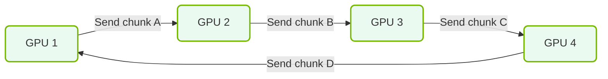

# 13.1e AllReduce: the collective communication operation that synchronizes gradients

#### 🏷️ The Nvidia GPU Architecture — The Silicon at the Heart of AI Infrastructure > 13 Multi-GPU Interconnects — Scaling Beyond One GPU > 13.1 Why Multi-GPU Communication Is Critical for AI Training

---

## 🧠 Context Introduction

When training large AI models across multiple GPUs, each GPU computes its own version of the gradients during backpropagation. However, these gradients must be **identical** across all GPUs before the model weights can be updated. Without synchronization, each GPU would update its weights differently, breaking the training process.

**AllReduce** is the collective communication operation that solves this problem. It efficiently combines gradients from all GPUs and distributes the result back to every GPU, ensuring all GPUs have the same updated gradients.

---

## ⚙️ What Is AllReduce?

AllReduce is a **collective communication pattern** used in distributed computing. It performs two operations in one step:

- **Reduce**: Combines data from all GPUs (e.g., summing gradients)
- **Broadcast**: Sends the combined result back to every GPU

The result is that **every GPU ends up with the same final value** — in this case, the synchronized gradients.

---

## 📊 How AllReduce Works (Step by Step)

Imagine you have 4 GPUs, each with its own gradient value for a single weight:

| GPU | Local Gradient |
|-----|----------------|
| GPU 0 | 0.2 |
| GPU 1 | 0.5 |
| GPU 2 | 0.3 |
| GPU 3 | 0.1 |

**Step 1 — Reduce Phase**: All GPUs communicate to compute the sum (or average) of all gradients.

- Total sum = 0.2 + 0.5 + 0.3 + 0.1 = **1.1**
- Average = 1.1 ÷ 4 = **0.275**

**Step 2 — Broadcast Phase**: The final result (0.275) is sent back to every GPU.

**Result**: All 4 GPUs now have gradient = **0.275** and can update their weights identically.

---

## 🛠️ Why AllReduce Is Critical for AI Training

- **Consistency**: Ensures all GPUs update model weights with the same gradients
- **Scalability**: Allows training across hundreds or thousands of GPUs
- **Efficiency**: Combines reduce and broadcast into a single optimized operation
- **Speed**: Modern NVIDIA GPUs use hardware-accelerated AllReduce via NVLink and NCCL

---

### 📊 Visual Representation: Ring All-Reduce Communication Loop
This diagram displays the Ring All-Reduce communication mechanism, showing how GPUs pass gradient chunks to adjacent devices in a ring to synchronize weights.



## 🕵️ Common AllReduce Algorithms

Different algorithms exist to perform AllReduce efficiently. Here are the most common ones:

| Algorithm | How It Works | Best For |
|-----------|--------------|----------|
| **Ring AllReduce** | GPUs form a ring and pass data in two phases (reduce-scatter + all-gather) | Large clusters with many GPUs |
| **Tree AllReduce** | GPUs are arranged in a tree structure for hierarchical reduction | Small to medium clusters |
| **Recursive Halving and Doubling** | GPUs pair up and exchange data in logarithmic steps | Balanced performance across cluster sizes |
| **NVLink Direct** | Uses direct GPU-to-GPU connections for minimal latency | Small groups of GPUs (e.g., 4 or 8) on same node |

---

## 🧩 AllReduce vs. Other Collective Operations

| Operation | Description | Example Use Case |
|-----------|-------------|------------------|
| **AllReduce** | Combines data from all GPUs and sends result to all GPUs | Gradient synchronization |
| **AllGather** | Collects data from all GPUs and sends full set to each GPU | Collecting model parameters |
| **ReduceScatter** | Reduces data and scatters portions across GPUs | First phase of Ring AllReduce |
| **Broadcast** | Sends data from one GPU to all others | Distributing initial model weights |

---

## 🔧 Practical Example: AllReduce in Action

For reference, here is a simplified Python example using **NVIDIA's NCCL library** (via PyTorch) to perform AllReduce on gradients:

```python
import torch
import torch.distributed as dist

# Initialize the distributed environment
dist.init_process_group(backend='nccl')

# Each GPU has its own gradient tensor
local_gradient = torch.tensor([0.2, 0.5, 0.3, 0.1])

# Perform AllReduce (sum by default)
dist.all_reduce(local_gradient, op=dist.ReduceOp.SUM)

# Now every GPU has the sum of all gradients
# To get the average, divide by the number of GPUs
world_size = dist.get_world_size()
average_gradient = local_gradient / world_size

print(f"GPU {dist.get_rank()}: Average gradient = {average_gradient}")
```

📤 **Output**: Each GPU prints its rank and the same average gradient value (e.g., `GPU 0: Average gradient = tensor([0.275])`)

---

## 🚀 Key Takeaways for New Engineers

- **AllReduce is the backbone of distributed training** — without it, multi-GPU training would not work
- **NVIDIA GPUs use hardware-accelerated AllReduce** via NVLink and NCCL for maximum performance
- **Ring AllReduce is the most common algorithm** for large-scale training due to its scalability
- **Always use AllReduce for gradient synchronization** — never manually sum and broadcast gradients
- **Monitor AllReduce performance** — slow AllReduce can become a bottleneck in large training jobs

---

## 📚 Summary

AllReduce is the collective communication operation that synchronizes gradients across all GPUs during distributed training. It combines reduce and broadcast into one efficient step, ensuring every GPU has identical gradients before updating model weights. Understanding AllReduce is essential for engineers working with multi-GPU AI infrastructure, as it directly impacts training speed, scalability, and model accuracy.