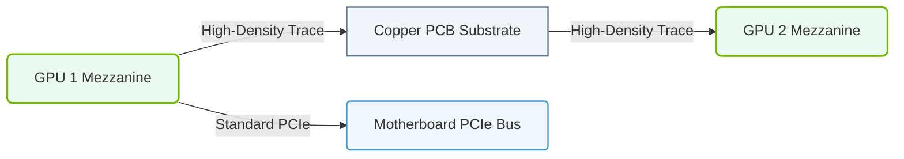

# 13.2b Physical implementation: gold contacts on SXM modules, bridges on PCIe cards

#### 🏷️ The Nvidia GPU Architecture — The Silicon at the Heart of AI Infrastructure > 13 Multi-GPU Interconnects — Scaling Beyond One GPU > 13.2 NVLink — GPU-to-GPU High-Speed Direct Interconnect

Welcome, new engineer! This topic dives into the physical, tangible side of GPU interconnects. While NVLink is a high-speed protocol, it needs a reliable physical connection to work. Here, we'll explore two key physical implementations: **gold contacts on SXM modules** and **bridges on PCIe cards**. Think of these as the "plugs and cables" that make GPU-to-GPU communication possible.

---

## 🧭 Context: Why Physical Implementation Matters

Before data can fly between GPUs, there must be a robust, low-resistance, and high-bandwidth physical pathway. The physical design of connectors and bridges directly impacts signal integrity, power delivery, and overall system reliability. Engineers working with AI infrastructure must understand these components to troubleshoot connectivity issues, plan system upgrades, and ensure optimal performance.

---

## ⚙️ Gold Contacts on SXM Modules

SXM (Server eXpansion Module) is a form factor used by NVIDIA for high-performance GPUs like the A100, H100, and H200. Unlike standard PCIe cards, SXM modules connect directly to the system's baseboard via a dedicated socket.

### 🔑 Key Characteristics

- **Material**: The contacts are plated with **gold** because gold is highly conductive and resistant to corrosion. This ensures a stable, low-resistance electrical connection over the lifetime of the system.
- **Design**: SXM modules have a row of gold-plated pads (contacts) on the bottom edge. These pads mate with spring-loaded pins in the SXM socket on the baseboard.
- **Purpose**: These contacts carry both **power** and **data** (including NVLink signals) between the GPU and the system.
- **Durability**: Gold contacts are designed for repeated insertion and removal cycles, but they are delicate. Engineers must handle SXM modules with care to avoid scratching or bending the contacts.

### 🛠️ Practical Considerations for Engineers

- **Inspection**: Before installation, visually inspect the gold contacts for any dirt, scratches, or discoloration. A clean contact ensures a good electrical connection.
- **Handling**: Always hold SXM modules by the edges. Avoid touching the gold contacts with bare fingers, as oils from skin can degrade performance over time.
- **Alignment**: When inserting an SXM module, ensure it is perfectly aligned with the socket. Forcing it in can bend the pins on the baseboard or damage the gold contacts.

---

### 📊 Visual Representation: NVLink Physical Board Connectivity
This diagram displays how NVLink Mezzanine connectors interface directly with high-density copper PCB traces to bypass the slower PCIe bus.

## 🕵️ Bridges on PCIe Cards

For GPUs that use a standard PCIe form factor (e.g., some NVIDIA RTX or older Tesla cards), NVLink connectivity is achieved through a physical **NVLink bridge**. This is a small, specialized circuit board that connects two adjacent GPUs.

### 🔑 Key Characteristics

- **Form Factor**: The bridge looks like a short, flat circuit board with connectors on both ends. It fits into dedicated slots on the top edge of each GPU card.
- **Material**: The connectors on the bridge and the GPU cards also use **gold-plated contacts** for the same reasons as SXM modules (low resistance, corrosion resistance).
- **Purpose**: The bridge provides a dedicated, high-bandwidth path for NVLink data between two GPUs. It bypasses the PCIe bus entirely.
- **Variants**: Bridges come in different sizes (e.g., 2-slot, 3-slot, 4-slot) to accommodate the physical spacing between GPU cards in the server.

### 🛠️ Practical Considerations for Engineers

- **Compatibility**: Not all GPUs support NVLink bridges. Check the GPU specifications and the bridge model (e.g., NVLink Bridge for RTX 6000, NVSwitch for HGX systems).
- **Installation**: The bridge must be installed **after** the GPUs are securely seated in the PCIe slots. It simply snaps into place.
- **Airflow**: Bridges can obstruct airflow between GPUs. Ensure the server's cooling system can handle the reduced airflow, especially in dense GPU configurations.
- **Troubleshooting**: If NVLink is not detected, check that the bridge is fully seated and that the gold contacts on both the bridge and the GPU are clean.

---

## 📊 Comparison: SXM Gold Contacts vs. PCIe NVLink Bridges

| Feature | SXM Module Gold Contacts | PCIe NVLink Bridge |
| :--- | :--- | :--- |
| **Form Factor** | Integrated into the module's edge connector | Separate, removable circuit board |
| **Connection Type** | Direct socket on the baseboard | Connects between two adjacent GPU cards |
| **Data Path** | Carries NVLink signals + power | Carries only NVLink data signals |
| **Installation** | Module is inserted into a socket | Bridge is snapped onto installed GPUs |
| **Durability** | High, but contacts are exposed | Moderate, bridge can be replaced easily |
| **Typical Use Case** | High-density servers (DGX, HGX) | Workstations or servers with PCIe GPUs |

---

## 🧠 Summary for New Engineers

- **Gold contacts** are the physical interface for both SXM modules and NVLink bridges. Their quality directly affects signal integrity.
- **SXM modules** use gold contacts on the module itself to connect to the baseboard. This is a high-density, high-power solution.
- **PCIe NVLink bridges** use gold contacts on the bridge and the GPU card to create a dedicated data link between two GPUs.
- **Always handle these components with care** — a damaged contact or a poorly seated bridge can cause intermittent failures or complete loss of NVLink connectivity.

Understanding these physical implementations helps you build, maintain, and troubleshoot the high-performance GPU clusters that power modern AI workloads.