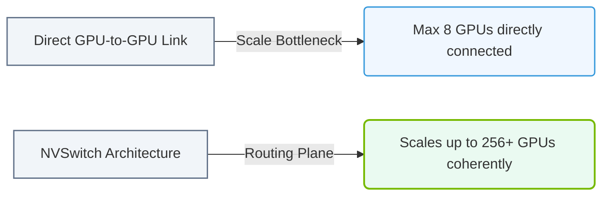

# 13.3a The problem NVSwitch solves: NVLink peer-to-peer vs. switched fabric

#### 🏷️ The Nvidia GPU Architecture — The Silicon at the Heart of AI Infrastructure > 13 Multi-GPU Interconnects — Scaling Beyond One GPU > 13.3 NVSwitch — All-to-All GPU Interconnect Fabric

---

## 🧭 Context Introduction

When you connect multiple GPUs together, you need a way for them to talk to each other quickly. Think of it like a team of workers in a warehouse. If you have only two workers, they can just shout across the room (direct connection). But if you have 8 or 16 workers, shouting becomes chaotic and slow. You need a central switchboard operator (NVSwitch) to route messages efficiently. This section explains why NVIDIA moved from simple **peer-to-peer** connections to a **switched fabric** using NVSwitch.

---

## ⚙️ The Problem: Scaling GPU Communication

### The Old Way: NVLink Peer-to-Peer (Direct Connections)

In a peer-to-peer setup, each GPU has a limited number of physical wires (NVLink bridges) connecting it directly to other GPUs. This creates a **mesh** or **hybrid cube** topology.

**Key limitations:**
- Each GPU can only talk to a few neighbors directly.
- If GPU A needs to send data to GPU D, it might have to hop through GPU B and GPU C first.
- This "multi-hop" traffic creates bottlenecks and increases latency.
- Adding more GPUs makes the wiring incredibly complex.

### The New Way: NVSwitch Switched Fabric

NVSwitch acts like a **central telephone exchange**. Every GPU connects directly to the NVSwitch, and the switch routes data between any two GPUs instantly.

**Key advantages:**
- **All-to-all connectivity:** Any GPU can talk to any other GPU in a single hop.
- **Full bandwidth:** Every GPU gets the maximum possible NVLink bandwidth.
- **Simpler wiring:** Each GPU only needs one connection to the switch, not many connections to other GPUs.
- **Scalability:** You can easily add more GPUs by adding more NVSwitch units.

---

## 📊 Comparison Table: Peer-to-Peer vs. Switched Fabric

| Feature | NVLink Peer-to-Peer | NVSwitch Switched Fabric |
| :--- | :--- | :--- |
| **Topology** | Mesh or hybrid cube | Star (all GPUs connect to switch) |
| **Connectivity** | Limited to physical neighbors | Full all-to-all (any GPU to any GPU) |
| **Data Path** | May require multiple hops | Single hop (direct) |
| **Latency** | Higher (due to hops) | Lower (direct connection) |
| **Bandwidth** | Shared among neighbors | Dedicated per GPU pair |
| **Wiring Complexity** | High (many cables) | Low (one cable per GPU to switch) |
| **Scalability** | Difficult beyond 8 GPUs | Easy up to hundreds of GPUs |
| **Example Use Case** | Small workstations (4-8 GPUs) | Large DGX systems (8+ GPUs) |

---

### 📊 Visual Representation: All-to-All Scale Bottleneck and the NVSwitch Solution
This diagram displays how the direct-link GPU bottleneck (limited physical port boundaries) is resolved by routing links through NVSwitch ASICs.

## 🛠️ How NVSwitch Works in Practice

### The Physical Setup

- An **NVSwitch** is a dedicated hardware chip (not a GPU) that sits in the middle of the system.
- Each GPU connects to the NVSwitch using **NVLink cables**.
- In large systems like the **NVIDIA DGX A100** or **DGX H100**, multiple NVSwitch chips work together to form a single, unified fabric.

### The Logical Behavior

When GPU 0 needs to send data to GPU 7:
1. GPU 0 sends the data to the NVSwitch over its NVLink connection.
2. The NVSwitch looks at the destination address (GPU 7).
3. The switch instantly routes the data to GPU 7 over its NVLink connection.
4. This happens in **microseconds** — faster than any multi-hop path.

### Real-World Analogy

Imagine a **conference room** with 8 people:
- **Peer-to-peer:** Each person can only whisper to the person next to them. To pass a note from person 1 to person 8, it must be passed through 6 intermediate people.
- **NVSwitch:** There is a central microphone and speaker system. Person 1 speaks into the mic, and person 8 hears it instantly through their speaker.

---

## 🕵️ Why This Matters for AI Workloads

### Training Large Neural Networks

Modern AI models (like GPT-4 or Llama) are so large that they must be split across multiple GPUs. During training:
- GPUs constantly exchange **gradients** (small mathematical updates).
- If communication is slow, GPUs sit idle waiting for data — this is called **communication overhead**.
- NVSwitch eliminates this overhead by providing **maximum bandwidth** and **minimum latency** between any two GPUs.

### Example: Data Parallel Training

In data parallel training, each GPU holds a copy of the model but processes different data. After each step:
1. All GPUs compute their local gradients.
2. They must **all-reduce** (sum up) these gradients.
3. With peer-to-peer, this requires multiple communication rounds.
4. With NVSwitch, the all-reduce happens in a single, fast operation.

---

## ✅ Key Takeaways for New Engineers

- **NVLink** is the physical cable/connection standard. **NVSwitch** is the routing hardware that uses NVLink.
- **Peer-to-peer** works for small GPU counts (2-4) but breaks down at scale.
- **NVSwitch** provides a **non-blocking, all-to-all** fabric — meaning every GPU can talk to every other GPU at full speed simultaneously.
- This is critical for **large-scale AI training** where communication between GPUs is the bottleneck.
- When you see a DGX system with 8 GPUs, the secret to its performance is the NVSwitch fabric inside.

---

## 🔍 Quick Check: Can You Answer These?

1. What happens to data when it travels through multiple GPU hops in a peer-to-peer setup?
2. How does NVSwitch reduce latency compared to a mesh topology?
3. Why is all-to-all connectivity important for training large AI models?

*(Answers: 1. It slows down and creates bottlenecks. 2. It provides a single-hop path instead of multi-hop. 3. Because gradients must be shared between all GPUs simultaneously.)*