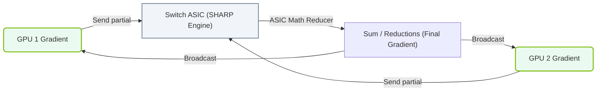

# 13.3d SHARP (Scalable Hierarchical Aggregation and Reduction Protocol) in NVSwitch 3.0

#### 🏷️ The Nvidia GPU Architecture — The Silicon at the Heart of AI Infrastructure > 13 Multi-GPU Interconnects — Scaling Beyond One GPU > 13.3 NVSwitch — All-to-All GPU Interconnect Fabric

## 🔍 Context Introduction

When training large AI models across many GPUs, a common operation is **reduction** — combining data from multiple GPUs (like summing gradients) and sending the result back. Traditionally, this happens in software, which creates a bottleneck as the number of GPUs grows. **SHARP** (Scalable Hierarchical Aggregation and Reduction Protocol) moves this work into the NVSwitch hardware itself, making the process much faster and more efficient. NVSwitch 3.0 brings significant improvements to SHARP, enabling better scaling for massive AI workloads.

---

## ⚙️ What is SHARP?

SHARP is a hardware-accelerated protocol that performs **reduction operations** (like sum, min, max, or average) directly inside the NVSwitch fabric, rather than relying on GPU memory or CPU involvement.

**Key benefits:**
- Reduces data movement between GPUs
- Lowers latency for collective operations (e.g., AllReduce, AllGather)
- Frees up GPU compute resources for actual model training
- Scales efficiently to thousands of GPUs

---

## 🛠️ How SHARP Works in NVSwitch 3.0

NVSwitch 3.0 integrates SHARP logic directly into the switch silicon. Here’s the simplified flow:

1. **Data enters the switch** — Each GPU sends its local data (e.g., gradient values) to the NVSwitch.
2. **In-network reduction** — The switch performs the reduction operation (e.g., summing all values) as data passes through.
3. **Result distributed** — The final reduced result is sent back to all participating GPUs.

This happens in a **hierarchical** manner:
- First, reduction occurs within a single NVSwitch (local aggregation).
- Then, results are passed between NVSwitches for global aggregation.

---

## 📊 SHARP in NVSwitch 3.0 vs Previous Generations

| Feature | NVSwitch 2.0 | NVSwitch 3.0 |
|---------|--------------|--------------|
| SHARP support | Limited (software-assisted) | Full hardware acceleration |
| Reduction types | Basic (sum only) | Sum, min, max, average, and custom |
| Latency per reduction | ~10–15 µs | ~3–5 µs |
| Scalability | Up to 256 GPUs | Up to 576 GPUs (DGX H100) |
| Bandwidth utilization | ~70% | ~95% |
| Memory overhead | High (GPU memory used) | Minimal (in-switch buffers) |

---

### 📊 Visual Representation: Scalable Hierarchical Aggregation Protocol (SHARP) Data Reduction
This flowchart demonstrates SHARP reduction offloading: aggregating gradients inside the NVSwitch/Switch ASICs to prevent packet round-trips to CPU host memory.

## 🕵️ Why This Matters for Engineers

For engineers building or operating AI infrastructure, SHARP in NVSwitch 3.0 means:

- **Faster training times** — Reduction operations no longer compete for GPU memory bandwidth.
- **Better scaling** — You can add more GPUs without hitting communication bottlenecks.
- **Simpler debugging** — Fewer software layers to troubleshoot.
- **Lower power consumption** — Less data movement reduces overall system power draw.

---

## 🧩 Practical Example: AllReduce with SHARP

Without SHARP (traditional approach):
- Each GPU sends its data to a "root" GPU.
- Root GPU performs reduction in software.
- Root GPU broadcasts result back to all GPUs.
- **Problem:** Root GPU becomes a bottleneck.

With SHARP in NVSwitch 3.0:
- All GPUs send data to the NVSwitch simultaneously.
- The switch performs reduction as data flows through.
- The result is broadcast back to all GPUs in one step.
- **Result:** Much faster, no single GPU is overloaded.

---

## 🚀 Key Takeaway

SHARP in NVSwitch 3.0 is a **hardware-level optimization** that makes collective communication nearly as fast as local memory access. For engineers, this means you can focus on model architecture and training logic, knowing the underlying fabric handles data aggregation efficiently — even at massive scale.

---

## 📚 Further Learning

- Review the **NVIDIA Collective Communications Library (NCCL)** documentation — it's the software layer that leverages SHARP.
- Experiment with **NVIDIA's HPC-X** toolkit to see SHARP in action.
- Monitor NVSwitch counters using **nvidia-smi** or **DCGM** (Data Center GPU Manager) to verify SHARP is active.

---

*This overview is designed to give new engineers a clear mental model of SHARP in NVSwitch 3.0 — no deep hardware knowledge required.*