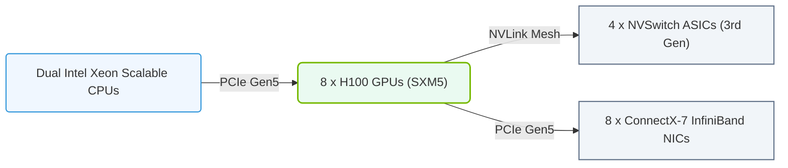

# 13.4c DGX H100: HGX H100 + InfiniBand ConnectX-7 + 400GbE management

#### 🏷️ The Nvidia GPU Architecture — The Silicon at the Heart of AI Infrastructure > 13 Multi-GPU Interconnects — Scaling Beyond One GPU > 13.4 HGX and DGX Platforms — The Reference AI Server Architectures

Welcome to the world of NVIDIA's flagship AI server platform. As a new engineer, you are about to explore how the **DGX H100** combines powerful GPU compute with high-speed networking to form the backbone of modern AI data centers. This section breaks down the three key components that make the DGX H100 a complete system: the HGX H100 baseboard, the InfiniBand ConnectX-7 network adapters, and the 400GbE management network.

---

## 📖 Context: Why This Matters

The DGX H100 is not just a server with eight GPUs. It is a **fully integrated AI supercomputer** designed for large-scale training and inference. To understand it, you need to see how three layers work together:

- **Compute Layer (HGX H100):** The physical board that holds eight H100 GPUs and their high-speed interconnects (NVLink and NVSwitch).
- **Data Layer (InfiniBand ConnectX-7):** The network adapters that connect this server to other servers, enabling multi-node scaling.
- **Management Layer (400GbE):** The dedicated Ethernet network used for system monitoring, firmware updates, and out-of-band control.

Think of it like a high-performance race car: the HGX H100 is the engine, InfiniBand is the drivetrain connecting to other cars, and 400GbE management is the dashboard and telemetry system.

---

## ⚙️ Component 1: HGX H100 — The GPU Baseboard

The **HGX H100** is the core compute board inside the DGX H100. It is a custom-designed PCB that hosts eight NVIDIA H100 Tensor Core GPUs.

### Key Features:
- **8x H100 GPUs** connected via 4th-gen NVLink (900 GB/s total bandwidth per GPU).
- **NVSwitch** on the board: Each GPU can talk to every other GPU at full speed (all-to-all connectivity).
- **600 GB/s** of aggregate NVLink bandwidth per GPU (12 NVLink links per GPU).
- **Total GPU memory:** 8 x 80 GB HBM3 = 640 GB of high-bandwidth memory.

### Why This Matters:
- Without the HGX baseboard, the GPUs would be isolated. The NVSwitch inside HGX allows all eight GPUs to act as a single massive accelerator for large models.
- This is the foundation for **model parallelism** — splitting a neural network across multiple GPUs.

---

## 🔗 Component 2: InfiniBand ConnectX-7 — The High-Speed Interconnect

While HGX connects GPUs inside one server, **InfiniBand** connects multiple DGX H100 servers together. The **ConnectX-7** is NVIDIA's 7th-generation InfiniBand adapter.

### Key Specifications:
- **400 Gb/s** per port (HDR InfiniBand).
- **Dual-port** design: Each ConnectX-7 card has two 400 Gb ports.
- **RDMA (Remote Direct Memory Access):** Allows GPUs in different servers to read/write each other's memory directly, bypassing the CPU.
- **SHARP (Scalable Hierarchical Aggregation and Reduction Protocol):** Offloads collective operations (like all-reduce) to the network switch, reducing GPU overhead.

### How It Fits in DGX H100:
- Each DGX H100 has **8x ConnectX-7** adapters (one per GPU).
- Each adapter connects to an external InfiniBand switch fabric.
- This creates a **fat-tree topology** where every GPU in the cluster can talk to every other GPU at full bandwidth.

### Comparison: InfiniBand vs. Ethernet for AI

| Feature | InfiniBand (ConnectX-7) | Standard Ethernet |
|---------|--------------------------|-------------------|
| **Bandwidth** | 400 Gb/s per port | 100-400 Gb/s (variable) |
| **Latency** | Sub-microsecond | Microsecond range |
| **RDMA Support** | Native (hardware offload) | Requires RoCE (software overhead) |
| **Collective Offload** | SHARP (in-network compute) | Not supported |
| **Use Case** | GPU-to-GPU training traffic | Management, storage, inference |

---

## 🛠️ Component 3: 400GbE Management — The Control Plane

The **400GbE management network** is a separate, dedicated Ethernet fabric used for system administration. It is not used for training data — it is for keeping the system healthy.

### What It Does:
- **Out-of-band management:** Access the BMC (Baseboard Management Controller) even if the OS is down.
- **Firmware updates:** Flash BIOS, GPU firmware, and network adapter firmware.
- **Telemetry collection:** Monitor temperatures, power consumption, fan speeds, and GPU health.
- **Logging and alerting:** Send system logs to a central management server.

### Physical Setup:
- Each DGX H100 has a **dedicated 400GbE management port** (usually on the rear I/O panel).
- This port connects to a **separate management switch** (not the InfiniBand fabric).
- Engineers access this network via SSH or web GUI to run diagnostics.

### Why 400GbE Instead of 1GbE?
- Modern AI servers generate massive amounts of telemetry data (GPU metrics, power logs, thermal data).
- 400GbE ensures the management network never becomes a bottleneck when collecting real-time data from hundreds of servers.

---

### 📊 Visual Representation: DGX H100 System Architecture Layout
This diagram displays the hardware layout of a DGX H100 server: x8 H100 GPUs connected via 4 NVSwitch chips, with dual Intel Xeon CPUs and ConnectX-7 NICs.

## 🕵️ How These Three Components Work Together

Imagine you are training a large language model across 32 DGX H100 servers (256 GPUs total). Here is the data flow:

1. **Compute (HGX H100):** Each server's eight GPUs use NVLink to share data internally. The model is split across these eight GPUs using tensor parallelism.

2. **Inter-node (InfiniBand ConnectX-7):** When the model needs to synchronize gradients across all 256 GPUs, the ConnectX-7 adapters perform an **all-reduce** operation. Data flows from GPU memory → PCIe → ConnectX-7 → InfiniBand switch → other servers → back to GPU memory. This happens at 400 Gb/s with sub-microsecond latency.

3. **Management (400GbE):** While training runs, the management network continuously collects:
   - GPU temperature (to trigger throttling if overheating)
   - Power draw (to stay within facility limits)
   - InfiniBand link status (to detect cable failures)
   - System logs (for debugging crashes)

If a GPU fails, the management network alerts you immediately, and you can remotely power-cycle the server without interrupting other nodes.

---

## 📊 Quick Reference Table: DGX H100 Network Ports

| Port Type | Quantity per DGX H100 | Speed | Purpose |
|-----------|----------------------|-------|---------|
| **InfiniBand (ConnectX-7)** | 8 (one per GPU) | 400 Gb/s each | Training data transfer between servers |
| **NVLink (on HGX board)** | 12 links per GPU | 900 GB/s aggregate | GPU-to-GPU inside the same server |
| **400GbE Management** | 1 (dedicated) | 400 Gb/s | System monitoring, firmware, out-of-band |
| **Standard Ethernet** | 2 (optional) | 25 Gb/s each | Storage access, inference serving |

---

## 🧠 Key Takeaways for New Engineers

- **The DGX H100 is a three-layer system:** compute (HGX), data (InfiniBand), and control (400GbE management).
- **InfiniBand is not Ethernet:** It is a specialized network designed for low-latency, high-throughput GPU communication. Do not confuse the two.
- **Management is critical:** You will spend a lot of time on the 400GbE management network checking logs, updating firmware, and monitoring health. This is your window into the system.
- **Scaling is the goal:** The HGX handles eight GPUs, but InfiniBand lets you scale to thousands. Understanding this interconnect is essential for building large AI clusters.

---

## 🔍 Next Steps

- Explore how **NVLink and NVSwitch** work inside the HGX baseboard (see section 13.3).
- Learn about **InfiniBand topologies** (fat-tree, dragonfly) to understand how multiple DGX H100 servers are wired together.
- Practice accessing the **BMC management interface** via the 400GbE management port to view system health metrics.

You now have a solid mental model of the DGX H100 architecture. As you work with these systems, remember: the magic is in the interconnects — both inside the server (NVLink) and between servers (InfiniBand).