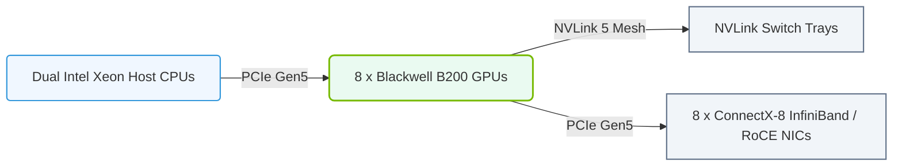

# 13.4d DGX B200: Blackwell system specifications and NVL72 rack design

#### 🏷️ The Nvidia GPU Architecture — The Silicon at the Heart of AI Infrastructure > 13 Multi-GPU Interconnects — Scaling Beyond One GPU > 13.4 HGX and DGX Platforms — The Reference AI Server Architectures

Welcome to the world of next-generation AI infrastructure. The **DGX B200** represents a monumental leap in GPU computing, built on the **Blackwell architecture**. For new engineers, think of this as the most powerful single-server building block for training massive AI models. The **NVL72 rack design** takes this further by linking 72 GPUs together into a single, giant virtual GPU — a concept that changes how we think about scaling AI workloads.

---

## 🧠 Context: Why Blackwell and NVL72 Matter

Before diving into specs, understand the core problem: AI models are growing exponentially (trillions of parameters). A single GPU, no matter how powerful, cannot hold or train these models alone. The **DGX B200** solves this by packing immense compute into one server, while the **NVL72 rack** solves it by creating a seamless, high-speed fabric between 72 GPUs — effectively turning an entire rack into one giant GPU. This eliminates the traditional bottlenecks of networking multiple servers together.

---

## ⚙️ DGX B200: Blackwell System Specifications

The DGX B200 is the flagship AI server. Here are the key specifications broken down simply:

### 🖥️ GPU Compute
- **GPU Architecture:** NVIDIA Blackwell (B200 GPU)
- **Number of GPUs:** 8 x B200 GPUs per DGX
- **FP8 Tensor Core Performance:** 144 PFLOPS (that's 144 quadrillion floating-point operations per second)
- **FP4 Tensor Core Performance:** 288 PFLOPS (for even faster, lower-precision AI workloads)
- **GPU Memory:** 192 GB of HBM3e per GPU (total 1.5 TB across 8 GPUs)
- **Memory Bandwidth:** 8 TB/s per GPU (extremely fast data access)

### 🔗 Interconnect (NVLink)
- **NVLink Generation:** 5th Gen NVLink
- **NVLink Bandwidth per GPU:** 1.8 TB/s (bidirectional)
- **NVLink Topology:** Fully connected (each GPU talks directly to every other GPU)

### 🧮 CPU & System Memory
- **CPU:** 2 x Intel Xeon or AMD EPYC processors (high-core-count)
- **System RAM:** 2 TB DDR5 (for CPU-side operations)
- **Storage:** 8 x NVMe SSDs (30 TB total, for fast data loading)

### 🌐 Networking
- **Network Interface:** 8 x 400 Gb/s ConnectX-8 SmartNICs
- **Total Network Bandwidth:** 3.2 Tb/s (for connecting to storage or other DGX systems)

### ⚡ Power & Cooling
- **Power Consumption:** 14.3 kW per DGX B200 (typical)
- **Cooling:** Liquid-cooled (direct-to-chip) — essential for managing heat at this density

---

### 📊 Visual Representation: DGX B200 System Architecture Layout
This diagram displays the hardware layout of a DGX B200 server: x8 Blackwell GPUs connected to NVSwitches, utilizing dual Intel Xeon CPUs.

## 🛠️ NVL72 Rack Design: Scaling Beyond One Server

The **NVL72** is not just a rack of servers; it's a **single, logical GPU with 72 GPUs**. Here's how it works:

### 🏗️ Physical Layout
- **Rack Contents:** 9 x DGX B200 servers (each with 8 GPUs) = 72 GPUs total
- **Rack Height:** Standard 42U rack (each DGX is 4U)
- **Interconnect:** All 72 GPUs are connected via a dedicated **NVLink Switch** tray (also in the rack)

### 🔌 NVLink Switch Tray
- **Purpose:** Acts as a central hub, allowing any GPU to talk to any other GPU at full NVLink speed
- **Number of Switch Trays:** 4 trays per NVL72 rack
- **Bandwidth:** Each GPU gets 1.8 TB/s to the switch fabric — no bottlenecks

### 🧠 Logical View: One Giant GPU
- **Total GPU Memory:** 72 GPUs x 192 GB = 13.8 TB of HBM3e
- **Total FP8 Performance:** 72 GPUs x 144 PFLOPS = 10.4 EFLOPS (exaflops)
- **Total Memory Bandwidth:** 72 GPUs x 8 TB/s = 576 TB/s
- **How it works:** Software (CUDA, NCCL) sees all 72 GPUs as a single device. Data is automatically distributed across all GPUs.

### 📊 Comparison: DGX B200 vs. NVL72 Rack

| Feature | DGX B200 (Single Server) | NVL72 Rack (Full System) |
| :--- | :--- | :--- |
| **Number of GPUs** | 8 | 72 |
| **Total GPU Memory** | 1.5 TB | 13.8 TB |
| **Total FP8 Performance** | 1.15 EFLOPS | 10.4 EFLOPS |
| **NVLink Bandwidth per GPU** | 1.8 TB/s (to 7 others) | 1.8 TB/s (to all 71 others) |
| **Power Consumption** | 14.3 kW | ~130 kW (including switches) |
| **Cooling** | Liquid-cooled | Liquid-cooled (entire rack) |
| **Use Case** | Single-node training, inference | Massive model training (trillions of parameters) |

---

## 🕵️ Key Concepts for New Engineers

### What Makes Blackwell Different from Hopper (Previous Gen)?
- **FP4 Support:** Blackwell introduces 4-bit floating point, doubling performance for inference and fine-tuning.
- **Second-Generation Transformer Engine:** Dynamically adjusts precision for each layer, saving memory and speeding up training.
- **NVLink 5th Gen:** 1.8 TB/s per GPU — 2x faster than the previous generation (NVLink 4 at 900 GB/s).

### Why NVL72 Instead of Traditional Clusters?
- **Traditional Cluster:** 72 GPUs spread across 9 servers, connected via Ethernet or InfiniBand. Latency is high, bandwidth is limited.
- **NVL72:** All 72 GPUs connected via NVLink. Latency is near-zero, bandwidth is massive. This is critical for models that need constant communication between GPUs (e.g., large language models).

### Deployment Considerations
- **Power:** A single NVL72 rack draws ~130 kW. You need high-density power distribution (think 3-phase, 480V).
- **Cooling:** Liquid cooling is mandatory. Air cooling cannot handle this heat density.
- **Networking:** While GPUs talk internally via NVLink, the rack still needs external networking (400 Gb/s per DGX) to connect to storage and other racks.

---

## ✅ Summary

- **DGX B200** is the most powerful single AI server, with 8 Blackwell GPUs, 1.5 TB memory, and 1.8 TB/s NVLink.
- **NVL72** takes 9 DGX B200 servers and connects all 72 GPUs into one giant virtual GPU, with 13.8 TB memory and 10.4 EFLOPS performance.
- **Key takeaway:** For training the largest AI models, the NVL72 rack eliminates network bottlenecks by using NVLink to create a single, high-speed fabric across all GPUs.
- **For engineers:** When designing AI infrastructure, think of the NVL72 as the new "unit of compute" — not a single server, but a rack that acts as one massive GPU.

You now have the foundational knowledge to understand how the DGX B200 and NVL72 fit into the broader AI infrastructure landscape. This is the cutting edge of hardware for training tomorrow's AI models.