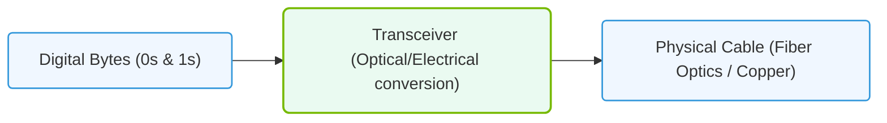

# 14.1a Layer 1 (Physical): cables, signals, optical fiber, and transceivers

#### 🏷️ The AI Data Center Networking — Moving Petabytes Without Latency > 14 Enterprise Networking Baseline > 14.1 The OSI Model — A Conceptual Framework for Network Communication

Welcome to the foundation of all network communication. As a new engineer stepping into AI infrastructure, you'll quickly learn that **Layer 1** — the Physical Layer — is where the rubber meets the road. Before any data packet can be routed or any AI model can be trained, there must be a physical connection. This section covers the tangible components: cables, signals, optical fiber, and transceivers.

Think of Layer 1 as the plumbing of the data center. If the pipes leak (bad cables) or the water pressure is wrong (signal issues), nothing else works.

---

## 🧭 Context: Why Layer 1 Matters in AI Infrastructure

In an AI data center, you are moving **petabytes of data** between GPUs, storage nodes, and network switches — all within milliseconds. Layer 1 defines:
- **How fast** data can travel (bandwidth)
- **How far** data can travel (distance limits)
- **How reliably** data arrives (signal integrity)

A single faulty cable or mismatched transceiver can cripple an entire cluster. Understanding these basics will help you troubleshoot, plan, and scale AI workloads.

---

## ⚙️ What is Layer 1?

Layer 1 is the **physical medium** that carries raw bitstreams (0s and 1s) from one device to another. It includes:

- **Cables** (copper or fiber)
- **Signals** (electrical or light pulses)
- **Connectors and transceivers** (the interfaces that convert signals)
- **Physical topology** (how devices are wired together)

> **Key concept:** Layer 1 has no concept of "packets" or "frames." It only deals with **bits** — the actual voltage or light pulses.

---

## 🛠️ Cables: Copper vs. Optical Fiber

| Feature | Copper (Twisted Pair / Coaxial) | Optical Fiber |
|---------|--------------------------------|---------------|
| **Medium** | Electrical signals | Light pulses (laser/LED) |
| **Max Distance** | ~100 meters (Cat6/Cat6a) | Up to 40+ km (single-mode) |
| **Bandwidth** | Up to 40 Gbps (Cat8) | Up to 800 Gbps and beyond |
| **Susceptibility** | Electromagnetic interference (EMI) | Immune to EMI |
| **Typical Use** | Short rack-to-switch connections | Long-haul, inter-rack, inter-building |
| **Cost per meter** | Low | Moderate to high |

### 🔌 Copper Cables (Direct Attach Copper — DAC)
- Used for short distances (up to 7 meters) within a rack.
- Common in AI clusters for connecting GPUs to top-of-rack switches.
- **Pros:** Low cost, low power, no transceiver needed.
- **Cons:** Heavy, limited distance, susceptible to interference.

### 💡 Optical Fiber
- Used for longer distances (10m to 40km+).
- Two main types:
  - **Single-mode fiber (SMF):** Thin core, laser-based, long distances.
  - **Multi-mode fiber (MMF):** Thicker core, LED-based, shorter distances (up to 400m).
- **Pros:** High bandwidth, lightweight, immune to EMI.
- **Cons:** Higher cost, requires precise connectors, more fragile.

---

## 📡 Signals: Electrical vs. Optical

### 🔋 Electrical Signals (Copper)
- Represent bits as voltage levels (e.g., +5V = 1, 0V = 0).
- Degrade over distance due to resistance and capacitance.
- Susceptible to **crosstalk** (interference from adjacent wires).

### 💡 Optical Signals (Fiber)
- Represent bits as light pulses (laser on = 1, laser off = 0).
- Travel at the speed of light in glass (~200,000 km/s).
- Virtually no signal loss over long distances (measured in dB/km).

> **Engineer's note:** In AI data centers, you will almost always use **optical signals** for inter-rack and inter-cluster connections. Copper is reserved for short, high-density links.

---

### 📊 Visual Representation: OSI Layer 1 Physical Data Transmission
This diagram displays Layer 1 operations, transforming digital binary bytes into physical light pulses or electrical signals over network cabling.

## 🔌 Transceivers: The Signal Converters

A **transceiver** is a small module that plugs into a switch, server, or GPU and converts electrical signals to optical (or vice versa). They are the "adapters" that make different media work together.

### Common Form Factors

| Form Factor | Speed Range | Typical Use |
|-------------|-------------|-------------|
| **SFP+** | 10 Gbps | Legacy connections |
| **SFP28** | 25 Gbps | Common in AI clusters |
| **QSFP+** | 40 Gbps | Older aggregation links |
| **QSFP28** | 100 Gbps | Current standard for AI |
| **QSFP-DD** | 400 Gbps | High-end AI clusters |
| **OSFP** | 800 Gbps | Next-gen AI infrastructure |

### 🧩 Key Transceiver Types

- **SR (Short Reach):** Multi-mode fiber, up to 100m. Used within a data center hall.
- **LR (Long Reach):** Single-mode fiber, up to 10km. Used between buildings.
- **ER (Extended Reach):** Single-mode fiber, up to 40km. Used for metro connections.
- **CWDM/DWDM:** Wavelength-division multiplexing — sends multiple signals on one fiber using different colors of light.

### ⚠️ Important: Transceiver Compatibility

Not all transceivers work with all switches. Always check:
- **Vendor compatibility** (Cisco, NVIDIA, Arista, etc.)
- **Speed matching** (e.g., a 100G transceiver on a 25G port will not work)
- **Fiber type** (single-mode vs. multi-mode)
- **Wavelength** (850nm for SR, 1310nm for LR, etc.)

> **Real-world tip:** In NVIDIA-Certified environments, use **NVIDIA Mellanox** transceivers for guaranteed compatibility with NVIDIA switches and DPUs.

---

## 🕵️ Common Layer 1 Issues in AI Infrastructure

| Symptom | Likely Cause | Quick Check |
|---------|--------------|-------------|
| Link flapping (up/down) | Dirty fiber end, loose connector | Clean with a fiber inspection scope |
| High error counters | Signal attenuation, bad cable | Check optical power levels (Tx/Rx) |
| No link at all | Wrong transceiver type, dead module | Swap with known-good transceiver |
| Intermittent performance | EMI near copper cables | Move cables away from power lines |
| Distance limit exceeded | Using MMF for long runs | Switch to SMF and LR transceivers |

---

## 🧪 Practical Tips for New Engineers

1. **Always inspect fiber ends** before plugging them in. Dust is the #1 killer of optical links.
2. **Label everything.** In a dense AI cluster, unlabeled cables are a nightmare to trace.
3. **Use the right cable for the distance.** Don't use a 100m-rated cable for a 500m run.
4. **Match transceiver speeds.** A 25G transceiver in a 100G port will not work (unless the port supports breakout).
5. **Keep copper cables away from power cables.** EMI can cause mysterious packet loss.
6. **Document your physical topology.** Know which cable goes where, and which transceiver is in which port.

---

## 📚 Summary

Layer 1 is the **foundation** of all AI infrastructure networking. As an engineer, you will:
- Choose between **copper** (short, cheap) and **fiber** (long, fast)
- Work with **transceivers** to convert signals between media
- Troubleshoot **signal integrity** issues that affect performance
- Ensure **physical compatibility** between cables, modules, and ports

Master these basics, and you'll be able to build and maintain the high-speed, low-latency networks that AI workloads demand.

---

*Next up: Layer 2 — Data Link (MAC addresses, switching, and VLANs).*