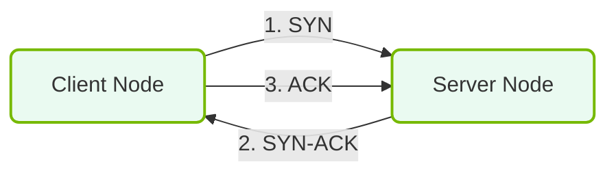

# 14.1d Layer 4 (Transport): TCP (reliable) vs. UDP (fast) — and why AI uses RDMA instead

#### 🏷️ The AI Data Center Networking — Moving Petabytes Without Latency > 14 Enterprise Networking Baseline > 14.1 The OSI Model — A Conceptual Framework for Network Communication

---

## 🌐 Context Introduction

When data travels across a network, it needs a "transport" method — like choosing between a **delivery truck** (slow but careful) and a **race car** (fast but risky). In networking, these two methods are **TCP** (Transmission Control Protocol) and **UDP** (User Datagram Protocol). Both operate at **Layer 4** of the OSI model.

For AI workloads, however, neither TCP nor UDP is ideal. AI needs to move **massive amounts of data** between GPUs at **lightning speed** — and that's where **RDMA** (Remote Direct Memory Access) comes in. Let's break it down.

---

## ⚙️ TCP — The Reliable Delivery Truck

TCP is designed for **accuracy over speed**. It ensures every piece of data arrives correctly and in order.

- **How it works:** TCP establishes a connection, sends data, and waits for an acknowledgment ("Got it!") before sending the next piece.
- **Key features:**
  - ✅ Guaranteed delivery — if a packet is lost, TCP resends it.
  - ✅ Ordered delivery — packets arrive in the correct sequence.
  - ✅ Flow control — prevents the sender from overwhelming the receiver.
- **Trade-off:** This reliability comes at a cost — **latency**. Each acknowledgment adds delay.

**When to use TCP:** Web browsing (HTTP), email (SMTP), file transfers (FTP) — anywhere data integrity is critical.

---

## 🚀 UDP — The Fast Race Car

UDP is designed for **speed over accuracy**. It sends data without waiting for confirmation.

- **How it works:** UDP simply sends packets (datagrams) and hopes they arrive. No handshake, no acknowledgment.
- **Key features:**
  - ✅ Very low latency — no waiting for confirmations.
  - ✅ Lightweight — minimal overhead.
  - ❌ No guarantee of delivery — packets can be lost.
  - ❌ No ordering — packets may arrive out of sequence.
- **Trade-off:** Speed comes at the cost of **reliability**.

**When to use UDP:** Live video streaming, online gaming, VoIP (voice calls) — where a tiny delay is worse than a lost packet.

---

## 📊 TCP vs. UDP — Quick Comparison

| Feature | TCP | UDP |
|---------|-----|-----|
| **Reliability** | ✅ Guaranteed delivery | ❌ No guarantee |
| **Speed** | 🐢 Slower (acknowledgments) | 🚀 Faster (no waiting) |
| **Ordering** | ✅ In-order delivery | ❌ Out-of-order possible |
| **Connection** | ✅ Connection-oriented (handshake) | ❌ Connectionless (fire-and-forget) |
| **Overhead** | 📦 Higher (headers + ACKs) | 📦 Lower (minimal headers) |
| **Use case** | Web, email, file transfer | Streaming, gaming, VoIP |

---

### 📊 Visual Representation: OSI Layer 4 TCP Session Handshake
This diagram displays Layer 4 TCP synchronization, showing the standard three-way handshake establishing a reliable channel.

## 🧠 Why AI Uses RDMA Instead

AI workloads — especially **distributed training** — require GPUs to exchange data constantly. Think of it like a team of chefs passing ingredients across a kitchen. If they wait for a confirmation every time, the meal takes forever.

**The problem with TCP for AI:**
- TCP's acknowledgment system adds **microseconds of delay** per message.
- In AI training, GPUs send **millions of messages per second** — those microseconds add up to **seconds or minutes** of wasted time.
- The CPU gets involved in every data transfer, creating a bottleneck.

**The problem with UDP for AI:**
- UDP is fast, but **unreliable**. Losing even one packet can corrupt an entire training run.
- AI data must be **perfect** — no dropped packets allowed.

**Enter RDMA (Remote Direct Memory Access):**
- RDMA allows one GPU to **directly read/write data into another GPU's memory** — without involving the CPU or operating system.
- It bypasses the traditional TCP/UDP stack entirely.
- Result: **Extremely low latency** (microseconds) + **high reliability** (hardware-level error checking).

**How RDMA works in AI data centers:**
- GPUs are connected via high-speed networks (e.g., InfiniBand or RoCE — RDMA over Converged Ethernet).
- Data moves directly from GPU memory → network → another GPU's memory.
- No CPU intervention, no TCP handshakes, no UDP packet loss.

**Why this matters for AI:**
- Training a large language model (LLM) like GPT involves **thousands of GPUs** working together.
- Each GPU must share its计算结果 (partial results) with others every few milliseconds.
- RDMA makes this **10–100x faster** than TCP, cutting training time from weeks to days.

---

## 🛠️ Real-World Analogy

| Method | Analogy | Best For |
|--------|---------|----------|
| **TCP** | 📬 Certified mail (signed receipt) | Important documents |
| **UDP** | 📨 Postcard (fast, but might get lost) | Birthday greetings |
| **RDMA** | 🚀 Direct teleportation (instant, perfect) | AI GPU-to-GPU data |

---

## 🕵️ Key Takeaway for New Engineers

- **TCP** = reliable but slow — use for web and file transfers.
- **UDP** = fast but unreliable — use for streaming and gaming.
- **RDMA** = both fast AND reliable — use for AI training where GPUs need to talk to each other at **microsecond speeds** without CPU involvement.

When you see "RDMA" in an AI infrastructure context, think: *"Direct memory access between GPUs — no middleman, no waiting, no errors."*

---

## 📌 Summary

- **Layer 4 (Transport)** handles how data is packaged and sent between devices.
- **TCP** prioritizes reliability with acknowledgments — good for accuracy, bad for speed.
- **UDP** prioritizes speed with no acknowledgments — good for real-time apps, bad for reliability.
- **AI workloads** need both speed and reliability — so they use **RDMA**, which bypasses the CPU and lets GPUs talk directly.
- RDMA is the backbone of modern AI data centers, enabling **fast, reliable, and efficient** distributed training.