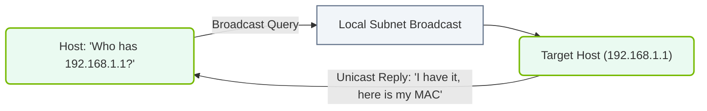

# 14.2d ARP (Address Resolution Protocol): Resolving IP Addresses to MAC Addresses

#### 🏷️ The AI Data Center Networking — Moving Petabytes Without Latency > 14 Enterprise Networking Baseline > 14.2 Ethernet Fundamentals — Switching, VLANs, and IP Routing

Welcome to the world of network communication! As a new engineer diving into AI infrastructure and operations, you'll quickly learn that devices on a network need to talk to each other. But here's the catch: they speak two different "languages." IP addresses (like **192.168.1.10**) are used for logical routing across networks, while MAC addresses (like **00:1A:2B:3C:4D:5E**) are used for physical delivery within a local network. **ARP (Address Resolution Protocol)** is the translator that bridges this gap.

---

## 🌐 Context: Why ARP Matters in AI Infrastructure

In an AI data center, servers, GPUs, and storage nodes constantly exchange massive datasets. Before any data packet can be sent from one machine to another on the same local network, the sender must know the destination's MAC address. Without ARP, your AI training job's data would never leave the source server. ARP ensures that every IP-to-MAC mapping is discovered and cached, enabling low-latency, high-throughput communication.

---

## ⚙️ How ARP Works: The Basic Flow

ARP operates at Layer 2 (Data Link) and Layer 3 (Network) of the OSI model. Here's the simple step-by-step process:

- **Step 1: Need to Communicate** — Device A (IP: **192.168.1.10**) wants to send data to Device B (IP: **192.168.1.20**) on the same subnet.
- **Step 2: Check the ARP Cache** — Device A looks in its local ARP table (a temporary memory store) for Device B's MAC address.
- **Step 3: Send an ARP Request (Broadcast)** — If no entry exists, Device A broadcasts an ARP request to all devices on the local network: *"Who has IP 192.168.1.20? Tell me your MAC address!"*
- **Step 4: Receive an ARP Reply (Unicast)** — Device B recognizes its IP and sends a direct ARP reply back to Device A: *"I am 192.168.1.20, and my MAC address is 00:1A:2B:3C:4D:5E."*
- **Step 5: Update the ARP Cache** — Device A stores this mapping in its ARP table for future use.
- **Step 6: Send the Data** — Now Device A can encapsulate the IP packet inside an Ethernet frame with the correct destination MAC address.

---

## 🕵️ ARP Packet Structure (Simplified)

An ARP message is small and efficient. Here are the key fields:

- **Hardware Type** — Specifies the network type (e.g., Ethernet = 1).
- **Protocol Type** — Specifies the protocol (e.g., IPv4 = 0x0800).
- **Hardware Size** — Length of MAC address (6 bytes for Ethernet).
- **Protocol Size** — Length of IP address (4 bytes for IPv4).
- **Opcode** — Indicates if it's a request (1) or reply (2).
- **Sender MAC Address** — MAC of the device sending the ARP message.
- **Sender IP Address** — IP of the device sending the ARP message.
- **Target MAC Address** — MAC of the device being queried (set to zeros in a request).
- **Target IP Address** — IP of the device being queried.

---

## 📊 ARP Cache: The Short-Term Memory

Every network device maintains an ARP cache (table) to avoid repeating broadcasts. Here's what a typical entry looks like:

| IP Address | MAC Address | Type | Age (minutes) |
|------------|-------------|------|---------------|
| 192.168.1.20 | 00:1A:2B:3C:4D:5E | Dynamic | 4 |
| 192.168.1.1 | 00:AA:BB:CC:DD:EE | Static | Permanent |

- **Dynamic entries** — Learned automatically via ARP. They expire after a timeout (usually 2–10 minutes).
- **Static entries** — Manually configured and never expire. Useful for critical infrastructure like gateways.

---

## 🛠️ Common ARP Issues in AI Data Centers

Even in high-performance environments, ARP can cause problems. Watch out for:

- **ARP Cache Poisoning (Spoofing)** — A malicious device sends fake ARP replies to redirect traffic. This can disrupt AI training jobs or steal data.
- **ARP Table Overflow** — Too many devices on a subnet can fill the cache, causing legitimate entries to be dropped.
- **Broadcast Storm** — Excessive ARP requests can flood the network, increasing latency for AI data transfers.
- **Stale Entries** — If a device changes its network card (MAC address), old ARP entries cause communication failures until they expire.

---

### 📊 Visual Representation: Address Resolution Protocol (ARP) IP-to-MAC Resolution
This diagram displays how ARP queries are broadcast across the local subnet to resolve target IP addresses into physical MAC addresses.

## 🔍 Viewing and Managing ARP (No Code Blocks)

To inspect ARP on a Linux-based AI server, you would use the **arp** command. For example:

- To display the current ARP cache: **arp -a** or **arp -n**
- To delete a specific entry: **arp -d 192.168.1.20**
- To add a static entry: **arp -s 192.168.1.20 00:1A:2B:3C:4D:5E**

On Windows systems, the command is **arp -a** to view the table.

📤 Output: A typical **arp -a** output might look like:
**? (192.168.1.20) at 00:1A:2B:3C:4D:5E [ether] on eth0**

---

## 📈 ARP in the Context of AI Infrastructure

In an AI data center, ARP plays a critical role in:

- **GPU-to-GPU Communication** — When using technologies like NVIDIA GPUDirect, ARP ensures that data packets between GPU servers are delivered to the correct physical network interface.
- **Storage Access** — AI training often reads from Network Attached Storage (NAS) or parallel file systems. ARP resolves the storage server's IP to its MAC for direct data transfer.
- **Cluster Management** — Orchestration tools (e.g., Kubernetes) rely on ARP for pod-to-pod communication across nodes.

---

## 🧠 Key Takeaways for New Engineers

- **ARP is essential** — Without it, IP packets cannot be delivered on a local network.
- **ARP is local** — It only resolves addresses within the same subnet. For cross-network communication, routers use a different process.
- **ARP is dynamic** — Entries are learned and expire automatically, but can be manually managed.
- **ARP is a security concern** — Always monitor for spoofing in production AI environments.
- **ARP is fast** — The protocol is lightweight, but broadcast storms can degrade performance in large clusters.

---

## ✅ Quick Reference: ARP vs. Other Resolution Protocols

| Protocol | Purpose | Layer | Scope |
|----------|---------|-------|-------|
| ARP | IP to MAC (IPv4) | Layer 2/3 | Local subnet |
| NDP (Neighbor Discovery Protocol) | IP to MAC (IPv6) | Layer 2/3 | Local subnet |
| DNS | Hostname to IP | Layer 7 | Entire internet |
| RARP (Reverse ARP) | MAC to IP (legacy) | Layer 2/3 | Local subnet |

---

## 🚀 Final Thought

As you build and operate AI infrastructure, remember that every petabyte of data moving between servers starts with a tiny ARP request. Mastering this fundamental protocol will help you troubleshoot network issues, optimize performance, and secure your AI data center. Keep this guide handy — you'll refer to it often!