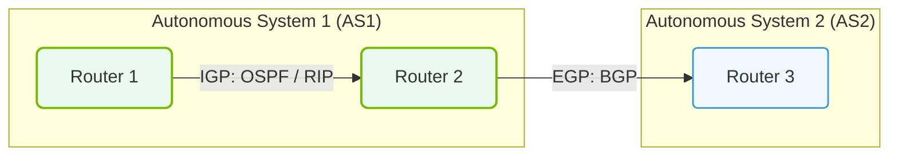

# 14.2e Routing protocols overview: static routes, BGP for large AI cloud fabrics

#### 🏷️ The AI Data Center Networking — Moving Petabytes Without Latency > 14 Enterprise Networking Baseline > 14.2 Ethernet Fundamentals — Switching, VLANs, and IP Routing

---

## 🌐 Context Introduction

In AI infrastructure, data moves at massive scale — think petabytes of training data flowing between GPU servers, storage clusters, and inference endpoints. Routing protocols are the "traffic cops" that decide how this data travels across the network fabric.

For new engineers, understanding routing is critical because:
- **AI workloads are bandwidth-hungry** — a single training job can saturate 400 Gbps links.
- **Latency matters** — milliseconds of delay can stall thousands of GPUs waiting for data.
- **Scale is enormous** — AI cloud fabrics can have hundreds of switches and thousands of endpoints.

This section covers two fundamental routing approaches: **static routes** (simple and predictable) and **BGP** (the workhorse of large AI networks).

---

## ⚙️ Static Routes — The Simple, Predictable Path

### What Are Static Routes?

A static route is a manually configured path that tells a switch or router: *"To reach this network, send traffic to this next-hop device."* Think of it like giving someone a printed map — it never changes unless you update it.

### When to Use Static Routes in AI Fabrics

- **Small test clusters** (e.g., 4–8 GPU servers)
- **Management networks** (e.g., out-of-band management for switches)
- **Default routes** (e.g., "send all unknown traffic to the internet gateway")
- **Edge connections** where only one path exists

### Key Characteristics

| Feature | Static Route Behavior |
|---------|----------------------|
| Configuration | Manual — every route typed by an engineer |
| Adaptability | None — if a link fails, traffic stops |
| Overhead | Zero — no protocol processing |
| Scalability | Poor — hundreds of routes become unmanageable |
| Convergence time | N/A — requires manual intervention to fix |

### 🛠️ Real-World Example: Static Route for a GPU Pod

Imagine you have a small AI training pod with 8 GPU servers on network **10.0.1.0/24**. The pod connects to a top-of-rack (ToR) switch. To reach the storage network **192.168.10.0/24**, you configure:

- **On the ToR switch:** A static route saying *"Traffic to 192.168.10.0/24 goes to next-hop 10.0.0.1"* (the upstream spine switch).

**Limitation:** If the spine switch fails, the GPU servers can't reach storage until an engineer updates the route.

---

## 🕵️ BGP — The Dynamic Routing Protocol for AI Clouds

### What Is BGP?

**Border Gateway Protocol (BGP)** is the routing protocol that powers the internet — and increasingly, large AI data center fabrics. Unlike static routes, BGP **dynamically learns** about available paths and adapts when links fail.

### Why BGP for AI Cloud Fabrics?

AI workloads demand:
- **High availability** — training jobs can run for weeks; a routing failure must be self-healing.
- **Load balancing** — BGP can spread traffic across multiple parallel links (ECMP).
- **Scalability** — BGP handles thousands of routes across hundreds of switches.
- **Traffic engineering** — you can influence which paths AI traffic takes.

### How BGP Works in an AI Fabric

1. **Peering:** Switches form BGP sessions with their neighbors (e.g., a leaf switch peers with two spine switches).
2. **Route advertisement:** Each switch tells its peers about the networks it can reach (e.g., "I can reach GPU subnet 10.0.1.0/24").
3. **Path selection:** BGP chooses the best path based on metrics like **AS path length** (fewer hops = better) and **local preference** (you can set priorities).
4. **Convergence:** If a link fails, BGP automatically recalculates paths in seconds.

### 🏗️ BGP in a Clos (Leaf-Spine) Topology

Most large AI fabrics use a **Clos topology** (also called leaf-spine). Here's how BGP fits:

- **Leaf switches** (connected to GPU servers) advertise their server subnets to all spine switches.
- **Spine switches** (the fabric backbone) propagate these routes to other leaf switches.
- **Result:** Every leaf knows how to reach every server through any spine — providing **multiple parallel paths**.

---

### 📊 Visual Representation: IGP vs. EGP Routing Scopes
This diagram contrasts Interior Gateway Protocols (IGP, within an autonomous system) against Exterior Gateway Protocols (EGP, between autonomous systems).

## 📊 Comparison: Static Routes vs. BGP for AI Fabrics

| Aspect | Static Routes | BGP |
|--------|---------------|-----|
| **Setup complexity** | Low — just type a few commands | Medium — requires peering configuration |
| **Failure recovery** | Manual — engineer must fix | Automatic — seconds to converge |
| **Load balancing** | Manual — must configure per-path | Built-in — ECMP across equal-cost paths |
| **Scale limit** | ~50–100 routes before unmanageable | Thousands of routes, hundreds of peers |
| **Best for** | Small clusters, management networks | Large AI fabrics (100+ GPU nodes) |
| **Resource usage** | Zero CPU/memory | Light — BGP uses minimal switch resources |
| **Traffic engineering** | None — fixed paths | Flexible — adjust local preference, AS path prepend |

---

## 🛠️ When to Choose Which

### ✅ Use Static Routes When:

- You have fewer than 10 GPU servers
- The network topology never changes
- You need a simple "default route to the internet"
- You're building a lab or test environment

### ✅ Use BGP When:

- You have 50+ GPU servers across multiple racks
- You need automatic failover (training jobs must not stop)
- You want to use **equal-cost multipath (ECMP)** for maximum bandwidth
- You're building a production AI cloud fabric

---

## 🧠 Key Takeaway for New Engineers

**Static routes** are like a paper map — great for a small neighborhood, but useless for navigating a city. **BGP** is like GPS — it adapts to road closures, finds the fastest route, and scales to any size.

For AI infrastructure, **BGP is the standard** for the data plane (where training data flows). Static routes are reserved for management and small-scale deployments.

### 🔍 Quick Self-Check

Ask yourself these questions when designing routing for an AI fabric:

1. **How many GPU servers?** >50 → BGP. <10 → Static may work.
2. **Can training tolerate downtime?** No → BGP for automatic recovery.
3. **Do you need multiple active paths?** Yes → BGP with ECMP.
4. **Is this a production system?** Yes → Always use BGP for the data fabric.

---

## 📚 Further Context

- BGP in AI fabrics typically uses **eBGP** (external BGP) even between switches in the same data center — this keeps routing simple and avoids complex iBGP rules.
- Modern AI fabrics often run **BGP unnumbered** — where interfaces use IPv6 link-local addresses, eliminating the need to assign IPs to every link.
- **BGP timers** can be tuned for faster convergence (e.g., 1-second keepalive, 3-second hold timer) to minimize disruption during link failures.

---

*Next step: Explore how BGP interacts with **RDMA over Converged Ethernet (RoCE)** for lossless AI traffic.*