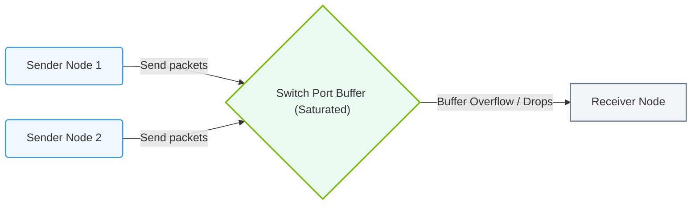

# 15.1d Incast and fan-in congestion: when 1000 GPUs send to one switch simultaneously

#### 🏷️ The AI Data Center Networking — Moving Petabytes Without Latency > 15 The AI Traffic Problem — Why Standard Networks Fail AI Clusters > 15.1 Traffic Patterns in AI Clusters

---

## 🧠 Context Introduction

Imagine you're in a large classroom with 1,000 students. The teacher asks a single question, and all 1,000 students immediately raise their hands to answer. The teacher can only listen to one student at a time. That's exactly what happens in an AI cluster when **incast congestion** occurs.

In AI training, GPUs frequently need to synchronize their results. When 1,000 GPUs all try to send their data to a single switch at the same moment, the switch gets overwhelmed. This creates a traffic jam called **fan-in congestion** — and it's one of the biggest performance killers in AI infrastructure.

---

## ⚙️ What Is Incast Congestion?

**Incast congestion** happens when multiple senders (GPUs) simultaneously transmit data to a single receiver (a switch or another GPU) through a shared network path.

| Concept | Simple Explanation |
|---------|-------------------|
| **Incast** | Many-to-one traffic pattern |
| **Fan-in** | Traffic converging on a single point |
| **Congestion** | The switch can't process all data at once |

**Key point:** In AI clusters, this is not rare — it's the *normal* behavior during gradient synchronization steps.

---

## 📊 Why Does This Happen in AI Clusters?

AI training uses **distributed computing** where many GPUs work together. After each training step, GPUs must share their results (gradients) with each other. This creates a **synchronization barrier** where:

- **All 1,000 GPUs** finish their computation at roughly the same time
- **All 1,000 GPUs** try to send data to a central switch
- **The switch** becomes the bottleneck

**The result:** Network latency spikes, training stalls, and GPU utilization drops dramatically.

---

## 🛠️ The Real Impact on Performance

When incast congestion hits, here's what happens inside the network:

- **Buffer overflow:** The switch's memory fills up instantly
- **Packet drops:** Data gets thrown away because there's no room
- **Retransmissions:** GPUs must resend lost data, wasting time
- **Tail latency:** Some packets arrive extremely late, holding up the entire training step

**Simple analogy:** Think of a single checkout lane at a supermarket. 1,000 customers all arrive at the same time. Only one can check out at a time. Everyone else waits — and waits — and waits.

---

### 📊 Visual Representation: TCP Incast Fan-in Switch Buffer Congestion
This flowchart shows TCP Incast: multiple sender nodes transmit concurrently to a single receiver, saturating the switch port buffer.

## 🕵️ How Engineers Detect Incast Congestion

Engineers look for these telltale signs:

- **High packet loss** on switch ports (above 0.1%)
- **Spikes in network latency** during synchronization phases
- **GPU idle time** increasing while waiting for network data
- **Training throughput** dropping below expected levels

**Monitoring tools** that help detect this:

- **NVIDIA NetQ** — shows real-time switch buffer utilization
- **NVIDIA DCGM** — reports GPU communication stalls
- **Standard network counters** — track packet drops and retransmissions

---

## 🛡️ Solutions to Mitigate Incast Congestion

Engineers use several strategies to prevent or reduce incast congestion:

| Solution | How It Works |
|----------|--------------|
| **Switch buffer sizing** | Use switches with larger memory to absorb bursts |
| **Flow control** | Pause senders when buffers are full (Priority Flow Control) |
| **ECN marking** | Switches signal senders to slow down before buffers fill |
| **Load balancing** | Spread traffic across multiple paths (e.g., Equal-Cost Multi-Path) |
| **Topology design** | Use leaf-spine architecture to avoid single-switch bottlenecks |

**The most common fix:** **NVIDIA Spectrum switches** use advanced buffering and congestion management to handle these bursts without dropping packets.

---

## 📈 Real-World Example: 1,000 GPUs Sending to One Switch

Here's what a typical incast event looks like in practice:

- **Normal network latency:** 1-2 microseconds
- **During incast:** Latency spikes to 100+ microseconds
- **Without mitigation:** Packet loss of 5-10%
- **With proper buffering:** Zero packet loss, latency stays under 10 microseconds

**The difference** between a well-designed network and a poorly designed one can be **2-5x slower training times** for the same AI model.

---

## ✅ Key Takeaways for New Engineers

- **Incast congestion is inevitable** in AI clusters — it's not a bug, it's a feature of distributed training
- **The switch is the bottleneck** — not the GPUs or the cables
- **Buffer size matters** — bigger switch buffers handle incast better
- **Detection is easy** — watch for packet loss and latency spikes during synchronization
- **Mitigation requires hardware** — use switches designed for AI workloads (like NVIDIA Spectrum)

**Remember:** If you see training slowing down and network counters showing packet drops, you're almost certainly looking at incast congestion. The fix is usually better switch hardware or smarter traffic management — not faster GPUs.