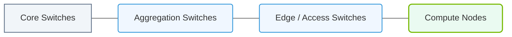

# 15.2c Fat-Tree topology: non-blocking bandwidth in high-performance clusters

#### 🏷️ The AI Data Center Networking — Moving Petabytes Without Latency > 15 The AI Traffic Problem — Why Standard Networks Fail AI Clusters > 15.2 Network Topology Designs for AI Clusters

## 🧠 Context Introduction

When engineers build high-performance clusters for AI workloads, one of the biggest challenges is moving data between GPUs quickly. In standard networks, if too many devices try to talk at once, the network becomes a bottleneck — like a highway during rush hour. The **Fat-Tree topology** solves this by providing multiple parallel paths between any two devices, ensuring that the network never slows down, no matter how much data is flowing. This is called **non-blocking bandwidth**.

---

## ⚙️ What is a Fat-Tree Topology?

A Fat-Tree is a specific network design where switches are arranged in layers, and the links between them get "fatter" (higher bandwidth) as you move up the tree. Unlike a traditional tree topology (where traffic bottlenecks at the root), a Fat-Tree provides multiple equal-cost paths between any two endpoints.

### Key characteristics:
- **Layered design**: Typically 3 layers — **Leaf**, **Spine**, and **Core** (or sometimes just Leaf and Spine for smaller clusters)
- **Multiple paths**: Every server can reach any other server through many different routes
- **Non-blocking**: The total bandwidth available at each layer equals or exceeds the bandwidth required by the layer below
- **Scalable**: You can add more switches and servers without redesigning the entire network

---

## 📊 How Fat-Tree Achieves Non-Blocking Bandwidth

The secret lies in the **oversubscription ratio**. In a non-blocking Fat-Tree, this ratio is **1:1** — meaning the bandwidth going into a switch equals the bandwidth coming out.

### Simple analogy:
- Imagine a **standard tree** as a single escalator in a mall — everyone must use it, causing a bottleneck
- A **Fat-Tree** is like having 10 escalators side by side — no waiting, no congestion

### In technical terms:
- **Leaf switches** connect directly to servers (e.g., 40 servers per leaf)
- **Spine switches** connect to every leaf switch, providing uplink bandwidth
- **Core switches** connect to multiple spine switches for even larger clusters
- Each server has the same bandwidth to any other server, regardless of location in the cluster

---

## 🛠️ Typical Fat-Tree Architecture (3-Tier Example)

Here is how a basic 3-tier Fat-Tree is structured for an AI cluster:

| Layer | Switch Type | Purpose | Example Port Count |
|-------|-------------|---------|-------------------|
| 🖥️ **Leaf** | Top-of-Rack (ToR) | Connects directly to servers | 48 x 25G downlinks, 8 x 100G uplinks |
| 🔗 **Spine** | Aggregation | Connects all leaf switches together | 32 x 100G ports |
| 🌐 **Core** | Core | Connects multiple spine switches | 128 x 100G ports |

**How traffic flows:**
- Server A (under Leaf 1) wants to talk to Server B (under Leaf 2)
- Traffic goes: Server A → Leaf 1 → Spine 1 → Leaf 2 → Server B
- There are many spines available, so the path can be chosen dynamically to avoid congestion

---

### 📊 Visual Representation: Fat-Tree Multi-Tier Switched Fabric
This diagram displays the multi-tiered Fat-Tree topology, maintaining full non-blocking throughput by increasing connection density closer to the core.

## 🕵️ Why Standard Networks Fail — and Fat-Tree Succeeds

| Problem | Standard Network | Fat-Tree Solution |
|---------|------------------|-------------------|
| 🚦 **Bottleneck at root** | All traffic goes through one root switch | Multiple core switches share the load |
| 🚧 **Single point of failure** | One switch failure takes down the network | Multiple paths mean traffic reroutes automatically |
| 📉 **Oversubscription** | 10:1 or worse (10x more devices than bandwidth) | 1:1 (full bandwidth for every device) |
| 🐢 **All-to-all communication** | AI training requires every GPU to talk to every other GPU — standard networks collapse | Fat-Tree handles this naturally with parallel paths |

---

## 🧩 Real-World Example: Building a 128-GPU Cluster

For engineers planning a small AI cluster with 128 GPUs (e.g., 32 servers with 4 GPUs each):

**Design choices:**
- Use **16 leaf switches**, each connecting 8 servers (32 servers total)
- Use **8 spine switches**, each connecting to all 16 leaf switches
- Each server connects at **100 Gbps** to its leaf switch
- Each leaf switch connects at **8 x 100 Gbps** to the spine layer

**Result:**
- Total server bandwidth: 32 servers × 100 Gbps = 3.2 Tbps
- Total spine bandwidth: 8 spines × 16 leaves × 100 Gbps = 12.8 Tbps
- The spine layer has **4x more bandwidth** than the server layer — fully non-blocking

---

## ✅ Key Takeaways for New Engineers

- **Fat-Tree is the gold standard** for AI clusters because it eliminates network congestion
- **Non-blocking** means the network is never the bottleneck — GPUs can communicate at full speed
- **Scaling is predictable**: Double the servers? Double the leaf and spine switches proportionally
- **Routing is simple**: Use Equal-Cost Multi-Path (ECMP) to spread traffic across all available paths
- **Cost vs. performance trade-off**: Fat-Tree requires more switches and cables than a traditional tree, but the performance gain for AI workloads is worth it

---

## 📚 Further Learning Path

1. Understand **oversubscription ratios** — this is the most important metric in cluster networking
2. Learn about **ECMP (Equal-Cost Multi-Path)** — the routing algorithm that makes Fat-Tree work
3. Explore **Clos topology** — Fat-Tree is a specific implementation of the more general Clos architecture
4. Practice designing a small Fat-Tree on paper (e.g., 16 servers, 4 leaf switches, 2 spine switches) to see how the math works

> 💡 **Pro tip**: When evaluating network gear for an AI cluster, always ask for the **bisection bandwidth** — this tells you the worst-case bandwidth between any two halves of the network. In a non-blocking Fat-Tree, bisection bandwidth equals the total server bandwidth.