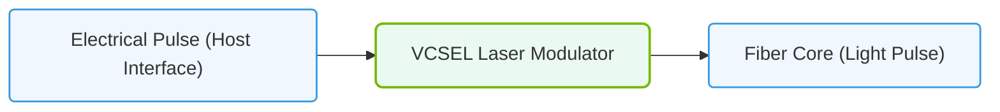

# 16.1b Optical transceivers: SFP28, QSFP28, QSFP-DD, OSFP — form factors and speeds

#### 🏷️ The AI Data Center Networking — Moving Petabytes Without Latency > 16 High-Speed Ethernet for AI — Spectrum-X, RoCEv2, and Lossless Fabrics > 16.1 Modern Ethernet Speeds for AI

---

## 🔍 Context Introduction

In AI data centers, optical transceivers are the physical components that convert electrical signals into light pulses and back again, enabling data to travel over fiber optic cables. Think of them as the "connectors" that plug into your network switch ports and server NICs. For AI workloads, choosing the right transceiver form factor is critical — it determines how fast data moves between GPUs, storage, and the network fabric.

This guide covers the four most common transceiver types you'll encounter in modern AI infrastructure: **SFP28**, **QSFP28**, **QSFP-DD**, and **OSFP**. Each has a distinct physical size (form factor) and supports specific data rates.

---

## ⚙️ What is a Form Factor?

A form factor defines the physical dimensions, electrical interface, and mechanical design of a transceiver. It dictates:
- How many ports fit on a switch faceplate
- Maximum data rate per port
- Cable type compatibility (copper vs. fiber)
- Power consumption and cooling requirements

---

## 📊 The Four Key Transceivers for AI

### 🔹 SFP28 (Small Form-factor Pluggable 28)

**Speed:** 25 Gbps per lane (single channel)

**Common Use:** Server NIC connections, leaf-to-spine links at moderate speeds

**Key Details:**
- Same physical size as SFP+ (10G) — backward compatible with SFP+ cages
- Uses a single electrical lane
- Typical reach: up to 10 km with single-mode fiber
- Often used for connecting GPU servers to top-of-rack switches at 25G

---

### 🔹 QSFP28 (Quad Small Form-factor Pluggable 28)

**Speed:** 100 Gbps (4 lanes × 25 Gbps)

**Common Use:** Spine-to-leaf uplinks, storage fabric, high-performance compute clusters

**Key Details:**
- Four electrical lanes in one module
- Can be broken out into 4×25G SFP28 connections using a breakout cable
- Dominant form factor for 100G Ethernet in AI data centers
- Supports both copper DAC (Direct Attach Copper) and fiber optics

---

### 🔹 QSFP-DD (Quad Small Form-factor Pluggable Double Density)

**Speed:** 200 Gbps or 400 Gbps (8 lanes × 25/50 Gbps)

**Common Use:** High-density spine switches, AI fabric core, GPU-to-GPU interconnects

**Key Details:**
- Backward compatible with QSFP28 cages (with adapter)
- Twice the lane count of QSFP28 (8 lanes instead of 4)
- Supports 200G (8×25G) and 400G (8×50G) configurations
- Most common form factor for 400G Ethernet in current AI deployments
- Higher power draw — requires proper airflow management

---

### 🔹 OSFP (Octal Small Form-factor Pluggable)

**Speed:** 400 Gbps or 800 Gbps (8 lanes × 50/100 Gbps)

**Common Use:** Next-gen AI fabric, 800G spine switches, future-proofed infrastructure

**Key Details:**
- Slightly larger than QSFP-DD — designed for better thermal performance
- Supports 400G (8×50G) and emerging 800G (8×100G) standards
- Not backward compatible with QSFP cages without adapters
- Preferred by some vendors for high-power 800G optics
- Better heat dissipation for high-density deployments

---

### 📊 Visual Representation: Laser-Fiber Transceiver Modules
This diagram displays how optical transceivers modulate electrical pulses into laser beams for fiber cable transmission.

## 🛠️ Comparison Table

| Form Factor | Max Speed | Lanes | Typical Use | Backward Compatible |
|-------------|-----------|-------|-------------|---------------------|
| SFP28 | 25 Gbps | 1 | Server NICs, leaf switches | SFP+ (10G) |
| QSFP28 | 100 Gbps | 4 | Spine-leaf uplinks, storage | QSFP+ (40G) |
| QSFP-DD | 400 Gbps | 8 | AI fabric core, 400G spine | QSFP28 (with adapter) |
| OSFP | 800 Gbps | 8 | Next-gen AI, 800G fabric | None (new form factor) |

---

## 🕵️ How to Choose for AI Workloads

- **For GPU server connections:** Start with **SFP28** (25G) or **QSFP28** (100G) depending on your GPU density and bandwidth requirements.
- **For spine-to-leaf fabric:** Use **QSFP28** (100G) or **QSFP-DD** (400G) — 400G is becoming the standard for AI clusters.
- **For future-proofing:** Consider **OSFP** if you plan to scale to 800G within 2–3 years.
- **For cost-sensitive builds:** **QSFP28** offers the best price-to-performance ratio today.
- **For maximum density:** **QSFP-DD** provides the most ports per switch faceplate at 400G.

---

## 📝 Practical Tips for Engineers

- Always check the **switch vendor's transceiver compatibility matrix** before purchasing — not all optics work with all switches.
- Use **DAC cables** for short distances (up to 7 meters) — they are cheaper and consume less power than fiber optics.
- For longer runs (10m+), use **fiber optic transceivers** with single-mode or multi-mode fiber.
- Label your transceivers with speed and distance ratings — it saves troubleshooting time later.
- Monitor **optical power levels** using switch CLI or management tools — low power indicates dirty connectors or failing optics.

---

## ✅ Summary

| Transceiver | Speed | When to Use |
|-------------|-------|-------------|
| SFP28 | 25G | Server connections, low-cost links |
| QSFP28 | 100G | Standard AI fabric uplinks |
| QSFP-DD | 400G | High-density AI core fabric |
| OSFP | 800G | Future-proofed, high-power deployments |

Understanding these four form factors will help you design, deploy, and troubleshoot the physical layer of AI data center networks — the foundation upon which all high-speed communication depends.