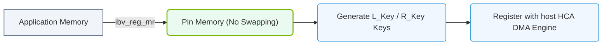

# 16.2c RDMA Verbs: the programming interface for Send, Receive, Write, and Read operations

#### 🏷️ The AI Data Center Networking — Moving Petabytes Without Latency > 16 High-Speed Ethernet for AI — Spectrum-X, RoCEv2, and Lossless Fabrics > 16.2 RDMA over Converged Ethernet v2 (RoCEv2)

---

## 🌐 Context Introduction

When you work with AI workloads, moving data between servers (like GPUs in different nodes) must happen extremely fast. Traditional networking uses the CPU to copy data from one machine's memory to another, which adds delays. **RDMA (Remote Direct Memory Access)** bypasses the CPU, letting one computer directly read or write data into another computer's memory over the network.

To use RDMA, engineers write code using something called **RDMA Verbs**. Think of Verbs as a set of building blocks or instructions that tell your network hardware (like an NVIDIA ConnectX NIC) what to do. The four most important operations are **Send, Receive, Write, and Read**.

---

## ⚙️ What Are RDMA Verbs?

RDMA Verbs are the programming interface (API) that allows software to communicate with RDMA-capable hardware. They are like the "words" in a language that your application uses to talk to the network card.

- **Verbs** are standardized by the InfiniBand Trade Association and work across different RDMA technologies (InfiniBand, RoCE, iWARP).
- They give you direct control over data movement without involving the operating system kernel.
- The main goal: move data from one memory location to another with minimal CPU involvement.

---

## 🛠️ The Four Core RDMA Verbs

Let's break down the four fundamental operations: **Send, Receive, Write, and Read**.

### 📤 Send and Receive (Two-Sided Operations)

These work like a traditional conversation. One side sends data, and the other side must be ready to receive it.

- **Send Verb**: The sender places data into a Work Queue Element (WQE) and tells the NIC to transmit it.
- **Receive Verb**: The receiver must post a buffer (memory space) where incoming data will land.
- **Key point**: Both sides must coordinate. If the receiver hasn't posted a buffer, the send will fail.

**Analogy**: Like mailing a package. You (sender) put the package in the mail, but the recipient must have a mailbox ready to receive it.

### 📥 Write (One-Sided Operation)

This is where RDMA shines. The local machine writes data directly into the remote machine's memory without the remote CPU knowing about it.

- **Write Verb**: You specify a local buffer (where your data is) and a remote buffer (where you want it to go).
- The remote CPU is **not involved** — it doesn't need to post a receive buffer.
- **Key point**: You need to know the remote memory address and a special key (called an R_key) to access it.

**Analogy**: Like having a key to your neighbor's house. You walk in, drop off a package, and leave — your neighbor never needs to open the door.

### 📖 Read (One-Sided Operation)

The opposite of Write. The local machine reads data directly from the remote machine's memory.

- **Read Verb**: You specify a remote buffer (where the data lives) and a local buffer (where you want to store it).
- Again, the remote CPU is **not involved**.
- **Key point**: You must have permission (R_key) to read the remote memory.

**Analogy**: Like looking at a book on your neighbor's shelf without asking them. You just walk in, read the page, and leave.

---

## 🕵️ Comparison Table: Two-Sided vs. One-Sided Operations

| Feature | Send / Receive (Two-Sided) | Write / Read (One-Sided) |
|---------|---------------------------|--------------------------|
| **Remote CPU involvement** | Required (must post receive buffer) | Not required |
| **Latency** | Higher (needs handshake) | Lower (direct memory access) |
| **Complexity** | Simpler to set up | Requires memory registration and keys |
| **Use case** | Small messages, control signals | Large data transfers, AI training |
| **Coordination** | Both sides must agree | Only one side initiates |

---

### 📊 Visual Representation: RDMA Verbs Client Memory Registration
This diagram displays how memory pages are locked and registered with the local HCA using the Verbs API.

## 🧩 How Verbs Work in Practice

When you write an RDMA application, you follow a sequence of steps:

1. **Create a Protection Domain (PD)**: A container that groups resources together for security.
2. **Register Memory**: Tell the NIC which memory regions it can access. This gives you a **local key (lkey)** and **remote key (rkey)**.
3. **Create Queue Pairs (QP)**: A QP is like a communication channel. It has a **Send Queue** and a **Receive Queue**.
4. **Post Work Requests (WR)**: You place Verbs (Send, Receive, Write, Read) into the queues.
5. **Poll for Completion**: Check if the operation finished successfully.

---

## 📊 Simple Example Flow

Here is a high-level view of how a **Write** operation works:

- **Step 1**: Machine A registers a buffer (local memory) with the NIC.
- **Step 2**: Machine B registers a buffer (remote memory) and shares its address and rkey with Machine A.
- **Step 3**: Machine A posts a **Write Verb** to its Send Queue, specifying:
  - Local buffer address and lkey
  - Remote buffer address and rkey
  - Data length
- **Step 4**: The NIC on Machine A sends the data directly to Machine B's memory.
- **Step 5**: Machine A polls for a completion event to confirm success.

---

## 🧠 Key Concepts for New Engineers

- **Work Queue Element (WQE)**: The instruction you post to a queue. Each WQE describes one Verb operation.
- **Completion Queue (CQ)**: Where the NIC posts notifications that an operation is done.
- **Memory Registration**: You must tell the NIC which memory it can access. This is done with **ibv_reg_mr()**.
- **R_key**: A remote key that grants permission to access remote memory. Treat it like a password.
- **Q_Key**: A key used for queue pair security (less common in RoCEv2).

---

## 🔧 Common Pitfalls to Avoid

- **Forgetting to post receive buffers**: For Send/Receive, if the receiver hasn't posted a buffer, the send will fail.
- **Using wrong R_key**: Write and Read operations will fail if the remote key is incorrect or expired.
- **Not polling completions**: Always check if your Verb operation succeeded. Silent failures can corrupt data.
- **Mixing PDs**: Resources from different Protection Domains cannot talk to each other.

---

## 📚 Summary

| Verb | Type | What It Does |
|------|------|--------------|
| **Send** | Two-Sided | Transmits data to a remote machine that must be ready to receive |
| **Receive** | Two-Sided | Prepares a buffer to accept incoming data from a Send |
| **Write** | One-Sided | Writes data directly into remote memory without remote CPU |
| **Read** | One-Sided | Reads data directly from remote memory without remote CPU |

RDMA Verbs give you the power to move data at incredible speeds — essential for AI training where terabytes of data must flow between GPUs. As a new engineer, start by understanding the difference between two-sided (Send/Receive) and one-sided (Write/Read) operations. Then practice with simple examples to see how memory registration and queue pairs work in real code.