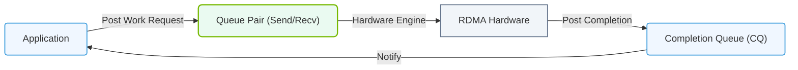

# 16.2d Queue Pairs (QPs): the communication endpoints in RDMA

#### 🏷️ The AI Data Center Networking — Moving Petabytes Without Latency > 16 High-Speed Ethernet for AI — Spectrum-X, RoCEv2, and Lossless Fabrics > 16.2 RDMA over Converged Ethernet v2 (RoCEv2)

## 🔍 Context Introduction

In RDMA (Remote Direct Memory Access) communication, data moves directly between the memory of two servers without involving the CPU or operating system for every packet. To make this happen, each server needs a dedicated communication channel. This channel is called a **Queue Pair (QP)**.

Think of a Queue Pair as a two-way postal service between two applications. One side (the Send Queue) handles outgoing letters, and the other side (the Receive Queue) handles incoming letters. The QP is the endpoint that connects these two queues to a remote QP on another server.

---

## ⚙️ What is a Queue Pair (QP)?

A Queue Pair is the fundamental communication endpoint in RDMA. Each QP consists of three components:

- **Send Queue (SQ)** — Holds work requests for sending data to a remote node.
- **Receive Queue (RQ)** — Holds work requests for receiving data from a remote node.
- **Completion Queue (CQ)** — Notifies the application when a send or receive operation finishes.

When an application wants to send data, it places a **Work Request (WR)** into the Send Queue. The RDMA network adapter (HCA or NIC) processes this request and moves the data directly to the remote server's memory. The remote server's Receive Queue holds a pre-posted buffer where the incoming data lands.

---

## 🛠️ How Queue Pairs Work in Practice

Here is a simple step-by-step flow of how two servers communicate using Queue Pairs:

1. **Server A** creates a QP and posts a receive buffer (a place to put incoming data) into its Receive Queue.
2. **Server B** creates its own QP and posts a send request into its Send Queue.
3. Server B's RDMA adapter reads the data from Server B's memory and sends it directly to Server A's memory.
4. Server A's RDMA adapter places the data into the pre-posted receive buffer.
5. Both servers get a completion notification in their Completion Queue.

This entire process happens **without any CPU involvement** on either side for the actual data movement.

---

## 📊 Types of Queue Pairs

There are three main types of Queue Pairs used in RDMA:

| QP Type | Description | Use Case |
|---------|-------------|----------|
| **Reliable Connection (RC)** | Guarantees delivery and ordering. Requires a one-to-one connection between two QPs. | Most common for AI training where data integrity is critical. |
| **Unreliable Connection (UC)** | No delivery guarantee, but still one-to-one. Lower overhead. | High-performance scenarios where occasional packet loss is acceptable. |
| **Unreliable Datagram (UD)** | No connection setup. One QP can send to many QPs. No ordering or delivery guarantee. | Broadcast or multicast-like communication. |

For AI workloads, **Reliable Connection (RC)** is the standard choice because it ensures every byte of gradient data arrives correctly and in order.

---

### 📊 Visual Representation: Queue Pair (QP) Work Request processing
This diagram displays the Queue Pair model: applications submit Work Requests (WR) to Send/Receive queues, which report status via Completion Queues (CQ).



## 🕵️ Key Characteristics of Queue Pairs

- **Each QP is identified by a unique QP Number** — This number is exchanged between servers during connection setup.
- **A single server can have thousands of QPs** — Each QP represents a separate communication channel to a different remote process or thread.
- **QPs are created and managed by the RDMA driver** — Engineers configure QP attributes like maximum message size, number of work requests, and completion queue association.
- **QPs operate in different states** — A QP goes through states like **Reset**, **Init**, **Ready to Receive (RTR)**, and **Ready to Send (RTS)** before it can communicate.

---

## 🧩 Example: Creating a Queue Pair (Conceptual)

To create a QP, engineers typically use the **ibv_create_qp()** function from the libibverbs library. Here is a simplified conceptual flow:

**For reference:**
```c
// Create a protection domain (PD)
struct ibv_pd *pd = ibv_alloc_pd(context);

// Create a completion channel and CQ
struct ibv_cq *cq = ibv_create_cq(context, cq_size, NULL, NULL, 0);

// Create a QP with RC type
struct ibv_qp_init_attr qp_attr;
memset(&qp_attr, 0, sizeof(qp_attr));
qp_attr.send_cq = cq;
qp_attr.recv_cq = cq;
qp_attr.qp_type = IBV_QPT_RC;
qp_attr.cap.max_send_wr = 16;
qp_attr.cap.max_recv_wr = 16;
qp_attr.cap.max_send_sge = 1;
qp_attr.cap.max_recv_sge = 1;

struct ibv_qp *qp = ibv_create_qp(pd, &qp_attr);
```

**📤 Output:** A new QP is created with a unique QP number. This QP number is then exchanged with the remote server to establish the connection.

---

## 🔗 Connecting Two Queue Pairs

For two QPs to communicate (in RC mode), they must be connected. This involves:

1. **Transition the local QP to Init state** — The QP is initialized but cannot send or receive yet.
2. **Exchange QP information** — Both servers share their QP number, GID (Global Identifier), and other attributes.
3. **Transition to Ready to Receive (RTR)** — The local QP is told about the remote QP and is ready to accept incoming data.
4. **Transition to Ready to Send (RTS)** — Both QPs can now send and receive data.

This connection setup is typically done using a **control path** (like TCP/IP or a management tool) before the RDMA data path becomes active.

---

## 🧠 Why Queue Pairs Matter for AI

In AI training, thousands of GPUs need to exchange gradient data every few milliseconds. Each GPU-to-GPU communication channel uses a dedicated Queue Pair. Key benefits:

- **Zero-copy data transfer** — Data moves directly from GPU memory to GPU memory without CPU copies.
- **Low latency** — No OS or kernel involvement for each message.
- **High throughput** — Multiple QPs can be used in parallel to saturate the network bandwidth.
- **Scalability** — A single server can manage thousands of QPs, each talking to a different remote GPU.

---

## ✅ Summary

- A **Queue Pair (QP)** is the endpoint for RDMA communication between two applications.
- Each QP has a **Send Queue**, **Receive Queue**, and **Completion Queue**.
- **Reliable Connection (RC)** QPs are the standard for AI workloads.
- QPs go through a **state machine** (Reset → Init → RTR → RTS) before they can communicate.
- Engineers configure QP attributes like queue depth, message size, and connection type.
- QPs enable **direct memory-to-memory data movement** without CPU involvement, which is critical for high-performance AI training.

Understanding Queue Pairs is the first step to mastering how data moves efficiently in modern AI data centers.