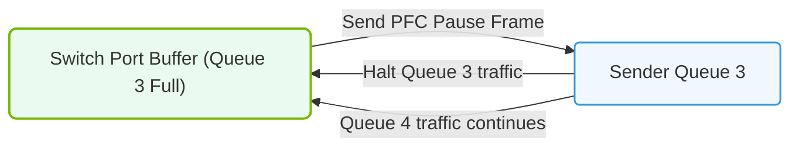

# 16.3b Priority Flow Control (PFC): per-priority pause frames to stop congestion

#### 🏷️ The AI Data Center Networking — Moving Petabytes Without Latency > 16 High-Speed Ethernet for AI — Spectrum-X, RoCEv2, and Lossless Fabrics > 16.3 Lossless Ethernet Configuration for RoCEv2

---

## 🌐 Context Introduction

In AI data centers, we move massive amounts of data between GPUs and storage systems. When too many packets arrive at a switch port at once, the switch's buffer fills up — this is called **congestion**. In traditional Ethernet, the switch simply drops packets when buffers overflow. For AI workloads using RDMA over Converged Ethernet (RoCEv2), dropped packets cause retransmissions, which dramatically increases latency and slows down training.

**Priority Flow Control (PFC)** solves this by sending a "pause" signal *before* the buffer overflows. Instead of dropping packets, the switch tells the sender to stop sending for a specific traffic class (priority). This keeps the network **lossless** — no packets are dropped, and AI training continues smoothly.

---

## ⚙️ How PFC Works — The Basics

PFC operates at Layer 2 (the data link layer) and works on a per-priority basis. Ethernet frames carry a 3-bit Priority Code Point (PCP) field, which defines 8 priority levels (0–7). PFC allows you to pause only one priority class at a time, leaving other traffic unaffected.

- **Per-priority pause frames**: When a switch port detects that its buffer for a specific priority is nearly full, it sends a **pause frame** back to the upstream device (another switch or a server NIC).
- **Pause frame content**: The frame specifies which priority to pause and for how long (in quanta — each quantum equals 512 bit-times).
- **Resume automatically**: The sender stops transmitting packets of that priority for the specified duration. After the time expires, transmission resumes automatically. The switch can also send an earlier resume frame if buffer space frees up.
- **No packet loss**: Because the pause happens *before* the buffer overflows, no packets are dropped for that priority class.

---

## 📊 PFC vs. Standard Ethernet Flow Control

| Feature | Standard Ethernet Flow Control (802.3x) | Priority Flow Control (802.1Qbb) |
|---------|----------------------------------------|----------------------------------|
| Scope | Pauses all traffic on a link | Pauses only one priority class |
| Granularity | Coarse (link-level) | Fine (per-priority) |
| Impact on other traffic | Blocks everything | Only blocks congested priority |
| Used for | General networks | Lossless RoCEv2 fabrics |
| Priority awareness | No | Yes (uses PCP values 0–7) |

---

### 📊 Visual Representation: Priority Flow Control (PFC) Pause Frame Mechanism
This diagram displays Priority Flow Control (PFC), pausing transmission on specific class-of-service queues when switch buffers fill.

## 🛠️ Configuring PFC in Practice

When setting up PFC for AI workloads, engineers typically follow these steps:

1. **Enable PFC globally** on the switch for the relevant ports.
2. **Map priority values** to traffic classes. For RoCEv2, priority 3 is commonly used for RDMA traffic, while other priorities carry standard TCP/IP traffic.
3. **Set buffer thresholds** — define when the switch should start sending pause frames (e.g., when buffer usage reaches 80%).
4. **Apply PFC to the correct priorities** — ensure only the RoCEv2 traffic class is paused, not control traffic or storage traffic.
5. **Verify on both ends** — the NIC (Network Interface Card) must also support PFC and be configured to respond to pause frames.

---

## 🕵️ Monitoring and Troubleshooting PFC

Even with PFC, problems can arise. Here are common issues and how to identify them:

- **PFC storms**: If a switch sends too many pause frames, it can cause head-of-line blocking — traffic of other priorities gets stuck behind paused traffic. Monitor the number of pause frames sent/received per port.
- **Incorrect priority mapping**: If RoCEv2 traffic uses priority 3 but PFC is configured for priority 5, no lossless behavior occurs. Verify PCP values match across all devices.
- **Buffer exhaustion**: If pause frames arrive too late, packets still drop. Check buffer utilization statistics on the switch.
- **NIC misconfiguration**: The server NIC must have PFC enabled and be set to trust the switch's priority markings. If the NIC ignores pause frames, lossless guarantees break.

**Key metrics to watch**:
- **Pause frame count** (sent and received per port)
- **Buffer occupancy** per priority class
- **Packet drop counters** for RoCEv2 traffic (should be zero in a healthy lossless fabric)

---

## ✅ Summary

Priority Flow Control is the mechanism that makes Ethernet "lossless" for AI workloads. By pausing only the congested priority class, PFC prevents packet drops without blocking unrelated traffic. For new engineers, remember these core points:

- PFC works per-priority (not per-link), using 802.1Qbb standard.
- It sends pause frames *before* buffer overflow, not after.
- RoCEv2 relies on PFC to maintain zero-packet-loss for RDMA traffic.
- Misconfiguration can cause PFC storms or head-of-line blocking — always monitor pause frame counts and buffer usage.

With PFC properly configured, your AI data center can move petabytes of training data with minimal latency and zero packet loss — exactly what GPU clusters need to stay busy and efficient.