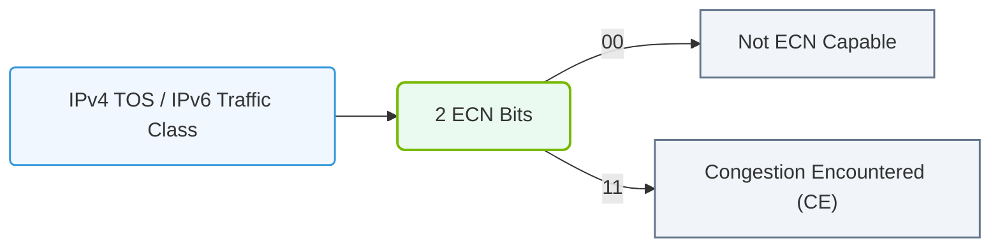

# 16.3c Explicit Congestion Notification (ECN): end-to-end congestion signaling

#### 🏷️ The AI Data Center Networking — Moving Petabytes Without Latency > 16 High-Speed Ethernet for AI — Spectrum-X, RoCEv2, and Lossless Fabrics > 16.3 Lossless Ethernet Configuration for RoCEv2

---

## 🌐 Context Introduction

In high-speed AI networks, congestion is a silent killer of performance. When multiple GPUs or servers try to send data through the same switch port, packets can be dropped, causing retransmissions that slow down training jobs. **Explicit Congestion Notification (ECN)** is a smarter way to handle this — instead of waiting for packet loss, the network *tells* the sender to slow down *before* packets are dropped. This is critical for RoCEv2 (RDMA over Converged Ethernet) because RDMA traffic is extremely sensitive to loss.

Think of ECN as a **"yellow light"** for your network traffic — it warns drivers (senders) to slow down before they crash (drop packets).

---

## ⚙️ How ECN Works — The Basics

ECN operates at the IP layer and uses two bits in the IP header (the ECN field) to signal congestion. Here is the simple flow:

1. **Sender marks packets as ECN-capable** — The sender sets the ECN field to indicate it supports ECN signaling.
2. **Switch detects congestion** — When a switch port starts to fill up (queue depth exceeds a threshold), it marks the packet's ECN field as "Congestion Experienced (CE)".
3. **Receiver echoes the signal** — The receiver sees the CE mark and sends a congestion notification back to the sender (usually via a special packet called a **CNP** — Congestion Notification Packet).
4. **Sender slows down** — The sender reduces its transmission rate until the congestion clears.

---

## 🛠️ ECN Marking vs. Drop — A Simple Analogy

| Scenario | Traditional (Drop) | ECN (Mark) |
|----------|-------------------|------------|
| Congestion detected | Switch drops the packet | Switch marks the packet |
| Sender reaction | Waits for timeout, retransmits | Immediately slows down |
| Performance impact | High latency, wasted bandwidth | Smooth rate adjustment |
| Best for | Loss-tolerant traffic | Loss-sensitive RDMA traffic |

---

## 🕵️ Key ECN Components in a RoCEv2 Network

- **ECT (ECN-Capable Transport) bit** — Set by the sender to indicate "I can handle ECN."
- **CE (Congestion Experienced) bit** — Set by the switch when congestion is detected.
- **CNP (Congestion Notification Packet)** — A special packet sent by the receiver back to the sender to signal "slow down."
- **Threshold (Kmin / Kmax)** — The queue depth values that trigger marking. When the queue exceeds Kmin, marking begins; at Kmax, all packets are marked.

---

## 📊 How to Configure ECN on NVIDIA Switches (Conceptual)

For new engineers, here is the logical configuration flow. Actual commands are shown below for reference.

**Step 1: Enable ECN globally on the switch**
- Set ECN to **enabled** on the switch.

**Step 2: Set ECN thresholds on the egress port**
- Define the **minimum threshold (Kmin)** — marking starts here.
- Define the **maximum threshold (Kmax)** — all packets are marked here.
- Set the **mark probability** — how aggressively to mark packets between Kmin and Kmax.

**Step 3: Enable ECN on the RoCEv2 traffic class**
- Apply ECN to the specific priority group used for RDMA traffic (usually priority 3 or 4).

**Step 4: Verify ECN is working**
- Check counters for ECN-marked packets.

---

For reference:

```
mlxconfig -d /dev/mst/mt4123_pciconf0 set ECN_ENABLE=1
mlxconfig -d /dev/mst/mt4123_pciconf0 set ECN_THRESHOLD_MIN=150000
mlxconfig -d /dev/mst/mt4123_pciconf0 set ECN_THRESHOLD_MAX=300000
mlxconfig -d /dev/mst/mt4123_pciconf0 set ECN_MARK_PROBABILITY=100
```

📤 **Output:** ECN enabled with Kmin=150000 bytes, Kmax=300000 bytes, 100% marking probability.

---

### 📊 Visual Representation: Explicit Congestion Notification (ECN) IP Header Bits
This diagram details the ECN bit settings (ECT and CE bits) within the IPv4/IPv6 Traffic Class fields.



## 🔄 End-to-End ECN Flow — Step by Step

1. **Sender** sends data with ECT bit set (ECN-capable).
2. **Switch** monitors queue depth on the egress port.
3. If queue depth exceeds **Kmin**, the switch marks the packet's CE bit.
4. **Receiver** sees the CE mark and generates a **CNP** back to the sender.
5. **Sender** receives the CNP and reduces its transmission rate (e.g., by 50%).
6. **Sender** gradually increases rate again (e.g., every 100 microseconds) until another CNP arrives.
7. This creates a **closed-loop feedback system** that prevents congestion without dropping packets.

---

## ✅ Why ECN Matters for AI Workloads

- **Zero packet loss** — Critical for RDMA, which cannot tolerate drops.
- **Lower latency** — No retransmissions mean faster job completion.
- **Higher throughput** — The network stays busy without wasting bandwidth on resends.
- **Fairness** — All flows get a fair share of bandwidth during congestion.

---

## ⚠️ Common Pitfalls for New Engineers

- **ECN is not enabled on both ends** — Both sender and receiver must support ECN.
- **Thresholds are too low** — Aggressive marking causes unnecessary slowdowns.
- **Thresholds are too high** — Congestion builds up before marking starts, leading to drops.
- **CNP generation is disabled** — The receiver must be configured to send CNPs.
- **Mixing ECN and non-ECN traffic** — Non-ECN flows will still cause drops.

---

## 📌 Quick Reference — ECN Configuration Checklist

- [ ] Enable ECN on all switches in the fabric
- [ ] Set appropriate Kmin and Kmax thresholds (start with 150KB / 300KB)
- [ ] Apply ECN to the RoCEv2 priority group
- [ ] Verify ECN counters show marked packets during congestion
- [ ] Test with a simple RDMA write workload to confirm rate adaptation

---

## 🧠 Final Thought

ECN is not just a "nice-to-have" — it is **essential** for building a lossless Ethernet fabric for AI. Without ECN, RoCEv2 traffic will suffer from packet drops, leading to training job failures and wasted GPU cycles. With ECN, your network becomes intelligent, self-regulating, and ready for the demands of large-scale AI training.