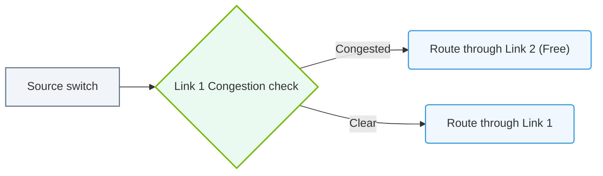

# 16.4b Adaptive Routing: dynamically selecting the least-congested path per packet

#### 🏷️ The AI Data Center Networking — Moving Petabytes Without Latency > 16 High-Speed Ethernet for AI — Spectrum-X, RoCEv2, and Lossless Fabrics > 16.4 NVIDIA Spectrum-X — Ethernet Optimized for AI

---

## 🌐 Context Introduction

In traditional Ethernet networks, data packets often follow a single, static path between two endpoints — even if that path becomes congested. For AI workloads, where massive datasets (like training data for large language models) must move between thousands of GPUs, this static approach leads to bottlenecks, packet loss, and wasted time.

**Adaptive Routing** changes this by allowing each packet to dynamically choose the least-congested path through the network, in real time. Think of it like a GPS for your data — if one highway is jammed, your packet takes the next fastest route.

---

## ⚙️ How Adaptive Routing Works

- **Per-packet decision**: Each individual packet is evaluated at every switch hop. The switch looks at current link utilization and selects the output port with the lowest congestion.
- **Real-time feedback**: Switches continuously monitor link load, buffer occupancy, and queue depths. This information is updated every few microseconds.
- **No pre-computed paths**: Unlike static routing (e.g., ECMP), there is no fixed hash-based path. The route is determined on the fly based on live conditions.
- **Local intelligence**: The decision is made locally at each switch — no central controller is needed for every packet. This keeps latency extremely low.

---

## 📊 Why Static Routing Fails for AI

| Feature | Static Routing (ECMP) | Adaptive Routing (Spectrum-X) |
|---------|----------------------|-------------------------------|
| Path selection | Based on packet header hash (fixed) | Based on real-time congestion |
| Handles traffic bursts | Poorly — can overload one path | Excellently — spreads load evenly |
| Link utilization | Often unbalanced (e.g., 70% on one link, 30% on another) | Near-perfect balance (e.g., 50/50) |
| Latency under load | Increases due to queuing | Stays low — avoids congested links |
| Adapts to failures | Slow — requires routing protocol convergence | Instant — reroutes around failed links |

---

## 🛠️ Key Benefits for AI Workloads

- **Reduced tail latency**: In distributed training, a single slow packet can stall thousands of GPUs. Adaptive routing minimizes these stragglers.
- **Higher effective bandwidth**: More links are utilized closer to their full capacity, meaning your expensive 400G or 800G fabric delivers more actual throughput.
- **Lossless operation**: By avoiding congestion, adaptive routing helps maintain the lossless fabric required for RoCEv2 (RDMA over Converged Ethernet).
- **Simpler network design**: Engineers don't need to manually tune load-balancing policies or worry about flow collisions.

---

### 📊 Visual Representation: Adaptive Routing Dynamic Path Switching
This diagram displays how adaptive routing dynamically directs packets away from congested links to balance traffic across the network fabric.

## 🕵️ Real-World Example: AllReduce Traffic

Consider an AllReduce operation (common in AI training) where every GPU sends data to every other GPU:

- **Without adaptive routing**: Many flows hash to the same link, creating a hot spot. Some GPUs wait for data, slowing the entire cluster.
- **With adaptive routing**: Each packet from each GPU independently picks the least-congested path. Traffic spreads evenly across all available links. The AllReduce completes faster.

---

## 🔧 Configuration Overview (NVIDIA Spectrum-X)

Adaptive routing is enabled at the switch level. In the NVIDIA Spectrum-X ecosystem, it is part of the **NVIDIA NetQ** and **Spectrum-4** switch software.

Key configuration parameters (set via NVIDIA's management tools, not CLI commands):

- **Enable adaptive routing globally**: Turn on per-packet load balancing for all traffic.
- **Set congestion thresholds**: Define what "congested" means (e.g., buffer occupancy > 50%).
- **Choose decision granularity**: Per-packet (most responsive) or per-flowlet (a middle ground).
- **Monitor with telemetry**: Use NVIDIA NetQ to visualize real-time path selection and link utilization.

> **Note**: These settings are typically applied through the NVIDIA switch management interface or automation tools like Ansible — not by typing commands on a switch console.

---

## ✅ Summary for New Engineers

- **Adaptive Routing** = each packet picks the fastest path at every switch, based on live congestion data.
- It is **critical for AI** because AI traffic is bursty, massive, and sensitive to latency.
- NVIDIA Spectrum-X implements this at hardware speed (no software overhead).
- The result: higher throughput, lower latency, and a network that self-optimizes without manual tuning.

---

## 📚 Related Topics to Explore Next

- **16.4a** — Static routing (ECMP) and its limitations
- **16.4c** — Flowlet switching vs. per-packet adaptive routing
- **16.5** — RoCEv2 and lossless fabric fundamentals
- **16.6** — Telemetry and congestion detection in Spectrum-X