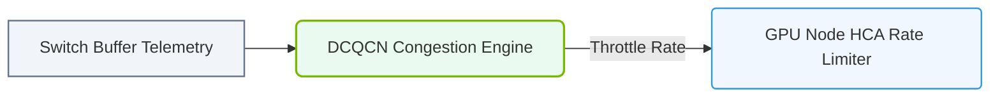

# 16.4d End-to-End congestion control (E2E CC) for AI workloads

#### 🏷️ The AI Data Center Networking — Moving Petabytes Without Latency > 16 High-Speed Ethernet for AI — Spectrum-X, RoCEv2, and Lossless Fabrics > 16.4 NVIDIA Spectrum-X — Ethernet Optimized for AI

## 📘 Context Introduction

When training large AI models, data moves in massive bursts across the network. Imagine thousands of GPUs all trying to send data simultaneously — without proper control, this creates a traffic jam called **congestion**. End-to-End Congestion Control (E2E CC) is a smart mechanism that prevents these jams by coordinating how much data each sender can inject into the network at any moment.

For new engineers, think of E2E CC as a **traffic management system** for AI workloads. It ensures that data flows smoothly from the source (GPU sending data) to the destination (GPU receiving data) without overwhelming any network link along the way.

---

## ⚙️ What is End-to-End Congestion Control?

E2E CC is a feedback loop between the sender and receiver of data. When the receiver detects that the network is getting congested (packets are delayed or dropped), it signals the sender to slow down. When the network is clear, the sender can speed up again.

Key characteristics for AI workloads:
- **Lossless operation** — AI training requires zero packet loss; E2E CC prevents drops before they happen
- **Low latency** — Keeps data moving at high speed without unnecessary delays
- **Fairness** — Ensures all GPU-to-GPU flows get equal bandwidth opportunity
- **Adaptive** — Automatically adjusts to changing network conditions

---

## 🕵️ How E2E CC Works in NVIDIA Spectrum-X

NVIDIA's Spectrum-X platform implements a specialized version of E2E CC designed specifically for AI workloads. Here's the flow:

1. **Sender starts transmitting** data at a configured rate
2. **Intermediate switches** monitor queue depths and link utilization
3. **Receiver sends feedback** (congestion signals) back to the sender
4. **Sender adjusts its rate** — decreases if congestion is detected, increases if the path is clear
5. **Loop repeats** continuously (every few microseconds) to maintain optimal throughput

The system uses **explicit congestion notification (ECN)** markers in packet headers to signal congestion without dropping packets.

---

## 📊 Comparison: Traditional TCP vs. E2E CC for AI

| Feature | Traditional TCP Congestion Control | E2E CC for AI (Spectrum-X) |
|---------|-----------------------------------|---------------------------|
| **Loss handling** | Drops packets, then retransmits | Prevents drops entirely |
| **Latency impact** | High (retransmission delays) | Very low (microsecond adjustments) |
| **Bandwidth utilization** | Moderate (conservative ramp-up) | High (aggressive but controlled) |
| **Fairness across flows** | Good | Excellent (hardware-assisted) |
| **Reaction time** | Milliseconds | Microseconds |
| **Suitable for AI training** | No (too slow, lossy) | Yes (lossless, fast) |

---

### 📊 Visual Representation: End-to-End Congestion Monitoring Loop
This diagram maps the complete end-to-end congestion loop, showing telemetry from switches to endpoints to throttle source transmission rates.

## 🛠️ Key Components in the E2E CC System

- **Congestion Detection** — Switches monitor buffer occupancy and mark packets when queues exceed a threshold
- **Rate Limiting** — Senders throttle their transmission rate based on feedback signals
- **Flow Control** — Per-flow granularity ensures one aggressive flow doesn't starve others
- **Telemetry** — Real-time monitoring provides visibility into congestion events

---

## ✅ Why E2E CC Matters for AI Workloads

AI training jobs often involve **all-to-all communication patterns** where every GPU talks to every other GPU. Without E2E CC:
- Some flows would get delayed, causing the entire training job to wait (straggler effect)
- Network buffers would overflow, causing packet drops and retransmissions
- GPU utilization would drop because GPUs idle while waiting for data

With E2E CC enabled:
- Training jobs complete faster (up to 30% improvement in some cases)
- Network operates at near 100% utilization without congestion collapse
- GPU utilization stays high because data arrives on time

---

## 🔧 Practical Considerations for Engineers

When deploying AI clusters with E2E CC, keep these points in mind:

- **Enable E2E CC on all switches** in the fabric — partial deployment reduces effectiveness
- **Monitor congestion signals** using NVIDIA's telemetry tools to identify hot spots
- **Tune thresholds** based on your workload characteristics (some AI models are more bursty than others)
- **Verify lossless operation** — E2E CC should keep packet drops at zero during normal operation
- **Test with representative workloads** — small-scale tests may not reveal congestion patterns seen in full-scale training

---

## 📌 Summary

End-to-End Congestion Control is a critical technology for making Ethernet work efficiently for AI workloads. By providing microsecond-level feedback between senders and receivers, E2E CC prevents network congestion before it happens, ensuring that GPUs spend their time computing rather than waiting for data. In NVIDIA Spectrum-X, this capability is built directly into the hardware, making it a key differentiator for AI data center networking.

For new engineers: **Think of E2E CC as the invisible traffic cop that keeps your AI training data moving at highway speeds, even during rush hour.**