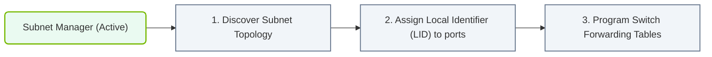

# 17.3a Subnet Manager (SM): topology discovery, LID assignment, and routing table computation

#### 🏷️ The AI Data Center Networking — Moving Petabytes Without Latency > 17 InfiniBand Architecture — The Gold Standard for AI Cluster Networking > 17.3 Subnet Management — The Brain of the InfiniBand Fabric

## 🧭 Context Introduction

In an AI data center, hundreds or thousands of GPUs need to communicate at blazing speeds. InfiniBand makes this possible, but it needs a "traffic cop" to manage all the connections. That's where the **Subnet Manager (SM)** comes in. Think of the SM as the brain of the InfiniBand fabric — it discovers all the devices, gives them unique addresses, and figures out the best paths for data to travel. Without the SM, your InfiniBand network would be a pile of disconnected hardware.

For new engineers, understanding the SM's three core jobs — **topology discovery**, **LID assignment**, and **routing table computation** — is essential to troubleshooting and operating an AI cluster.

---

## ⚙️ 1. Topology Discovery — Mapping the Fabric

The SM starts by learning what devices are connected and how they are linked together.

- **How it works:** The SM sends special management packets (called SMPs — Subnet Management Packets) to every port in the fabric.
- **What it learns:** Each device responds with its type (switch, HCA, router), port count, and link speed.
- **Result:** The SM builds a complete map of the network — like a subway map showing every station and track.

**Key points for engineers:**
- The SM discovers **all** switches, host channel adapters (HCAs), and cables.
- If a cable is unplugged or a switch fails, the SM will notice during the next discovery cycle.
- Topology discovery happens at startup and can be triggered manually if needed.

---

## 📊 2. LID Assignment — Giving Every Device an Address

Once the SM knows the layout, it assigns a **Local Identifier (LID)** to every port in the fabric.

- **What is a LID?** A 16-bit number (0x0001 to 0xBFFF) that uniquely identifies each port.
- **Why it matters:** Data packets use LIDs to find their destination — like a street address for mail delivery.
- **How it's done:** The SM assigns LIDs sequentially or based on a predefined policy.

**Comparison: LID vs. IP Address**

| Feature | LID (InfiniBand) | IP Address (Ethernet) |
|---------|------------------|-----------------------|
| Length | 16 bits | 32 bits (IPv4) or 128 bits (IPv6) |
| Scope | Local subnet only | Global or local |
| Assignment | By Subnet Manager | By DHCP or static config |
| Purpose | Routing within InfiniBand fabric | Routing across networks |

**Important for engineers:**
- LIDs are **local** to the InfiniBand subnet — they don't leave the fabric.
- A port can have multiple LIDs (for multipath routing), but one is the primary.
- If the SM restarts, LIDs may change — which can break running applications.

---

### 📊 Visual Representation: Subnet Manager Routing Table Generation
This flowchart displays how the InfiniBand Subnet Manager (SM) discovers network nodes, configures LIDs, and programs route tables.

## 🛠️ 3. Routing Table Computation — Finding the Best Paths

With the map and addresses ready, the SM calculates how data should flow between every pair of devices.

- **Goal:** Minimize congestion, balance load, and avoid deadlocks.
- **Common algorithms:**
  - **Up/Down routing** — Simple and reliable for small fabrics.
  - **DOR (Dimension Order Routing)** — Used in larger clusters like fat-tree topologies.
  - **Adaptive routing** — Dynamic path selection based on real-time traffic.

**What the SM computes:**
- A **linear forwarding table (LFT)** for each switch — telling it which output port to use for each destination LID.
- The SM then pushes these tables to every switch in the fabric.

**For engineers to remember:**
- The routing table determines **all** data paths — a bad table means slow or broken communication.
- Changing the topology (e.g., adding a switch) forces the SM to recompute all routes.
- You can influence routing with **path records** or **SL (Service Level) mapping**.

---

## 🕵️ 4. How the SM Works in Practice

Here's a simplified flow of the SM's operation:

1. **Startup:** SM activates on a designated node (often a switch or management server).
2. **Discovery:** SM sends SMPs to find all devices and links.
3. **LID Assignment:** SM assigns a unique LID to every port.
4. **Routing Computation:** SM calculates the best paths and builds forwarding tables.
5. **Table Distribution:** SM sends the tables to every switch.
6. **Monitoring:** SM continuously checks for changes (cable pulls, device failures).
7. **Reconfiguration:** If changes are detected, steps 2–5 repeat.

**Real-world note:** In large AI clusters (thousands of nodes), the SM runs on a dedicated server and may take several minutes to complete discovery and routing.

---

## 📋 Quick Reference for New Engineers

| SM Function | What It Does | Why It Matters |
|-------------|--------------|----------------|
| Topology Discovery | Finds all devices and connections | Without it, the SM is blind |
| LID Assignment | Gives each port a unique address | Packets need addresses to reach destinations |
| Routing Table Computation | Calculates best paths for data | Determines performance and reliability |

**Common troubleshooting tips:**
- If GPUs can't communicate, check if the SM is running.
- Use management tools (like **ibdiagnet** or **ibstatus**) to verify LID assignments.
- A "split subnet" error usually means two SMs are conflicting — only one should be active.

---

## ✅ Summary

The Subnet Manager is the invisible hero of every InfiniBand-based AI cluster. It discovers the hardware, assigns addresses, and computes routes so that data can move at maximum speed. For new engineers, mastering these three functions — **topology discovery**, **LID assignment**, and **routing table computation** — will help you understand why your cluster works (or doesn't work) and how to fix it when things go wrong.

Remember: **No SM, no fabric.** Always ensure your Subnet Manager is healthy and properly configured.