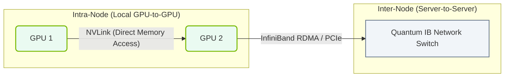

# 17.4b NCCL (NVIDIA Collective Communications Library): the RDMA library for GPU-to-GPU

#### 🏷️ The AI Data Center Networking — Moving Petabytes Without Latency > 17 InfiniBand Architecture — The Gold Standard for AI Cluster Networking > 17.4 RDMA over InfiniBand — Maximum Performance Data Transfer

---

## 🔍 Context Introduction

When training large AI models across multiple GPUs, those GPUs need to talk to each other constantly — sharing gradients, synchronizing parameters, and moving data. Without a fast, efficient communication library, the GPUs spend more time waiting than computing. **NCCL** (NVIDIA Collective Communications Library) is the specialized library that makes this GPU-to-GPU communication happen at maximum speed, using RDMA (Remote Direct Memory Access) over InfiniBand to bypass the CPU and move data directly between GPU memories.

---

## ⚙️ What is NCCL?

NCCL is NVIDIA's library designed specifically for **multi-GPU and multi-node communication** in AI workloads. It implements common **collective communication patterns** that deep learning frameworks need.

**Key characteristics:**
- Optimized for NVIDIA GPUs and NVIDIA networking hardware (InfiniBand, NVLink)
- Supports RDMA for direct memory access between GPUs across nodes
- Automatically detects the best communication path (NVLink inside a node, InfiniBand between nodes)
- Used by frameworks like PyTorch, TensorFlow, and JAX under the hood

---

## 📊 How NCCL Uses RDMA over InfiniBand

RDMA (Remote Direct Memory Access) allows NCCL to move data from one GPU's memory directly to another GPU's memory **without involving the CPU or operating system kernel**. This is critical for performance.

**The flow without RDMA (slow):**
- GPU A → CPU A → Network → CPU B → GPU B
- Each step adds latency and CPU overhead

**The flow with RDMA over InfiniBand (fast):**
- GPU A → InfiniBand HCA → InfiniBand Network → InfiniBand HCA → GPU B
- Data moves directly from GPU memory to GPU memory

---

## 🛠️ NCCL Collective Operations

NCCL provides several communication patterns that are essential for distributed training:

| Operation | What It Does | Why It's Used |
|-----------|-------------|---------------|
| **AllReduce** | Sums data across all GPUs and gives the result back to every GPU | Gradient synchronization during training |
| **AllGather** | Collects data from all GPUs and distributes the full collection to each GPU | Data parallelism |
| **ReduceScatter** | Sums data across GPUs, then scatters portions back | Memory-efficient AllReduce |
| **Broadcast** | Sends data from one GPU to all others | Parameter initialization |
| **Reduce** | Sums data from all GPUs to a single GPU | Gradient accumulation |

---

### 📊 Visual Representation: NVIDIA Collective Communications Library (NCCL) Channels
This diagram displays NCCL routing, using NVLink for intra-node transfers and InfiniBand RDMA for inter-node transfers.

## 🕵️ NCCL Communication Modes

NCCL can use different underlying transport mechanisms depending on what hardware is available:

- **NVLink** — Direct GPU-to-GPU connections inside a single server (fastest, lowest latency)
- **InfiniBand with RDMA** — Between servers across the network (high bandwidth, low CPU usage)
- **TCP/IP** — Fallback when InfiniBand is not available (slower, higher CPU usage)

NCCL automatically selects the best available path for each communication.

---

## 📈 Performance Considerations for Engineers

When working with NCCL in an AI cluster, keep these points in mind:

- **Ring vs Tree algorithms** — NCCL uses different algorithms depending on GPU count and topology. Ring algorithms work well for small messages; Tree algorithms scale better for large messages.
- **NCCL environment variables** — You can tune NCCL behavior using environment variables like:
  - **NCCL_IB_DISABLE** — Set to 1 to disable InfiniBand and force TCP fallback
  - **NCCL_DEBUG** — Set to INFO or VERSION to see which transport NCCL is using
  - **NCCL_SOCKET_IFNAME** — Specify which network interface to use for control traffic
- **Topology awareness** — NCCL detects the GPU topology (which GPUs share a PCIe switch, which are connected via NVLink) and optimizes communication accordingly

---

## 🧪 Checking NCCL Operation

To verify NCCL is working correctly with RDMA over InfiniBand, engineers can:

- Run the **nccl-tests** benchmark suite to measure bandwidth and latency between GPUs
- Check **NCCL_DEBUG=INFO** output to confirm "Using IB" or "Using RDMA" messages
- Monitor InfiniBand counters using **ibstat** or **perfquery** to see traffic flowing between nodes

---

## ✅ Summary

NCCL is the essential communication library that makes distributed GPU training possible at scale. By leveraging **RDMA over InfiniBand**, it moves data directly between GPU memories with minimal latency and zero CPU involvement. For engineers building or operating AI clusters, understanding NCCL means understanding how to get the most performance out of multi-GPU training — whether inside a single server or across hundreds of nodes.