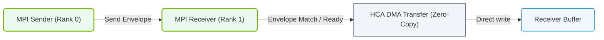

# 17.4c MPI (Message Passing Interface) over InfiniBand: HPC heritage in AI clusters

#### 🏷️ The AI Data Center Networking — Moving Petabytes Without Latency > 17 InfiniBand Architecture — The Gold Standard for AI Cluster Networking > 17.4 RDMA over InfiniBand — Maximum Performance Data Transfer

---

## 🔍 Context Introduction

When you train a large AI model across hundreds or thousands of GPUs, those GPUs need to talk to each other constantly. They share gradients, synchronize weights, and exchange intermediate results. This communication must happen fast — otherwise, your GPUs sit idle waiting for data. MPI (Message Passing Interface) is the software standard that orchestrates this communication. When combined with InfiniBand's RDMA capabilities, it delivers the low-latency, high-bandwidth performance that modern AI clusters demand. This combination is a direct inheritance from the High-Performance Computing (HPC) world, where supercomputers have used MPI over InfiniBand for decades.

---

## ⚙️ What is MPI?

MPI is a standardized, portable message-passing system designed for parallel computing. It defines how processes on different nodes (or within the same node) send and receive data.

- **Point-to-point communication**: One process sends a message directly to another.
- **Collective communication**: All processes participate in operations like broadcast, gather, reduce, or allreduce.
- **Synchronization**: Processes can wait for each other at specific points.
- **Process management**: MPI handles starting, stopping, and organizing parallel tasks.

In AI training, the most critical MPI operation is **AllReduce** — where every GPU computes its local gradients, then the cluster sums them and distributes the result back to all GPUs.

---

## 🛠️ How MPI Works Over InfiniBand

InfiniBand provides the physical and link-layer transport. MPI sits on top, using InfiniBand's RDMA capabilities to move data directly between GPU memories without involving the CPU or system memory.

- MPI sends a message → InfiniBand's RDMA engine reads the data from GPU memory → data travels across the InfiniBand fabric → RDMA engine writes directly into the destination GPU memory → MPI receives the completion notification.
- No CPU intervention, no kernel overhead, no extra memory copies.
- This is called **MPI over InfiniBand with RDMA**.

---

## 📊 Key Benefits for AI Clusters

| Benefit | Explanation |
|---------|-------------|
| 🚀 **Ultra-low latency** | RDMA bypasses the OS stack, reducing message delivery time to microseconds |
| 💨 **High bandwidth** | InfiniBand links (200–400 Gbps) match GPU memory bandwidth requirements |
| 🔄 **Efficient AllReduce** | MPI collective operations are hardware-optimized for InfiniBand |
| 🧩 **Scalability** | MPI scales to tens of thousands of nodes without performance collapse |
| 🔗 **GPU Direct** | Data moves GPU-to-GPU without touching host memory |

---

### 📊 Visual Representation: MPI over InfiniBand Zero-Copy Send
This diagram displays MPI data paths: matching messaging envelopes over InfiniBand to trigger direct DMA memory transfers.

## 🕵️ Common MPI Operations in AI Training

- **MPI_Allreduce**: The workhorse of distributed training. Each process contributes a local value (e.g., gradient tensor), and all processes receive the summed result.
- **MPI_Bcast**: One process sends data to all others (e.g., broadcasting model parameters at initialization).
- **MPI_Scatter**: Distributes chunks of data from one process to many (e.g., splitting a dataset).
- **MPI_Gather**: Collects data from all processes into one (e.g., aggregating validation results).

---

## 🔄 MPI vs. NCCL: What's the Difference?

NVIDIA's NCCL (NVIDIA Collective Communications Library) is a newer, GPU-optimized library that also runs over InfiniBand. MPI is the older, more general standard.

- **MPI**: General-purpose, runs on any interconnect (Ethernet, InfiniBand, OmniPath), widely used in HPC.
- **NCCL**: GPU-specific, optimized for NVIDIA GPUs and NVLink, designed specifically for deep learning.
- **In practice**: Many AI frameworks (like PyTorch, TensorFlow) use NCCL by default, but MPI is still used in custom HPC-AI hybrid workflows and legacy systems.

---

## 🧠 Simple Mental Model

Think of an AI cluster as a team of chefs in a kitchen:

- Each chef (GPU) has their own ingredients (data).
- MPI is the recipe book that tells them when to share ingredients.
- InfiniBand is the high-speed conveyor belt that moves ingredients instantly between chefs.
- RDMA means the ingredients move directly from one chef's hand to another's — no waiting for a runner (CPU) to carry them.

---

## ✅ Key Takeaways for New Engineers

- MPI over InfiniBand is the proven, battle-tested way to connect GPUs in large AI clusters.
- It inherits decades of HPC optimization for parallel computing.
- The magic is in RDMA: data moves directly between GPU memories with zero CPU involvement.
- For most modern AI frameworks, you won't write MPI code directly — but understanding it helps you troubleshoot performance issues and design cluster topologies.
- When you see "AllReduce" in training logs, you're seeing MPI's most important legacy in action.

---

## 📌 Summary

MPI over InfiniBand is not just historical baggage — it's the foundation that makes large-scale AI training possible. The HPC heritage gives us a reliable, high-performance communication layer that AI clusters depend on today. As a new engineer, knowing how MPI and InfiniBand work together will help you understand why your training jobs run fast (or slow), and how to design networks that keep GPUs fed with data.