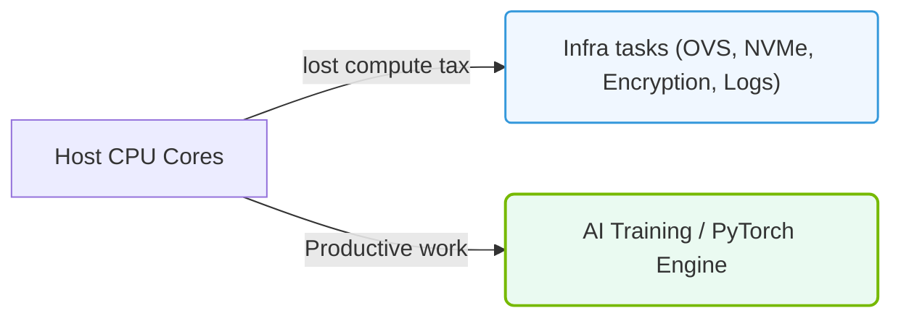

# 18.1a How virtualization, security scanning, and storage protocols consume CPU cycles

#### 🏷️ The AI Data Center Networking — Moving Petabytes Without Latency > 18 NVIDIA Data Processing Units (DPUs) — Offloading Infrastructure > 18.1 The Infrastructure Tax Problem

---

## 🌐 Context Introduction

In any AI data center, the CPU is the brain that runs your AI workloads. However, before the CPU can even start training models or processing data, it must handle a hidden burden: **infrastructure tasks**. These are the background jobs that keep the system secure, connected, and organized — but they eat up valuable CPU cycles. For new engineers, think of this as a "tax" on your compute resources. Every cycle spent on virtualization, security scanning, or storage protocols is a cycle *not* spent on your AI model. Understanding this tax is the first step to optimizing your infrastructure.

---

## ⚙️ Virtualization — The CPU Cost of Abstraction

Virtualization allows multiple virtual machines (VMs) or containers to run on a single physical server. This is essential for resource sharing, but it comes at a cost.

- **Hypervisor overhead**: The hypervisor (software that manages VMs) must intercept and translate every hardware request from the guest OS to the physical hardware. This translation consumes CPU cycles.
- **Context switching**: When the CPU switches between VMs, it must save and restore the state of each VM. This is a CPU-intensive operation.
- **Interrupt handling**: Virtual devices (like virtual network cards) generate interrupts that the CPU must process. Each interrupt steals cycles from your AI workload.

**Example of the tax**: A single VM can consume 5-10% of a CPU core just for virtualization overhead. With 10 VMs on a host, you could lose an entire core to management tasks.

---

## 🕵️ Security Scanning — The CPU Cost of Protection

Security is non-negotiable in AI data centers, but scanning for threats consumes significant CPU resources.

- **Antivirus and malware scanning**: Every file read or write operation must be inspected. The CPU must decompress, scan, and match patterns against known threats. This adds latency to every I/O operation.
- **Intrusion detection systems (IDS)**: These monitor network traffic in real-time. The CPU must inspect every packet header and payload, looking for suspicious patterns. For high-bandwidth AI workloads (e.g., 100 Gbps), this can saturate multiple cores.
- **Encryption/decryption**: Secure protocols like TLS require the CPU to encrypt data before sending and decrypt upon receiving. This is mathematically intensive and can consume 20-30% of a CPU core per encrypted stream.

**Real-world impact**: A security scan on a large dataset (e.g., 1 TB of training data) can take hours and consume 100% of a CPU core, delaying your AI pipeline.

---

### 📊 Visual Representation: Infrastructure CPU Overhead (lost compute tax)
This diagram displays how network, storage, security, and telemetry workloads consume host CPU cycles, leaving fewer resources for AI training workloads.

## 🗄️ Storage Protocols — The CPU Cost of Data Access

AI workloads are data-hungry. Moving data from storage to compute requires protocols like NVMe-oF, iSCSI, or NFS. Each protocol adds CPU overhead.

- **Protocol parsing**: The CPU must interpret storage protocol headers (e.g., SCSI commands, NFS file handles). This is a per-packet cost.
- **Data copy operations**: When data moves from storage to memory, the CPU often must copy it from kernel space to user space. This memory copy consumes cycles and memory bandwidth.
- **Checksum calculations**: Many storage protocols require checksums (e.g., CRC32) to ensure data integrity. The CPU must compute these for every block of data.
- **Queue management**: Storage devices use queues for I/O requests. The CPU must manage these queues, handling completions and retries.

**Example**: For a 100 Gbps NVMe-oF connection, the CPU can spend 30-40% of a core just on protocol processing and data movement.

---

## 📊 Comparison Table — The Infrastructure Tax at a Glance

| Infrastructure Task | Typical CPU Consumption | Impact on AI Workload |
|---------------------|------------------------|------------------------|
| Virtualization (per VM) | 5-10% of a core | Reduces available compute for training |
| Security scanning (per file) | 20-100% of a core during scan | Delays data loading and preprocessing |
| Storage protocol (per 100 Gbps link) | 30-40% of a core | Slows data ingestion and checkpointing |
| Encryption (per stream) | 20-30% of a core | Adds latency to data transfers |

---

## 🛠️ Why This Matters for AI Infrastructure

For AI workloads, every CPU cycle counts. A single training run can take days or weeks. If 30% of your CPU is consumed by infrastructure tasks, your training time increases by nearly a third. This is the **infrastructure tax problem**.

- **Latency-sensitive workloads**: Real-time AI inference (e.g., autonomous driving) cannot tolerate delays from security scans or storage protocol overhead.
- **Throughput-bound workloads**: Large-scale training (e.g., LLMs) requires maximum data throughput. Storage protocol overhead directly limits how fast data can be fed to GPUs.
- **Scalability challenges**: As you add more servers, the infrastructure tax multiplies. More VMs, more security scans, more storage connections — all consuming more CPU.

---

## ✅ Key Takeaways for New Engineers

- **CPU cycles are a finite resource**: Every cycle spent on infrastructure is a cycle lost to AI.
- **Virtualization, security, and storage are the three biggest consumers**: These are the "big three" of the infrastructure tax.
- **Offloading is the solution**: Technologies like NVIDIA DPUs (Data Processing Units) are designed to handle these tasks, freeing the CPU for AI work.
- **Measure before optimizing**: Use tools like **nmon**, **perf**, or **htop** to see how much CPU is consumed by infrastructure tasks on your system. This baseline helps you identify where to offload.

Remember: As an engineer, your goal is to maximize the CPU cycles available for AI. Understanding where they are lost is the first step to reclaiming them.