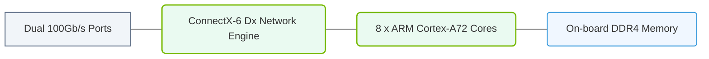

# 18.2a BlueField-2: ConnectX-6 NIC + ARM cores + on-chip memory

#### 🏷️ The AI Data Center Networking — Moving Petabytes Without Latency > 18 NVIDIA Data Processing Units (DPUs) — Offloading Infrastructure > 18.2 NVIDIA BlueField DPU Architecture

---

## 🌐 Context Introduction

In modern AI data centers, the network is no longer just a pipe for moving data — it has become a bottleneck. Traditional CPUs spend valuable cycles managing network traffic, storage operations, and security tasks. The **NVIDIA BlueField-2 DPU** solves this by combining a high-performance network interface card (NIC) with programmable ARM cores and dedicated on-chip memory. This allows engineers to offload infrastructure tasks from the main CPU, freeing it to focus on compute-intensive AI workloads.

Think of BlueField-2 as a **smart network card** that can run its own operating system and applications, handling everything from packet processing to storage virtualization — all without touching the host CPU.

---

## ⚙️ Key Components of BlueField-2

The BlueField-2 DPU is built around three core hardware elements:

- **ConnectX-6 NIC** — A 200Gb/s Ethernet or InfiniBand network adapter that handles high-speed data movement with hardware acceleration.
- **ARM Cortex-A72 Cores** — Up to 8 general-purpose ARM cores (at 2.0 GHz) that run custom software for network, storage, and security offload.
- **On-Chip Memory** — Integrated DDR4 memory controller with up to 16 GB of dedicated memory, allowing the ARM cores to process data locally without accessing host memory.

---

## 🛠️ How BlueField-2 Offloads Infrastructure

Instead of the host CPU handling every network packet or storage request, BlueField-2 intercepts and processes these tasks directly. Here’s how it works in practice:

- **Network Offload**: The ConnectX-6 NIC handles packet parsing, filtering, and forwarding at line rate. The ARM cores run software-defined networking (SDN) functions like Open vSwitch (OVS) or firewall rules.
- **Storage Offload**: BlueField-2 can present virtual storage devices to the host while handling RAID, encryption, and NVMe over Fabrics (NVMe-oF) on the DPU itself.
- **Security Offload**: The ARM cores run inline encryption, TLS termination, and root-of-trust services without consuming host CPU cycles.

---

## 📊 BlueField-2 vs Traditional NIC

| Feature | Traditional NIC | BlueField-2 DPU |
|---------|----------------|-----------------|
| **Processing** | No onboard CPU | 8 ARM Cortex-A72 cores |
| **Memory** | None | Up to 16 GB DDR4 |
| **Network Speed** | Up to 100 Gb/s | 200 Gb/s (Ethernet or InfiniBand) |
| **Offload Capability** | Minimal (checksum, segmentation) | Full network, storage, security offload |
| **Programmability** | Fixed function hardware | Fully programmable via ARM cores |
| **Host CPU Impact** | High (interrupts, context switches) | Near zero (data path handled on DPU) |

---

### 📊 Visual Representation: BlueField-2 DPU Hardware Layout
This diagram details the BlueField-2 DPU, integrating ConnectX-6 Dx network engines, ARM A72 processor cores, and DDR4 memory.

## 🕵️ Real-World Use Cases

Engineers deploy BlueField-2 in several critical scenarios:

- **AI Training Clusters**: Offload collective communication (e.g., NCCL) and reduce GPU idle time waiting for data.
- **Software-Defined Storage**: Run storage controllers on the DPU, presenting NVMe drives to hosts over a network.
- **Multi-Tenant Cloud**: Isolate tenant traffic and enforce security policies without impacting hypervisor performance.
- **Edge AI**: Process and filter data at the network edge before sending it to the central data center.

---

## 🧩 Simple Example: Offloading a Network Function

Imagine you want to run a simple packet filter on incoming traffic. Without a DPU, the host CPU must:

1. Receive the packet from the NIC via an interrupt.
2. Copy the packet into host memory.
3. Run firewall software to inspect and decide.
4. Forward or drop the packet.

With BlueField-2, the same flow happens entirely on the DPU:

- **Step 1**: ConnectX-6 NIC receives the packet.
- **Step 2**: ARM core runs the firewall logic using on-chip memory.
- **Step 3**: Packet is forwarded or dropped — host CPU never sees it.

The result is **zero CPU overhead** for the host, and the packet processing happens at wire speed.

---

## 🔍 Key Takeaways for New Engineers

- **BlueField-2 is not just a faster NIC** — it is a complete data processing unit with its own CPU and memory.
- **The ARM cores run standard Linux** — you can write C, Python, or use containerized applications on the DPU.
- **On-chip memory is critical** — it allows the DPU to process data locally without competing for host memory bandwidth.
- **Offloading is transparent to applications** — the host sees standard network and storage interfaces, while the DPU handles the heavy lifting.

---

## 📚 Further Learning Path

To deepen your understanding of BlueField-2, explore these topics next:

- **DOCA SDK** — NVIDIA’s software framework for programming BlueField DPUs.
- **NVMe-oF with BlueField** — How to offload storage virtualization.
- **Collective Communications Library (NCCL)** — How DPUs accelerate AI training.
- **DPU vs SmartNIC** — Understanding the difference between programmable NICs and full DPUs.

---

*This guide is part of the NVIDIA-Certified Associate: AI Infrastructure and Operations curriculum. Focus on understanding the hardware components and their roles — the software tools will make more sense once you grasp the architecture.*