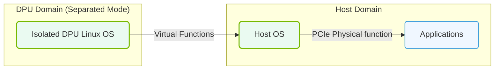

# 18.2c P-mode vs DPU-mode: the DPU as a PCIe endpoint vs. autonomous server

#### 🏷️ The AI Data Center Networking — Moving Petabytes Without Latency > 18 NVIDIA Data Processing Units (DPUs) — Offloading Infrastructure > 18.2 NVIDIA BlueField DPU Architecture

---

## 🌐 Context Introduction

When you first encounter NVIDIA BlueField DPUs, you'll hear about two distinct operating modes: **P-mode** and **DPU-mode**. These modes define how the DPU interacts with the host server and the network. Think of it as the DPU having two personalities — one where it acts like a smart network card attached to the host, and another where it becomes its own independent server with its own operating system. Understanding the difference is crucial for designing AI infrastructure that is both efficient and scalable.

---

## ⚙️ What is P-mode? (PCIe Endpoint Mode)

In **P-mode**, the DPU behaves as a traditional PCIe endpoint — similar to how a standard network interface card (NIC) or GPU connects to the host server. The host CPU sees the DPU as a peripheral device attached via the PCIe bus.

**Key characteristics:**
- The DPU is managed entirely by the host operating system
- All DPU resources (network ports, storage controllers) appear as standard PCIe devices to the host
- The host CPU handles all control plane operations
- The DPU accelerates data plane tasks (packet processing, encryption) but does not run its own independent OS
- Simpler deployment — no separate DPU software stack to manage

**Use cases for P-mode:**
- Basic network acceleration without requiring a separate DPU operating system
- Environments where engineers want minimal changes to existing server management workflows
- Legacy applications that expect standard NIC behavior

---

## 🖥️ What is DPU-mode? (Autonomous Server Mode)

In **DPU-mode**, the BlueField DPU runs its own independent operating system (typically NVIDIA DOCA or a Linux distribution) and functions as a fully autonomous server. The DPU has its own CPU cores, memory, and network interfaces that are completely separate from the host.

**Key characteristics:**
- The DPU boots its own OS independently of the host server
- The DPU manages its own network stack, storage controllers, and security policies
- The host and DPU communicate over the PCIe bus as peer devices, not as master-slave
- The DPU can run applications, containers, or virtual machines independently
- The host CPU is completely offloaded from infrastructure tasks

**Use cases for DPU-mode:**
- Zero-trust security architectures where the DPU enforces network policies without host involvement
- Storage disaggregation where the DPU handles NVMe over Fabrics (NVMe-oF) directly
- AI training clusters where the DPU manages data movement between GPUs and storage
- Multi-tenant environments where each DPU isolates tenant workloads

---


### 📊 Visual Representation: DPU Separated vs. Embedded operating modes
This diagram contrasts DPU Separated mode (running its own OS domain completely isolated from host) and Embedded switch mode.




## 🛠️ Comparison Table: P-mode vs DPU-mode

| Feature | P-mode (PCIe Endpoint) | DPU-mode (Autonomous Server) |
|---------|------------------------|------------------------------|
| **Operating System** | Host OS manages DPU | DPU runs its own independent OS |
| **CPU Usage** | Host CPU handles control plane | DPU CPU handles all infrastructure tasks |
| **Network Stack** | Host manages network configuration | DPU manages its own network stack |
| **Security Isolation** | Limited — host can access DPU resources | Strong — DPU enforces policies independently |
| **Deployment Complexity** | Low — plug-and-play like a standard NIC | Higher — requires DPU OS management |
| **Performance Offload** | Partial — only data plane acceleration | Full — control plane and data plane offloaded |
| **Use Case Focus** | Simple acceleration | Advanced infrastructure services |

---

## 🕵️ When to Choose Each Mode

**Choose P-mode when:**
- You are deploying DPUs for basic network acceleration without changing existing server management
- Your applications expect standard NIC behavior and do not require DPU-level isolation
- You want minimal operational overhead and quick deployment

**Choose DPU-mode when:**
- You need strong security isolation between tenants or between host and network
- You want to completely offload infrastructure tasks (networking, storage, security) from the host CPU
- You are building AI clusters where the DPU manages data movement between GPUs and storage
- You need the DPU to run its own applications or containers independently

---

## 🔄 Mode Selection at Boot

The DPU mode is selected at boot time through firmware configuration. Engineers can switch between modes, but this requires a full power cycle of the DPU.

**For reference:**
```
# To check current mode on a BlueField DPU
mlxconfig -d /dev/mst/mt4123_pciconf0 query | grep INTERNAL_CPU_MODEL

# To set DPU-mode (autonomous)
mlxconfig -d /dev/mst/mt4123_pciconf0 set INTERNAL_CPU_MODEL=1

# To set P-mode (PCIe endpoint)
mlxconfig -d /dev/mst/mt4123_pciconf0 set INTERNAL_CPU_MODEL=0
```

📤 **Output:** The command will return the current mode setting (0 for P-mode, 1 for DPU-mode).

---

## 🧠 Key Takeaway for New Engineers

Think of P-mode as the DPU being a **smart assistant** that helps the host server do its job faster. DPU-mode is the DPU becoming a **co-worker** that handles its own responsibilities independently. For AI infrastructure, DPU-mode is typically preferred because it allows the host CPU to focus entirely on AI computation while the DPU manages all the infrastructure plumbing. However, P-mode remains useful for simpler deployments or when transitioning from traditional NIC-based architectures.