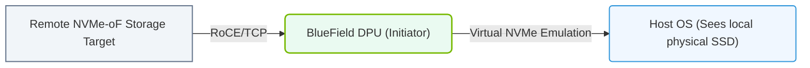

# 18.3c Deploying storage initiators (NVMe-oF) on the DPU: freeing the host CPU entirely

#### 🏷️ The AI Data Center Networking — Moving Petabytes Without Latency > 18 NVIDIA Data Processing Units (DPUs) — Offloading Infrastructure > 18.3 DOCA — The DPU Programming Framework

---

## 🧠 Context Introduction

In modern AI data centers, storage performance is critical. Traditionally, the host CPU handles all storage operations — including managing NVMe over Fabrics (NVMe-oF) initiators. This consumes valuable CPU cycles that could otherwise be used for AI training or inference workloads. By deploying NVMe-oF storage initiators directly on the NVIDIA BlueField DPU, you can **free the host CPU entirely** from storage management tasks. This offloading improves overall system efficiency, reduces latency, and allows the host to focus purely on compute.

---

## ⚙️ What is NVMe-oF and Why Offload It?

- **NVMe-oF (NVMe over Fabrics)** is a protocol that allows a host to access remote NVMe storage over a network (e.g., Ethernet or InfiniBand) with very low latency.
- The **initiator** is the client side — it sends storage commands to a remote target (storage server).
- Traditionally, the initiator runs as software on the host CPU, consuming CPU cycles for every I/O operation.
- By moving the initiator to the DPU, the host CPU is **completely removed** from the storage data path.

---

## 🛠️ How It Works: DPU as the Storage Initiator

| Component | Traditional Setup | DPU-Offloaded Setup |
|-----------|-------------------|----------------------|
| **Host CPU** | Handles NVMe-oF initiator software + application | Only runs application (no storage overhead) |
| **DPU** | Not involved | Runs NVMe-oF initiator firmware/hardware |
| **Storage Traffic** | Goes through host CPU and NIC | Bypasses host CPU entirely (direct DPU-to-storage) |
| **CPU Utilization** | High (up to 30% for storage I/O) | Near zero for storage operations |

---

## 🕵️ Key Benefits of Offloading NVMe-oF Initiator to the DPU

- **Zero CPU overhead for storage** — The host CPU is completely freed from managing storage connections, packet processing, and I/O completion.
- **Lower latency** — Storage commands are processed directly on the DPU's hardware acceleration, reducing round-trip times.
- **Higher throughput** — The DPU can handle millions of IOPS without impacting host performance.
- **Improved security** — Storage traffic is isolated from the host, reducing attack surface.
- **Consistent performance** — No "noisy neighbor" effect from storage operations competing with AI workloads.

---


### 📊 Visual Representation: NVMe over Fabrics (NVMe-oF) DPU virtualization
This diagram displays how the DPU virtualizes remote NVMe-oF block targets, presenting them to the host CPU as standard local PCIe NVMe drives.




## 🔧 Deployment Steps (High-Level Overview)

1. **Prepare the DPU** — Ensure the BlueField DPU is running DOCA software and has the NVMe-oF initiator firmware loaded.

2. **Configure network connectivity** — Set up the DPU's network ports to reach the NVMe-oF target (storage server).

3. **Discover remote storage** — Use the DPU's management interface to scan for available NVMe-oF targets on the network.

4. **Connect to the target** — Establish an NVMe-oF connection from the DPU to the target storage system.

5. **Expose storage to the host** — The DPU presents the remote NVMe namespace as a local NVMe device to the host CPU.

6. **Verify offload** — Confirm that the host sees the storage device but does not handle any NVMe-oF protocol processing.

---

## 📊 Example Workflow (Conceptual)

**For reference:**
```
# On the DPU management console:
# Step 1: Discover available NVMe-oF targets
nvmf_discover -t tcp -a 192.168.1.100

# Step 2: Connect to a discovered target
nvmf_connect -t tcp -a 192.168.1.100 -n nqn.2024-01.com.example:storage1

# Step 3: Verify the connection
nvmf_list
```

📤 **Output:** The DPU reports a connected NVMe-oF target. The host now sees a new NVMe block device (e.g., `/dev/nvme0n1`) without any host-side NVMe-oF software running.

---

## 🧩 What the Host CPU Sees (and Doesn't See)

- **Sees:** A standard NVMe SSD attached locally (via PCIe from the DPU).
- **Does NOT see:** Any network traffic, TCP connections, NVMe-oF protocol handling, or storage command processing.
- **Result:** The host application simply reads/writes to a local NVMe drive — all complexity is hidden by the DPU.

---

## 🚦 Important Considerations for New Engineers

- **Firmware compatibility** — Ensure your DPU firmware supports NVMe-oF initiator mode (available in BlueField-2 and later).
- **Network requirements** — The DPU needs dedicated network connectivity to the storage fabric (separate from host network).
- **Storage target support** — The remote storage system must support NVMe-oF (most modern all-flash arrays do).
- **Performance tuning** — Adjust queue depths and connection counts on the DPU for optimal throughput.
- **Monitoring** — Use DOCA tools to monitor DPU-side storage performance (latency, IOPS, bandwidth).

---

## ✅ Summary

Deploying NVMe-oF storage initiators on the DPU is a powerful technique to **completely offload storage I/O from the host CPU**. For AI workloads, this means more CPU cycles for training and inference, lower and more predictable latency, and better overall data center efficiency. As a new engineer, understanding this concept is key to designing high-performance AI infrastructure where every CPU cycle counts.

---

*Next topic suggestion: 18.3d — Configuring NVMe-oF targets on the DPU for storage server offload.*