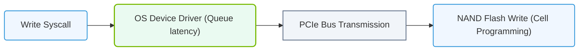

# 19.1c Latency (microseconds to milliseconds): read latency for inference serving

#### 🏷️ The AI Data Center Networking — Moving Petabytes Without Latency > 19 Enterprise Storage Architectures for AI > 19.1 Storage Performance Metrics — What Matters for AI

---

## 🧠 Context: Why Latency Matters for AI Inference

When an AI model serves a prediction (like identifying an object in an image or translating text), the time it takes to read the required data from storage directly impacts how fast the user gets a response. This time is called **read latency**. For inference serving, even small delays can make or break the user experience.

Think of it like ordering coffee: the time from when you place your order to when you receive your cup is the "latency." If the barista has to walk to a faraway storage room for beans, your coffee takes longer. In AI, the "storage room" is your data storage system, and the "coffee" is the model's prediction.

---

## ⚙️ What is Read Latency in Inference Serving?

Read latency measures the time it takes to retrieve data (like model weights, embeddings, or feature vectors) from storage when an inference request arrives. It is typically measured in:

- **Microseconds (µs):** 1 millionth of a second — ideal for real-time applications.
- **Milliseconds (ms):** 1 thousandth of a second — acceptable for many use cases but can feel slow for interactive services.

For inference serving, latency targets often range from **single-digit milliseconds** (for real-time chatbots or recommendation engines) to **hundreds of milliseconds** (for batch processing or less time-sensitive tasks).

---

## 📊 Key Latency Ranges for Inference Serving

| Latency Range | Typical Use Case | User Experience |
|---------------|------------------|-----------------|
| **< 1 ms** | Real-time AI (e.g., voice assistants, fraud detection) | Instantaneous |
| **1–10 ms** | Interactive AI (e.g., search suggestions, image recognition) | Feels instant |
| **10–100 ms** | Near-real-time (e.g., content moderation, translation) | Noticeable but acceptable |
| **> 100 ms** | Batch inference (e.g., nightly data processing) | Delayed response |

---


### 📊 Visual Representation: Storage Latency Components
This flowchart breaks down write latency: from the initial software system call down to physical NAND cell program operations.




## 🛠️ What Causes Read Latency in AI Storage?

Several factors contribute to how long it takes to read data for inference:

- **Storage media type:** NVMe SSDs offer microsecond latency; HDDs can add tens of milliseconds.
- **Network distance:** Data traveling across a data center adds microseconds; across regions adds milliseconds.
- **Caching efficiency:** Frequently accessed data stored in memory (RAM) or GPU memory reduces read latency dramatically.
- **Data size:** Larger model files or feature vectors take longer to read than smaller ones.
- **Concurrent requests:** Many simultaneous inference calls can create queueing delays in storage systems.

---

## 🕵️ How to Measure Read Latency for Inference

Engineers measure read latency using tools that time how long a storage read operation takes. A common approach is to simulate an inference request and record the time from request to data arrival.

**Example measurement approach (for reference):**

```bash
# Simulate a small read from storage to measure latency
time dd if=/path/to/model_weights.bin of=/dev/null bs=4k count=1
```

📤 **Output:** real 0m0.002s (2 milliseconds) — this shows the read took 2 ms.

For more precise measurements, engineers use specialized benchmarking tools that report latency in microseconds.

---

## 🔧 Optimizing Read Latency for Inference Serving

To keep inference fast, engineers focus on reducing read latency through these strategies:

- **Use NVMe or SSD storage** instead of HDDs for model weights and embeddings.
- **Implement caching layers** (e.g., Redis, GPU memory caching) for frequently accessed data.
- **Co-locate compute and storage** in the same rack or cluster to minimize network hops.
- **Preload model weights** into GPU memory before serving starts (avoids storage reads during inference).
- **Use high-speed interconnects** like NVIDIA NVLink or InfiniBand for faster data movement.

---

## ✅ Key Takeaway

Read latency for inference serving is measured in **microseconds to milliseconds** and directly affects how fast an AI model responds to users. The goal is to keep latency as low as possible — ideally under **10 ms** for interactive applications — by using fast storage, caching, and efficient data placement.

For new engineers, remember: every microsecond counts when serving AI at scale.