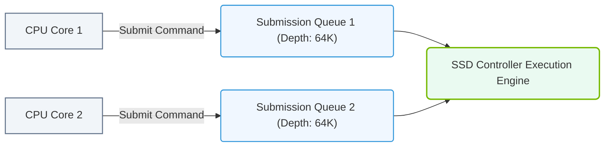

# 19.1d Queue depth: how many concurrent I/O requests NVMe can process (64K QD)

#### 🏷️ The AI Data Center Networking — Moving Petabytes Without Latency > 19 Enterprise Storage Architectures for AI > 19.1 Storage Performance Metrics — What Matters for AI

---

## 🧠 Context: Why Queue Depth Matters for AI

When training large AI models or running inference pipelines, your storage system must handle thousands of small and large I/O requests simultaneously. Think of queue depth (QD) as the number of "lanes" available for data requests to travel from your application to the storage device.  

NVMe (Non-Volatile Memory Express) drives are designed to handle an extremely high queue depth — up to **64,000 (64K)** concurrent I/O requests. This is a massive leap compared to older storage protocols like SATA or SAS, which typically support only one queue with 32–254 commands.

For AI workloads, high queue depth means:
- Faster data loading for training batches
- Reduced latency when reading checkpoints or model weights
- Better utilization of high-speed NVMe storage arrays

---

## ⚙️ What Is Queue Depth?

Queue depth is the number of I/O operations that can be **outstanding** (submitted but not yet completed) at any given time.

- **Low QD (e.g., 1–32):** The storage device processes requests one by one or in small batches. Good for simple workloads, but bottlenecks appear under heavy AI data loads.
- **High QD (e.g., 64K):** The device can handle tens of thousands of concurrent requests. This is essential for AI because many parallel processes (GPU workers, data loaders) all need data simultaneously.

---

## 📊 NVMe vs. Legacy Protocols — Queue Depth Comparison

| Feature | SATA / SAS (AHCI) | NVMe |
|---|---|---|
| Number of queues | 1 queue | Up to 64K queues |
| Queue depth per queue | 32 commands (SATA) / 254 commands (SAS) | 64K commands per queue |
| Total concurrent I/O | 32–254 | 64K × 64K (theoretically billions) |
| Typical real-world QD for AI | 32–128 | 1,000–64,000 |
| Best for | HDDs, low-bandwidth workloads | Flash/NVMe, high-throughput AI |

---

## 🛠️ How Queue Depth Affects AI Infrastructure

### ✅ Benefits of High Queue Depth (64K QD)

- **Parallel data access:** Multiple GPUs can read training data simultaneously without waiting.
- **Reduced tail latency:** Even under heavy load, most requests complete quickly because the queue can absorb bursts.
- **Better NVMe utilization:** Modern NVMe drives are fast enough to handle thousands of requests — low QD would leave performance on the table.
- **Supports distributed training:** Frameworks like PyTorch, TensorFlow, and JAX issue many small I/O requests per second; high QD keeps them flowing.

### ⚠️ Considerations for Engineers

- **Not all workloads benefit equally:** If your AI pipeline reads large sequential files (e.g., single huge checkpoint), a moderate QD (e.g., 256–1024) may be sufficient.
- **Queue depth must be tuned:** Setting QD too high can overwhelm the storage controller or cause memory pressure. Start with 128–1024 and increase while monitoring latency.
- **NVMe drivers and OS support:** Ensure your Linux kernel (or Windows Server) and NVMe driver are configured to allow high queue depths. Defaults may limit QD to 128 or 256.

---


### 📊 Visual Representation: NVMe Multi-Queue Depth Architecture
This diagram displays NVMe multi-queue architecture, showing how parallel CPU cores submit commands to matching hardware queues.




## 🕵️ How to Check and Tune Queue Depth

### 🔍 Checking Current Queue Depth

On a Linux system, you can check the NVMe device's queue depth using:

**For reference:**
```bash
cat /sys/block/nvme0n1/queue/nr_requests
```
📤 Output: **256** (typical default)

To see the maximum supported queue depth:

**For reference:**
```bash
cat /sys/block/nvme0n1/device/queue_depth
```
📤 Output: **1024** (or higher, depending on the drive)

### 🔧 Tuning Queue Depth

You can increase the queue depth temporarily:

**For reference:**
```bash
echo 4096 > /sys/block/nvme0n1/queue/nr_requests
```

To make it permanent, add a udev rule or set it in your storage configuration script.

---

## 🧪 Real-World AI Example

Imagine you're training a large language model with 8 GPUs. Each GPU runs a data loader that reads 4KB–1MB chunks from an NVMe SSD array. Without high queue depth:

- Each GPU issues ~100 I/O requests per second.
- Total: 800 requests/second.
- With QD=32, the drive can only handle 32 at a time — requests queue up, causing GPU starvation.

With QD=64K:

- All 800 requests are submitted almost instantly.
- The NVMe drive processes them in parallel, completing in milliseconds.
- GPUs stay busy, training throughput increases by 2–5x.

---

## ✅ Key Takeaways for New Engineers

- **Queue depth = concurrency.** Higher QD means more parallel I/O, which is critical for AI.
- **NVMe supports up to 64K QD** — but real-world tuning is needed.
- **Start with QD=256–1024** for most AI workloads, then increase if latency remains low.
- **Monitor with tools like `iostat`, `nvme-cli`, or `fio`** to see if your storage is bottlenecked by low QD.
- **Don't confuse queue depth with queue count.** NVMe has both many queues and deep queues — both matter.

---

## 📚 Further Reading (Internal)

- 19.1a IOPS and Throughput — What They Mean for AI
- 19.1b Latency Metrics — P99 and Tail Latency
- 19.1c Bandwidth vs. IOPS — When Each Matters
- 19.2 NVMe Over Fabrics (NVMe-oF) for AI Clusters

---

*This guide is part of the NVIDIA-Certified Associate: AI Infrastructure and Operations curriculum.*