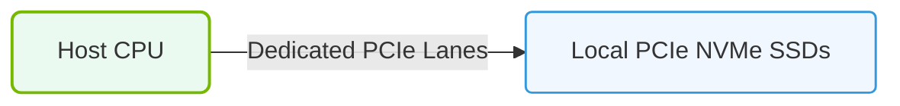

# 19.2a DAS (Direct Attached Storage): NVMe U.2/E3 drives in the server — maximum speed

#### 🏷️ The AI Data Center Networking — Moving Petabytes Without Latency > 19 Enterprise Storage Architectures for AI > 19.2 Storage Tiers and Connectivity Models

---

## 🧠 Context Introduction

In AI infrastructure, data must move fast — from storage to GPU memory and back. Direct Attached Storage (DAS) is the simplest and often fastest way to connect storage to a server. For new engineers, think of DAS as drives plugged directly into the server's motherboard or backplane, with no network switch or storage appliance in between.

NVMe U.2 and E3 drives are the modern standard for high-speed DAS in AI servers. They replace older SATA and SAS drives, offering dramatically higher speeds and lower latency. This topic explains what these drives are, how they connect, and what "maximum speed" really means in practice.

---

## ⚙️ What Are NVMe U.2 and E3 Drives?

- **NVMe (Non-Volatile Memory Express)** is the protocol that allows SSDs to communicate directly with the CPU over PCI Express lanes — bypassing older SATA/SAS controllers.
- **U.2** (formerly SFF-8639) is a physical connector form factor for 2.5-inch NVMe SSDs. It uses the same physical size as a laptop hard drive but delivers PCIe speeds.
- **E3** (also called EDSFF or Enterprise and Data Center Standard Form Factor) is a newer, longer form factor designed specifically for data centers. It offers better cooling and higher capacity than U.2.

---

## 🛠️ How They Connect in a Server

- Each NVMe U.2 or E3 drive connects directly to the server's PCIe bus via a backplane or a dedicated NVMe switch.
- The number of PCIe lanes available determines the maximum speed per drive.
- Common configurations:
  - **x4 PCIe lanes** per drive (standard for most NVMe U.2 drives)
  - **x8 PCIe lanes** per drive (available on some high-end E3 drives)
- The server's CPU and chipset must support enough PCIe lanes to handle all drives simultaneously.

---

### 📊 Visual Representation: Direct Attached Storage (DAS) Dedicated PCIe Bus
This diagram displays DAS, showing SSDs installed locally in server chassis and communicating directly over the host PCIe bus.

## 📊 Maximum Speed — What Does It Mean?

The "maximum speed" of an NVMe U.2 or E3 drive depends on three factors:

| Factor | Explanation |
|--------|-------------|
| **PCIe Generation** | Gen3 = ~1 GB/s per lane, Gen4 = ~2 GB/s per lane, Gen5 = ~4 GB/s per lane |
| **Lane Count** | More lanes = more bandwidth (x4 vs x8) |
| **Drive Controller** | The SSD's internal controller limits how fast it can read/write |

### Real-World Maximum Speeds (per drive)

- **PCIe Gen3 x4 (U.2)** : Up to 3.5 GB/s sequential read, 3.0 GB/s sequential write
- **PCIe Gen4 x4 (U.2)** : Up to 7.0 GB/s sequential read, 6.5 GB/s sequential write
- **PCIe Gen5 x4 (E3)** : Up to 14.0 GB/s sequential read, 12.0 GB/s sequential write
- **PCIe Gen5 x8 (E3)** : Up to 28.0 GB/s sequential read, 24.0 GB/s sequential write

> 💡 **Key Insight:** The "maximum speed" is a theoretical ceiling. Real-world performance depends on workload type (random vs sequential), queue depth, and thermal throttling.

---

## 🕵️ Why Speed Matters for AI Workloads

- AI training and inference require reading large datasets (often terabytes) repeatedly.
- Faster storage means:
  - Shorter data loading times before training starts
  - Reduced GPU idle time waiting for data
  - Ability to stream data at rates that match GPU memory bandwidth
- For multi-GPU servers, multiple NVMe drives can be striped together (RAID 0 or software striping) to achieve aggregate speeds exceeding 50 GB/s.

---

## 🔧 Practical Considerations for Engineers

- **Thermal management:** NVMe drives generate significant heat under sustained load. Ensure proper airflow in the server chassis.
- **PCIe lane allocation:** Check your server's CPU and chipset specifications. Some CPUs have limited PCIe lanes, which may restrict how many drives you can install at full speed.
- **Cabling:** U.2 drives use a specific cable (SFF-8639 to SFF-8643) that must be compatible with your server backplane.
- **Driver support:** Modern Linux kernels (5.x and later) have native NVMe support. No additional drivers are needed for basic operation.

---

## ✅ Summary

- **DAS with NVMe U.2/E3 drives** is the fastest storage tier directly attached to a server.
- **Maximum speed** is determined by PCIe generation and lane count — Gen5 x8 offers up to 28 GB/s per drive.
- For AI workloads, this speed eliminates storage as a bottleneck when feeding data to GPUs.
- Always verify your server's PCIe lane budget and cooling capacity before deploying high-speed NVMe DAS.

---

*Next topic in this section: 19.2b — NVMe over Fabrics (NVMe-oF) for shared storage pools.*