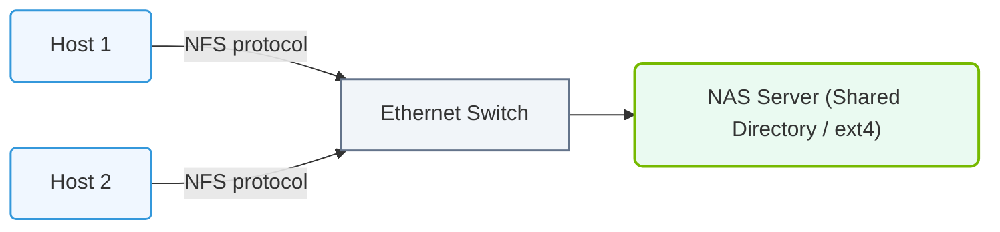

# 19.2b NAS (Network Attached Storage): NFS shares for datasets — convenient but limited

#### 🏷️ The AI Data Center Networking — Moving Petabytes Without Latency > 19 Enterprise Storage Architectures for AI > 19.2 Storage Tiers and Connectivity Models

---

## 🌐 Context Introduction

In AI workflows, datasets are the lifeblood of model training and inference. Engineers often need a simple way to share large datasets across multiple servers — without copying files manually to each machine. Network Attached Storage (NAS) using NFS (Network File System) shares is one of the most common solutions for this. It allows multiple servers to access the same files over the network as if they were local. However, while NFS is incredibly convenient for small-to-medium scale AI projects, it has significant limitations when dealing with the massive data volumes and high-performance demands of modern AI workloads. This guide explains how NFS works, when to use it, and where it falls short.

---

## ⚙️ What is NAS and NFS?

- **NAS (Network Attached Storage):** A dedicated file storage device connected to the network that provides file-level data access to multiple clients.
- **NFS (Network File System):** A protocol that allows a computer to access files over a network as if they were on its local hard drive.
- **How it works:** A NAS device exports a directory (called a "share" or "export"), and client machines mount that directory to a local path.

---

## 📊 Why NFS is Convenient for AI Datasets

| Feature | Benefit for Engineers |
|---------|----------------------|
| **Centralized storage** | One copy of the dataset, accessible by all training nodes |
| **No data duplication** | Saves disk space — no need to copy datasets to every server |
| **Easy to set up** | Mount a share with a single command; no complex configuration |
| **Transparent access** | Files appear as local files; existing tools and scripts work without changes |
| **Supports many clients** | Dozens or hundreds of servers can mount the same share simultaneously |

---

## 🛠️ How Engineers Typically Use NFS for Datasets

- **Mounting an NFS share:** Engineers use a mount command to attach the remote dataset to a local directory, such as `/mnt/datasets`.
- **Training scripts read from the mount:** Python or other AI frameworks access files at the mounted path as if they were local.
- **Shared access:** Multiple GPU servers can read the same dataset simultaneously during distributed training.
- **Simple updates:** New data added to the NAS is immediately visible to all clients without any manual sync.

---

### 📊 Visual Representation: Network Attached Storage (NAS) Shared File Access
This diagram displays NAS architecture, showing multiple host systems accessing files over standard IP networks using NFS or SMB.

## 🕵️ The Limitations of NFS for AI Workloads

While convenient, NFS was not designed for the extreme demands of AI training. Here are the key limitations:

- **🐢 Slow for many small files:** AI datasets often contain millions of small files (e.g., images). NFS struggles with metadata operations (listing files, checking permissions) for large directories.
- **📉 Network latency overhead:** Every file read/write goes over the network. For high-throughput workloads, this adds significant latency compared to local SSDs.
- **🚫 No parallel data paths:** NFS is a single-server protocol. The NAS device becomes a bottleneck when many clients request data simultaneously.
- **⚠️ Not designed for concurrent writes:** If multiple training jobs write to the same NFS share, file corruption or data loss can occur.
- **📦 Limited scalability:** Beyond a few hundred clients or a few terabytes of data, performance degrades rapidly.
- **🔒 Single point of failure:** If the NAS device goes down, all clients lose access to their datasets.

---

## 📈 When to Use NFS vs. When to Avoid It

| Scenario | Recommended Approach |
|----------|----------------------|
| Small datasets (< 1 TB) with few files | ✅ NFS works fine |
| Prototyping or development environments | ✅ NFS is convenient |
| Large datasets with many small files | ❌ Avoid NFS — use object storage or parallel file systems |
| High-throughput training (multiple GPUs) | ❌ Avoid NFS — use local SSDs or distributed storage |
| Production AI pipelines with strict SLAs | ❌ Avoid NFS — use dedicated AI storage solutions |

---

## 🔄 Alternatives to NFS for AI Datasets

When NFS is not enough, engineers typically move to:

- **Object Storage (e.g., S3, MinIO):** Better for large files and scalable to petabytes, but higher latency per request.
- **Parallel File Systems (e.g., Lustre, GPFS):** Designed for high-throughput, low-latency access from thousands of clients.
- **Local NVMe SSDs:** Fastest option — copy dataset to each node's local storage before training.
- **Distributed Caching (e.g., Alluxio, JuiceFS):** Combines the convenience of NFS with better performance through caching.

---

## ✅ Key Takeaways for New Engineers

- **NFS is great for simplicity** — use it for small-scale experiments, shared code repositories, or low-volume datasets.
- **NFS is not built for speed** — avoid it for large-scale AI training, especially with many small files or high throughput requirements.
- **Plan for growth** — as your datasets grow, migrate to storage solutions designed for AI workloads.
- **Monitor performance** — if training is I/O-bound and you're using NFS, that is often the bottleneck.

---

## 📚 Summary

NFS shares over NAS are the "training wheels" of AI data storage — easy to use, widely supported, and perfect for getting started. However, as your AI projects scale in data volume and performance demands, you will quickly outgrow NFS. Understanding its limitations early will help you design more robust and performant AI infrastructure from the start.