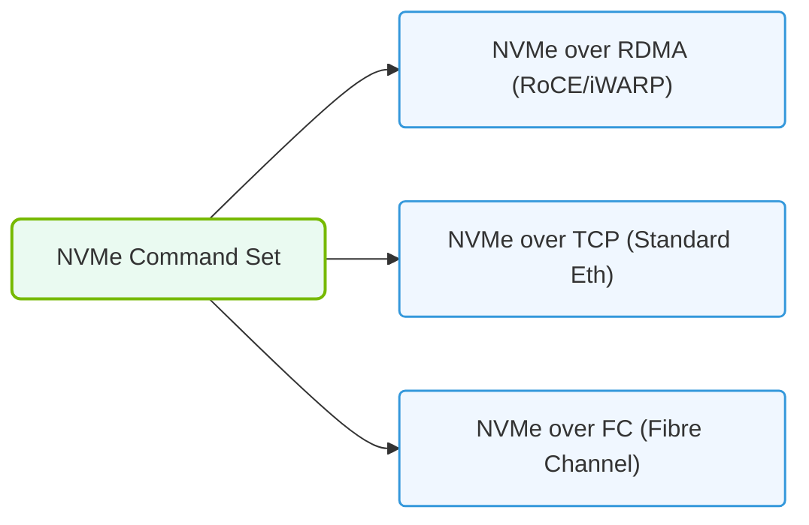

# 19.3a NVMe-oF concepts: extending the NVMe protocol over a network fabric

#### 🏷️ The AI Data Center Networking — Moving Petabytes Without Latency > 19 Enterprise Storage Architectures for AI > 19.3 NVMe over Fabrics (NVMe-oF) — Networked Storage Without Compromise

## 🧠 Context Introduction

In AI data centers, storage speed is critical. Traditional storage protocols like SATA or SAS were designed for spinning hard drives and introduce unnecessary overhead when used with modern NVMe (Non-Volatile Memory Express) SSDs. NVMe over Fabrics (NVMe-oF) solves this by taking the fast, low-latency NVMe protocol and extending it across a network fabric — allowing remote storage to behave almost like local storage. For new engineers, think of it as **making a storage server in another rack feel like it's plugged directly into your GPU server's PCIe slot**.

---

## ⚙️ What is NVMe-oF?

NVMe-oF is a specification that allows NVMe commands to be transported over a network (fabric) instead of only over a local PCIe bus. This enables:

- **Shared storage pools** accessible by multiple AI training nodes
- **Low latency** (microseconds instead of milliseconds)
- **High throughput** matching the speed of local NVMe drives
- **Scalability** — add more storage without physically touching servers

Key components:
- **NVMe-oF Initiator** — the client (e.g., a GPU server requesting data)
- **NVMe-oF Target** — the storage server exposing its NVMe drives
- **Fabric** — the network connecting them (usually Ethernet or InfiniBand)

---

## 🛠️ How NVMe-oF Works (Simplified)

1. **NVMe commands** (read/write) are encapsulated into network packets
2. **The fabric** transports these packets between initiator and target
3. **The target** processes the command on its local NVMe drive
4. **The result** is sent back over the fabric to the initiator

The magic is that the initiator sees the remote drive as a local NVMe device — no special filesystem or driver changes needed for applications.

---

## 📊 NVMe-oF vs. Traditional Storage Protocols

| Feature | NVMe-oF | iSCSI (SCSI over IP) | NFS (Network File System) |
|---------|---------|----------------------|---------------------------|
| **Protocol** | NVMe (native flash) | SCSI (legacy) | File-level |
| **Latency** | ~10-50 microseconds | ~100-500 microseconds | ~500-2000 microseconds |
| **CPU Overhead** | Very low | Moderate | High |
| **Parallelism** | 64K queues, 64K commands each | Single queue, limited depth | File locking overhead |
| **Best for AI** | ✅ Excellent | ❌ Too slow | ❌ Too much overhead |

---

### 📊 Visual Representation: NVMe over Fabrics (NVMe-oF) Transport Layers
This diagram contrasts the protocol stacks of NVMe over RDMA (RoCE), NVMe over TCP, and NVMe over Fibre Channel.

## 🔌 Common NVMe-oF Fabrics

Two main transport types dominate AI data centers:

### 1. **NVMe/TCP** (Ethernet-based)
- Uses standard Ethernet networks (25/100/400 GbE)
- Most common for existing data centers
- Slightly higher latency than RDMA but easier to deploy

### 2. **NVMe/RDMA** (InfiniBand or RoCE)
- Uses Remote Direct Memory Access (RDMA)
- InfiniBand: dedicated fabric, lowest latency
- RoCE (RDMA over Converged Ethernet): RDMA on Ethernet
- Preferred for latency-sensitive AI training workloads

---

## 🕵️ Why NVMe-oF Matters for AI Infrastructure

AI training pipelines involve:
- **Loading massive datasets** (terabytes to petabytes)
- **Checkpointing model states** frequently
- **Sharing data** across hundreds of GPUs

Without NVMe-oF:
- Storage becomes a bottleneck — GPUs idle waiting for data
- Each server needs local NVMe (expensive, hard to manage)

With NVMe-oF:
- Storage is **pooled and shared** — one storage server feeds many GPU servers
- **Data locality** is less critical — any GPU can access any data quickly
- **Elastic scaling** — add storage capacity without touching compute nodes

---

## 🧩 Simple Analogy: The Pizza Delivery

Imagine you're hosting a party (AI training) and need pizza (data):

- **Local NVMe** = Pizza in your own kitchen (fastest, but limited space)
- **NVMe-oF** = Pizza delivered by a drone in 2 minutes (almost as fast, unlimited supply)
- **Traditional NAS** = Pizza delivered by car in 30 minutes (works, but everyone waits)

NVMe-oF makes remote storage feel local — the "drone delivery" for AI data.

---

## 🚦 Key Takeaways for New Engineers

- **NVMe-oF is not a new storage device** — it's a way to network existing NVMe drives
- **Latency is the enemy** — NVMe-oF keeps it in microseconds, not milliseconds
- **Two main transports**: TCP (easier) and RDMA (faster)
- **AI workloads benefit most** due to massive data movement requirements
- **Management is simpler** — one storage pool, many consumers

---

## 📚 Further Learning Path

1. Understand basic NVMe concepts (queues, commands, namespaces)
2. Learn Ethernet vs. InfiniBand differences
3. Explore NVMe-oF target configuration (Linux nvmet, SPDK)
4. Practice connecting an initiator to a target over TCP
5. Benchmark latency differences between local NVMe and NVMe-oF

> **Remember**: In AI infrastructure, storage speed directly impacts training time. NVMe-oF is the technology that removes storage as a bottleneck — making your GPUs work at full potential.