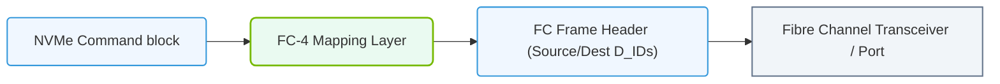

# 19.3d NVMe/FC: NVMe over Fibre Channel for traditional SAN environments

#### 🏷️ The AI Data Center Networking — Moving Petabytes Without Latency > 19 Enterprise Storage Architectures for AI > 19.3 NVMe over Fabrics (NVMe-oF) — Networked Storage Without Compromise

---

## 🔍 Context Introduction

In traditional enterprise data centers, **Fibre Channel (FC)** has been the gold standard for connecting servers to shared storage (SANs). It's reliable, low-latency, and purpose-built for block storage. However, older protocols like SCSI over Fibre Channel (FCP) have become a bottleneck for modern AI workloads that demand massive parallel I/O.

**NVMe over Fibre Channel (NVMe/FC)** solves this by running the NVMe protocol directly over existing Fibre Channel infrastructure. It allows engineers to keep their trusted SAN hardware while unlocking the speed and parallelism of NVMe. Think of it as giving your legacy Fibre Channel network a high-performance engine upgrade — no forklift upgrade required.

---

## ⚙️ How NVMe/FC Works

NVMe/FC encapsulates NVMe commands inside Fibre Channel frames. This means:

- **Native NVMe commands** (not SCSI) travel over the FC fabric.
- **No TCP/IP overhead** — FC is a lossless, low-latency transport.
- **Multiple queues** (up to 64K) with deep queue depths (up to 64K commands per queue) — compared to SCSI's single queue with 256 commands.
- **Direct memory access (DMA)** between host and storage, reducing CPU overhead.

The result? Latency drops from milliseconds (SCSI) to microseconds (NVMe), and IOPS skyrocket.

---

## 🛠️ Key Components for NVMe/FC

To deploy NVMe/FC, you need:

- **NVMe-capable storage arrays** — Modern all-flash arrays that support NVMe over Fabrics.
- **Fibre Channel Host Bus Adapters (HBAs)** — Gen 5 (16GFC), Gen 6 (32GFC), or Gen 7 (64GFC) that support NVMe/FC.
- **FC switches** — Must support NVMe/FC (most Brocade and Cisco switches from 2016 onward).
- **Operating system support** — Linux (NVMe-oF initiator), Windows Server, VMware vSphere (with NVMe over FC support).
- **NVMe/FC drivers** — Provided by HBA vendors (e.g., Broadcom/Emulex, Marvell/QLogic).

---

## 📊 NVMe/FC vs. Traditional SCSI over FC (FCP)

| Feature | SCSI over FC (FCP) | NVMe over FC (NVMe/FC) |
|---------|-------------------|------------------------|
| **Command set** | SCSI (legacy) | NVMe (modern, streamlined) |
| **Queue depth** | 1 queue, 256 commands | Up to 64K queues, 64K commands each |
| **Latency** | Milliseconds (1-10 ms) | Microseconds (10-100 µs) |
| **CPU overhead** | High (interrupt-driven) | Low (polling-based) |
| **Parallelism** | Limited | Massive (ideal for AI workloads) |
| **Infrastructure change** | None (uses existing FC) | Same FC cables, switches, HBAs (with firmware upgrade) |
| **Protocol overhead** | Higher (SCSI framing) | Lower (NVMe streamlined framing) |

---

### 📊 Visual Representation: NVMe over Fibre Channel (FC-NVMe) Frame Routing
This diagram shows FC-NVMe encapsulation, routing NVMe block payloads over high-reliability Fibre Channel fabric infrastructures.

## 🕵️ When to Use NVMe/FC

NVMe/FC is ideal for:

- **Existing FC SAN environments** — No need to rip and replace cabling or switches.
- **AI training clusters** — High IOPS and low latency for reading/writing checkpoints and datasets.
- **Database workloads** — Oracle, SQL Server, or SAP HANA that benefit from fast block storage.
- **VMware environments** — vSphere 7.0+ supports NVMe over FC for virtual machines.
- **Compliance-heavy industries** — Finance, healthcare, government that require dedicated, isolated storage networks.

Avoid NVMe/FC if:

- You have no existing FC infrastructure (consider NVMe/TCP or NVMe/RoCE instead).
- Your storage arrays don't support NVMe-oF.
- Your team lacks FC expertise.

---

## 🧩 Deployment Considerations for Engineers

When planning an NVMe/FC rollout, keep these points in mind:

- **Firmware upgrades** — FC switches and HBAs may need firmware updates to support NVMe/FC. Check vendor compatibility matrices.
- **Zoning** — Same as SCSI FC: use WWPN-based zoning. NVMe/FC uses the same FC frame headers, so zoning rules don't change.
- **Multipathing** — Use native NVMe multipathing (Linux kernel 5.0+) or vendor-specific tools (e.g., PowerPath, MPIO).
- **Performance tuning** — Enable NVMe polling mode on HBAs (reduces CPU interrupts). Set queue depths appropriately (start with 256 per queue).
- **Monitoring** — Use FC switch tools (e.g., Brocade Fabric OS, Cisco DCNM) to monitor NVMe/FC traffic. Look for **NVMe over FC** counters in port statistics.

---

## ✅ Summary

NVMe/FC is the bridge between legacy SAN reliability and modern NVMe performance. It lets engineers protect their Fibre Channel investment while giving AI workloads the low-latency, high-parallelism storage they demand. For any engineer managing a traditional FC SAN, learning NVMe/FC is a practical, high-impact skill — no new cables required.

---

## 📚 Further Learning

- **NVMe-oF specification** — NVM Express Inc. (nvmexpress.org)
- **Fibre Channel Industry Association (FCIA)** — fcinfo.com
- **Vendor docs** — Broadcom Emulex NVMe/FC, Marvell QLogic NVMe/FC, Brocade NVMe/FC support guides