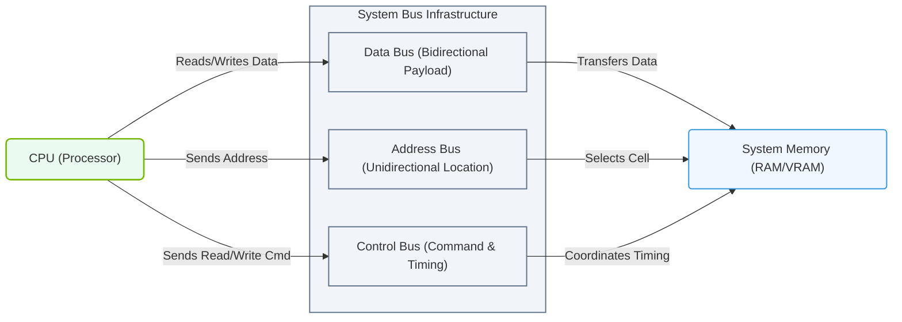

# 1.1b Memory bus, address bus, and data bus — the three communication highways

#### 🏷️ The Physical Realm — Data Center Foundations & Hardware Architecture > 1 What Is a Computer? Core Architecture for Absolute Beginners > 1.1 The Von Neumann Architecture — How Every Computer Is Designed

## 🧭 Context Introduction

In the Von Neumann architecture, the CPU needs to communicate with memory to fetch instructions and read/write data. This communication happens over three distinct "highways" called **buses**. Think of them as dedicated lanes on a road system — each with a specific job. Understanding these three buses is essential for engineers working with AI workloads, because memory bandwidth and bus width directly impact how fast models can train and infer.

---

## ⚙️ What Is a Bus?

A **bus** is a set of parallel wires or traces on a circuit board that carries signals between components. In a computer, the three main buses connect the CPU to memory (RAM). They work together as a coordinated team.

---

## 🛣️ The Three Buses Explained

### 1. 📊 Data Bus — The Cargo Carrier

- **Purpose:** Transfers actual data (the "payload") between CPU and memory.
- **Direction:** Bidirectional — data can flow both ways (read from memory or write to memory).
- **Width:** Measured in bits (e.g., 8-bit, 16-bit, 32-bit, 64-bit). Wider bus = more data moved per cycle.
- **Key point for engineers:** A 64-bit data bus can move 8 bytes of data in one clock cycle. For AI workloads, wider data buses mean faster movement of model weights and activations.

### 2. 🏠 Address Bus — The GPS Navigator

- **Purpose:** Carries the memory address (location) where data should be read from or written to.
- **Direction:** Unidirectional — only from CPU to memory (CPU decides which address to access).
- **Width:** Determines how much memory the CPU can address. For example:
  - 32-bit address bus → can address 2³² = 4 GB of RAM
  - 64-bit address bus → can address 2⁶⁴ = 16 exabytes (huge)
- **Key point for engineers:** AI models often require large memory capacity (e.g., 80 GB for a large LLM). A narrow address bus limits how much memory the system can use.

### 3. 🔗 Memory Bus — The Traffic Controller

- **Purpose:** Carries control signals that coordinate the operation (e.g., read command, write command, timing signals).
- **Direction:** Bidirectional for control signals, but mostly CPU-to-memory for commands.
- **Signals include:** Clock, read/write enable, chip select, and synchronization pulses.
- **Key point for engineers:** The memory bus ensures data doesn't collide and that the CPU and memory stay in sync. In modern systems, this is often integrated into the memory controller.

---

## 🕵️ How They Work Together (Example)

Imagine the CPU wants to read a number from memory address **0x1000**:

1. **Address bus** carries the address `0x1000` from CPU to memory.
2. **Memory bus** sends a "read" control signal to memory.
3. **Data bus** carries the actual number from memory back to the CPU.

All three buses operate simultaneously in every memory access cycle.

### 📊 Visual Representation: CPU-to-Memory Bus Communication

This diagram illustrates how the unidirectional Address Bus, bidirectional Data Bus, and Control Bus work in unison to facilitate data transfer between the CPU and System RAM.

---

## 📊 Comparison Table

| Feature | Data Bus | Address Bus | Memory Bus |
|---------|----------|-------------|------------|
| **What it carries** | Actual data (numbers, instructions) | Memory addresses (locations) | Control signals (commands) |
| **Direction** | Bidirectional (read/write) | Unidirectional (CPU → memory) | Mostly CPU → memory |
| **Width determines** | How much data per cycle | Maximum memory capacity | Timing and synchronization |
| **Example width** | 64 bits (8 bytes) | 48 bits (256 TB addressable) | Varies by standard |
| **AI relevance** | Affects data throughput for model weights | Limits max model size in RAM | Affects memory latency |

---

## 🛠️ Why This Matters for AI Infrastructure

For engineers working with AI systems:

- **Data bus width** directly impacts **memory bandwidth** — how fast you can feed data to the GPU or CPU. Wider is better for large batch sizes.
- **Address bus width** determines if your system can hold a full AI model in RAM (e.g., a 70B parameter model needs ~140 GB of memory).
- **Memory bus** timing affects **latency** — slower control signals mean longer wait times for data.

In modern NVIDIA systems, these buses are integrated into the **memory controller** on the CPU or GPU die. For example, NVIDIA Grace Hopper superchips use a high-speed **NVLink-C2C** interconnect that effectively combines all three buses into a single, very fast link.

---

## ✅ Quick Recap

| Bus | Analogy | Key Takeaway |
|-----|---------|--------------|
| Data Bus | Cargo truck | Moves the actual data |
| Address Bus | GPS / Map | Tells where the data lives |
| Memory Bus | Traffic light + police | Controls when and how data moves |

---

## 📝 Final Thought for New Engineers

When you see specifications like "64-bit data bus" or "48-bit address bus" in a server datasheet, you now know exactly what they mean. For AI workloads, always check the **memory bandwidth** (data bus width × clock speed) — it's often the bottleneck in training and inference.