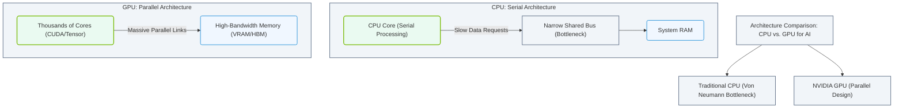

# 1.1c Why the Von Neumann bottleneck limits AI workloads (preview of GPU need)

#### 🏷️ The Physical Realm — Data Center Foundations & Hardware Architecture > 1 What Is a Computer? Core Architecture for Absolute Beginners > 1.1 The Von Neumann Architecture — How Every Computer Is Designed

---

## 🧠 Context Introduction

Before we talk about GPUs and AI, you need to understand the fundamental limitation of every traditional computer. Almost every CPU-based system you've ever used follows the **Von Neumann architecture** — a design from 1945 that separates memory (where data is stored) from the processor (where data is computed). This separation creates a hidden speed limit called the **Von Neumann bottleneck**, and it's the single biggest reason why AI workloads struggle on standard CPUs.

---

## ⚙️ What Is the Von Neumann Bottleneck?

In a Von Neumann machine, the CPU and memory are connected by a single shared bus (a data highway). Every instruction and every piece of data must travel back and forth across this single path.

- **The problem:** The bus is much slower than the CPU itself.
- **The result:** The CPU spends most of its time **waiting** for data to arrive, rather than actually computing.
- **The analogy:** Imagine a world-class chef (the CPU) who can cook a meal in 2 minutes, but must walk to a single pantry (memory) across the room for every single ingredient. The chef is idle most of the time.

---

## 📊 Why This Hurts AI Workloads

AI workloads (like training neural networks) are fundamentally different from traditional software:

| Traditional Workload (e.g., Word Processor) | AI Workload (e.g., Neural Network Training) |
|---------------------------------------------|---------------------------------------------|
| Processes one instruction at a time | Processes millions of calculations simultaneously |
| Small amounts of data moved per operation | Massive datasets (GB to TB) moved constantly |
| CPU is busy computing most of the time | CPU is idle waiting for data most of the time |
| Memory access is occasional | Memory access is constant and heavy |

**Key insight:** AI models require **massive parallel computation** — thousands of simple math operations happening at the same time. The Von Neumann bottleneck makes this painfully slow on CPUs because:

- Every single math operation requires a round trip to memory
- The single data bus becomes a traffic jam
- The CPU's speed is wasted on waiting, not computing

---

## 🕵️ A Concrete Example

Consider training a simple neural network with 1 million parameters.

**On a CPU (Von Neumann architecture):**
- The CPU fetches one weight from memory
- The CPU fetches one input value from memory
- The CPU performs one multiplication
- The CPU stores the result back to memory
- Repeat 1 million times per training step

**Result:** The CPU is idle for roughly **80-90%** of the time, waiting for data to arrive over the bottleneck.

### 📊 Visual Representation: CPU vs. GPU Architectural Comparison

This diagram compares the traditional CPU serial architecture, constrained by a narrow shared bus bottleneck, with the highly parallel NVIDIA GPU architecture utilizing massive parallel links.

---

## 🛠️ Preview: How GPUs Break the Bottleneck

GPUs (Graphics Processing Units) are designed to bypass the Von Neumann bottleneck in a clever way:

- **Massive parallelism:** A GPU has thousands of small cores (not a few big ones like a CPU)
- **On-chip memory:** GPUs have large, fast memory caches right next to the cores
- **SIMD execution:** Single Instruction, Multiple Data — one instruction operates on thousands of data points simultaneously

**The key difference:**
- **CPU:** One fast chef, one slow pantry (Von Neumann bottleneck)
- **GPU:** Thousands of slower chefs, each with their own small pantry right next to them (no bottleneck)

---

## 📈 The Real-World Impact

| Metric | CPU (Von Neumann) | GPU (Parallel) |
|--------|-------------------|----------------|
| Data transfer per operation | One value at a time | Thousands of values at once |
| Core utilization | ~10-20% (waiting for data) | ~80-90% (data is local) |
| Training time for a small model | Days | Hours |
| Training time for a large model | Months (impractical) | Days |

---

## ✅ Summary for New Engineers

1. **The Von Neumann bottleneck** is the fundamental speed limit of traditional computers — the single data path between CPU and memory.
2. **AI workloads** are uniquely vulnerable because they require massive data movement and parallel computation.
3. **GPUs** solve this by putting many simple processors close to memory, allowing thousands of calculations to happen simultaneously without waiting for data.
4. **This is why** modern AI infrastructure relies on GPUs (or specialized accelerators like TPUs) rather than standard CPUs.

> **Remember:** When you see an AI training job running on a GPU cluster, you're watching the Von Neumann bottleneck being bypassed — thousands of parallel paths replacing the single slow highway.