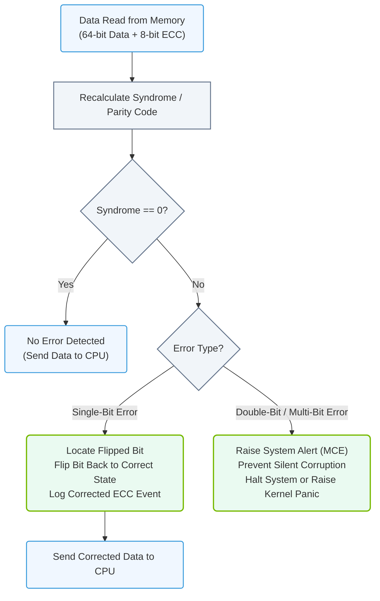

# 1.3c ECC (Error-Correcting Code) Memory: why bit-flip errors can corrupt a 72-hour training run

#### 🏷️ The Physical Realm — Data Center Foundations & Hardware Architecture > 1 What Is a Computer? Core Architecture for Absolute Beginners > 1.3 System Memory (RAM) — Speed and Capacity Fundamentals

## 🧠 Context Introduction

Imagine you're training a massive AI model — like a large language model or a computer vision system. You've set the training to run for **72 hours straight**. Everything is going smoothly until, at hour 68, the training suddenly fails with a bizarre error, or worse, produces garbage results. You've just lost nearly three days of compute time.

One of the most common (and silent) culprits? **A single bit-flip in memory**.

This section explains what bit-flips are, why they're dangerous for long-running AI workloads, and how **ECC (Error-Correcting Code) Memory** acts as your safety net.

---

## ⚙️ What is a Bit-Flip?

A **bit-flip** is exactly what it sounds like: a single binary digit (a 0 or 1) in your computer's memory spontaneously changes to its opposite value.

- **Normal bit:** `0` stays `0`, `1` stays `1`
- **Flipped bit:** `0` becomes `1`, or `1` becomes `0`

This might sound tiny, but in a system with billions of bits, even one wrong bit can cause catastrophic results.

### 🕵️ What Causes Bit-Flips?

Bit-flips are caused by **cosmic rays**, **background radiation**, or **hardware defects**. Yes, cosmic rays from space can actually strike your RAM chips and change a bit's state. This is not science fiction — it's a well-documented phenomenon in data centers.

---

## 📊 Why Bit-Flips Are Dangerous for AI Training

AI training is **deterministic** — every calculation depends on the previous one. A single bit-flip can:

- **Corrupt a weight value** in your neural network, causing the model to learn incorrect patterns
- **Break a loop counter**, causing infinite loops or premature termination
- **Change a memory address**, leading to segmentation faults or data corruption
- **Alter a gradient value**, derailing the entire optimization process

### 🧮 The 72-Hour Training Scenario

| Time Elapsed | What Happens Without ECC | What Happens With ECC |
|--------------|--------------------------|------------------------|
| Hour 0-24 | Training runs normally | Training runs normally |
| Hour 25 | A cosmic ray flips a bit in a weight matrix | ECC detects and corrects the error instantly |
| Hour 26-71 | The corrupted weight propagates errors through all subsequent calculations | Training continues with correct data |
| Hour 72 | Model finishes but produces garbage results (or crashes) | Model finishes correctly |

**Without ECC**, you might not even know a bit-flip occurred until the very end — wasting 72 hours of GPU time and electricity.

---

## 🛠️ How ECC Memory Works

**ECC (Error-Correcting Code) memory** is a special type of RAM that can detect and correct single-bit errors automatically.

### 🔬 How It Works (Simplified)

1. **Extra bits are stored** alongside your data (usually 8 extra bits for every 64 bits of data)
2. **A mathematical code** (Hamming code or similar) is computed for each chunk of data
3. **When reading**, the memory controller recalculates the code and compares it to the stored code
4. **If a single bit is wrong**, the controller knows exactly which bit and flips it back
5. **If two bits are wrong**, the controller detects the error but cannot correct it (it raises an alert)

### 🆚 ECC vs. Non-ECC Memory

| Feature | Non-ECC Memory | ECC Memory |
|---------|----------------|------------|
| Cost | Lower | ~10-20% more expensive |
| Speed | Slightly faster | Slightly slower (due to error checking) |
| Error handling | Silent corruption | Automatic correction of single-bit errors |
| Detection | None | Detects and reports multi-bit errors |
| Use case | Gaming, personal computers | Servers, AI training, scientific computing |

### 📊 Visual Representation: ECC Error Detection and Correction Flow

This flowchart maps the logical steps taken by the ECC memory controller to recalculate parity, verify data integrity, correct single-bit errors, and alert the system on uncorrectable multi-bit errors.

---

## 💡 Why Engineers Must Care About ECC

For AI infrastructure and operations, ECC memory is **not optional** — it's a requirement. Here's why:

- **Training runs last days or weeks** — the longer the run, the higher the probability of a bit-flip
- **GPU clusters share memory** — a single corrupted value can pollute data across multiple GPUs
- **Reproducibility is critical** — bit-flips make it impossible to reproduce results
- **Cost of failure is enormous** — losing a 72-hour run means wasted GPU time, electricity, and delayed project timelines

### 📈 Real-World Impact

In large-scale AI training (like training GPT or BERT models), bit-flips are **expected** to occur multiple times per day across a cluster of thousands of GPUs. Without ECC, these errors would silently corrupt models, forcing engineers to constantly restart training.

---

## 🧪 How to Verify ECC is Enabled

When setting up AI infrastructure, always check that ECC memory is active. Here's how engineers typically verify this:

**For Linux systems:**
- Use the command **`sudo dmidecode -t memory`** to check memory type
- Look for the line that says **"Error Correction Type: Single-bit ECC"** or **"Multi-bit ECC"**

**For NVIDIA GPUs:**
- Use **`nvidia-smi -q -d ECC`** to check ECC status on GPU memory
- Expected output should show **"ECC Enabled: Yes"** for each GPU

**For system logs:**
- Check **`/var/log/mcelog`** or **`journalctl -u mcelog.service`** for ECC correction events
- You should see entries like **"Corrected memory error"** — this means ECC is working

---

## ✅ Key Takeaways for New Engineers

- **Bit-flips are real** — cosmic rays and radiation can flip bits in RAM
- **One bit-flip can ruin a 72-hour training run** by corrupting weights, gradients, or control logic
- **ECC memory automatically fixes single-bit errors** and reports multi-bit errors
- **Always use ECC memory for AI training servers** — it's a non-negotiable requirement
- **Verify ECC is enabled** during system setup and periodically check logs for corrected errors

---

## 📚 Summary

| Concept | What It Means |
|---------|---------------|
| Bit-flip | A single bit in memory changes from 0 to 1 or 1 to 0 |
| Cause | Cosmic rays, radiation, hardware defects |
| Impact on AI | Corrupts model weights, breaks training loops, wastes days of compute |
| ECC Memory | RAM that detects and corrects single-bit errors automatically |
| Why engineers need it | Prevents silent corruption during long training runs |

**Bottom line:** If you're building or managing AI infrastructure, always choose ECC memory. It's a small price to pay for protecting multi-day, multi-thousand-dollar training runs from a single cosmic ray.