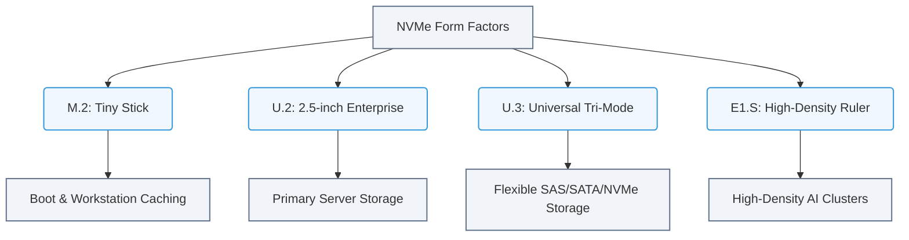

# 1.4d U.2, U.3, M.2, and E1.S form factors — physical packaging differences

#### 🏷️ The Physical Realm — Data Center Foundations & Hardware Architecture > 1 What Is a Computer? Core Architecture for Absolute Beginners > 1.4 Storage Devices — From Spinning Disk to NVMe

## 📖 Context Introduction

When you start working with AI infrastructure, you will quickly encounter different physical shapes and sizes for storage drives. These are called **form factors**. Think of them like different types of luggage: a carry-on suitcase, a duffel bag, and a backpack all serve the same purpose (carrying your stuff), but they fit differently in overhead bins, cars, and closets.

In the world of NVMe (Non-Volatile Memory Express) solid-state drives, the four most common form factors you will see are **U.2**, **U.3**, **M.2**, and **E1.S**. Each one has a unique physical shape, connector type, and intended use case. Understanding these differences is essential for building or maintaining AI servers, where storage speed and density directly impact model training and inference performance.

---

## ⚙️ What Is a Form Factor?

A form factor defines three things about a storage device:
- **Physical dimensions** (length, width, height)
- **Connector type** (how it plugs into the motherboard or backplane)
- **Power and signal interface** (how it communicates with the system)

For NVMe drives, the interface is always PCI Express (PCIe), but the physical package changes.

---

## 🧩 The Four Form Factors — A Quick Overview

### 1. 🔲 M.2 — The Tiny Stick

**M.2** drives look like small sticks of gum. They are very common in laptops, desktops, and some servers.

- **Shape:** Small rectangular card (22mm wide, varying lengths like 30mm, 42mm, 80mm, or 110mm)
- **Connector:** Edge connector with a single notch (keying) — usually **M-key** for NVMe
- **Mounting:** Screws directly onto the motherboard
- **Capacity:** Up to 8TB (consumer) or 15TB (enterprise)
- **Cooling:** Often relies on a small heatsink; can throttle under sustained heavy writes
- **Use case:** Boot drives, caching, light AI workloads, edge devices

**Key limitation for AI:** M.2 drives are small and can get very hot under continuous high-speed writes. They are not ideal for large-scale AI data lakes.

---

### 2. 🟦 U.2 — The Enterprise Workhorse

**U.2** drives look like small, thick 2.5-inch hard drives. They are designed for enterprise servers and storage arrays.

- **Shape:** 2.5-inch wide, 15mm thick (standard laptop hard drive size)
- **Connector:** SFF-8639 (a combined data+power connector)
- **Mounting:** Slides into a hot-swap drive bay (like a hard drive)
- **Capacity:** Up to 30TB per drive
- **Cooling:** Metal casing allows good heat dissipation; often uses server airflow
- **Use case:** Primary storage for AI training data, large databases, virtualization

**Why engineers like U.2:** It is hot-swappable (replace without powering down), fits into standard 2.5-inch bays, and supports full PCIe Gen4/Gen5 speeds.

---

### 3. 🟩 U.3 — The Universal Successor

**U.3** is the newer version of U.2. It looks almost identical but adds a critical feature: **tri-mode support**.

- **Shape:** Same as U.2 (2.5-inch, 15mm thick)
- **Connector:** SFF-8639 (same physical connector as U.2)
- **Key difference:** U.3 can operate in **NVMe**, **SAS**, or **SATA** mode — automatically detected by the system
- **Backward compatibility:** U.3 drives work in U.2 slots, but U.2 drives do NOT work in U.3-only slots
- **Use case:** Same as U.2, but with more flexibility for mixed storage environments

**Why this matters:** If you have a server that supports U.3, you can mix old SAS drives with new NVMe drives in the same chassis.

---

### 4. 🟫 E1.S — The Slim Density King

**E1.S** drives are long and thin, designed specifically for high-density storage servers (like those used in AI data centers).

- **Shape:** Long rectangle (various widths: 25mm, 38mm, 54mm; lengths up to 111mm)
- **Connector:** Edge connector with a single notch (similar to M.2 but physically larger)
- **Mounting:** Slides into a dedicated slot or carrier tray
- **Capacity:** Up to 8TB (current generation)
- **Cooling:** Excellent — large surface area and can be placed in direct airflow paths
- **Use case:** Ultra-dense storage nodes, AI training clusters, edge servers

**Why E1.S is special:** It is designed to pack many drives into a small space (high density) while keeping them cool. This is critical for AI clusters where you need many terabytes of fast storage in a single rack unit.

---

## 📊 Comparison Table

| Feature | M.2 | U.2 | U.3 | E1.S |
|---------|-----|-----|-----|------|
| **Shape** | Small stick | 2.5-inch disk | 2.5-inch disk | Long rectangle |
| **Connector** | Edge (M-key) | SFF-8639 | SFF-8639 | Edge (special) |
| **Hot-swap** | No | Yes | Yes | Yes (in carrier) |
| **Max capacity** | ~15TB | ~30TB | ~30TB | ~8TB |
| **Cooling** | Poor (needs heatsink) | Good (metal case) | Good (metal case) | Excellent (large surface) |
| **Typical use** | Boot, cache | Primary storage | Mixed storage | High-density storage |
| **PCIe support** | Gen3/Gen4 | Gen4/Gen5 | Gen4/Gen5 | Gen4/Gen5 |
| **Price per GB** | Low | Medium | Medium | High |

---

## 🕵️ Physical Differences at a Glance

### Connector Visuals

- **M.2:** A small gold edge with a single notch (key) on the left side. You plug it at a 30-degree angle, then screw it down flat.
- **U.2 / U.3:** A rectangular connector with two rows of pins, surrounded by a metal shroud. It looks like a thicker, wider USB port.
- **E1.S:** A long gold edge connector, similar to M.2 but much larger. It slides into a slot and locks with a latch.

### Size Comparison

- **M.2:** About the size of a stick of gum (22mm x 80mm)
- **U.2 / U.3:** About the size of a deck of cards (100mm x 70mm x 15mm)
- **E1.S:** About the size of a ruler (up to 111mm long, 25-54mm wide)

---

## 🛠️ When to Use Which Form Factor

| Scenario | Recommended Form Factor | Why |
|----------|------------------------|-----|
| Boot drive for a single GPU workstation | M.2 | Cheap, fast, small |
| AI training data storage in a rack server | U.2 or U.3 | Hot-swappable, high capacity, good cooling |
| High-density storage node (many drives in 1U) | E1.S | Slim, stackable, excellent airflow |
| Mixed storage environment (NVMe + SAS) | U.3 | Tri-mode support |
| Edge AI device (limited space, low power) | M.2 | Tiny footprint, low power |

### 📊 Visual Representation: Storage Form Factor Classifications and Use Cases
This diagram categorizes the four primary NVMe form factors, highlighting their key design focuses (size, capacity/cooling, tri-mode compatibility, density) and recommended server roles.

---

## ✅ Key Takeaways for New Engineers

1. **M.2 is for small, fast, cheap storage** — great for boot drives, not for heavy AI workloads.
2. **U.2 is the enterprise standard** — reliable, hot-swappable, and fits in standard server bays.
3. **U.3 is U.2's smarter sibling** — same physical shape, but supports multiple storage protocols.
4. **E1.S is for density** — packs many drives into a small space with great cooling.
5. **Always check your server's backplane** — a U.2 slot may not accept U.3 drives (but U.3 slots accept U.2 drives).
6. **Cooling matters** — M.2 drives can overheat under sustained writes; U.2/U.3/E1.S handle heat better.

---

## 📚 Further Learning

- Look at the physical drives in your lab or data center — identify which form factor each one uses.
- Check the server's storage backplane specification to see which form factors it supports.
- Remember: form factor is about **physical fit**, not speed. A U.2 drive and an M.2 drive can both be equally fast (PCIe Gen4), but they fit in completely different places.

---

*This guide is part of the NVIDIA-Certified Associate: AI Infrastructure and Operations learning path. Understanding storage form factors helps you design, build, and maintain the physical backbone of AI systems.*