# 1.4e Endurance ratings (TBW) and enterprise vs consumer grade drives

#### 🏷️ The Physical Realm — Data Center Foundations & Hardware Architecture > 1 What Is a Computer? Core Architecture for Absolute Beginners > 1.4 Storage Devices — From Spinning Disk to NVMe

---

## 🔍 Context Introduction

When you buy a solid-state drive (SSD), you might notice terms like "TBW" or "enterprise grade" on the box. These aren't just marketing buzzwords — they define how long a drive will last under real workloads. For engineers working with AI infrastructure, understanding endurance ratings is critical because AI training and inference operations involve massive amounts of data being written and rewritten constantly. Choosing the wrong drive can lead to premature failure, data loss, or unexpected downtime.

---

## ⚙️ What Is TBW (Terabytes Written)?

TBW stands for **Terabytes Written**. It is a manufacturer's warranty rating that tells you how much total data can be written to a drive before it is likely to fail.

- **TBW is a measure of endurance**, not speed or capacity.
- It represents the total cumulative amount of data that can be written over the drive's lifetime.
- For example, a drive rated at **300 TBW** means you can write 300 terabytes of data to it before the warranty expires.
- Once you exceed the TBW rating, the drive may still work, but the manufacturer no longer guarantees its reliability.

**Why TBW matters for AI workloads:**
- AI model training involves writing checkpoints, logs, and intermediate data repeatedly.
- Data preprocessing pipelines write large datasets to storage.
- Inference servers may cache results, writing frequently.

---

## 📊 Consumer vs Enterprise Drives: The Core Differences

| Feature | Consumer Grade Drive | Enterprise Grade Drive |
|---------|---------------------|-----------------------|
| **TBW Rating** | Low (e.g., 150–600 TBW for 1TB drive) | High (e.g., 1,000–10,000+ TBW for 1TB drive) |
| **Typical Use** | Laptops, desktops, gaming, light workloads | Servers, data centers, AI training, databases |
| **Duty Cycle** | 8 hours/day, 5 days/week | 24/7 continuous operation |
| **Power Loss Protection** | Minimal or none | Capacitors to flush data during power failure |
| **Error Correction** | Basic | Advanced (e.g., ECC, RAID support) |
| **Firmware** | Optimized for burst performance | Optimized for consistent latency and reliability |
| **Price per GB** | Lower | Higher (2–5x more expensive) |

### 📊 Visual Representation: Architectural Trade-Offs — Consumer vs. Enterprise SSDs
This diagram illustrates the design choices and structural differences between consumer and enterprise drives, showcasing their respective optimization focus areas.

```mermaid
flowchart TD
    subgraph ConsumerSSD [Consumer SSD: Burst-Optimized]
        C1[NAND Flash: Higher Bit Density TLC/QLC] --> C2[Controller: Burst performance firmware]
        C2 --> C3[No Power Loss Protection Capacitors]
        C3 --> C4[Low Endurance: 150-600 TBW]
    end

    subgraph EnterpriseSSD [Enterprise SSD: 24/7 Consistent & Durable]
        E1[NAND Flash: High Endurance TLC/MLC] --> E2[Controller: Consistent latency firmware]
        E2 --> E3[Integrated Power Loss Protection Capacitors]
        E3 --> E4[High Endurance: 1,000-10,000+ TBW]
    end

    class C1 memory;
    class C2 cpu;
    class C3 system;
    class C4 system;
    
    class E1 memory;
    class E2 cpu;
    class E3 system;
    class E4 system;

    classDef cpu fill:#eafaf1,stroke:#76b900,stroke-width:2px,rx:6px,ry:6px;
    classDef memory fill:#f0f7ff,stroke:#3498db,stroke-width:1.5px,rx:4px,ry:4px;
    classDef system fill:#f1f5f9,stroke:#64748b,stroke-width:1.5px;
```

---

## 🛠️ How to Read an SSD Endurance Rating

SSD manufacturers typically list TBW in the product specifications. Here is how to interpret it:

- **Low endurance (consumer):** 150–300 TBW per 1TB capacity — suitable for boot drives, office work, light file storage.
- **Medium endurance (prosumer):** 600–1,200 TBW per 1TB capacity — good for creative workstations, video editing.
- **High endurance (enterprise):** 3,000–10,000+ TBW per 1TB capacity — designed for AI training, database servers, virtualization.

**Example calculation:**
If you have a drive rated at **3,000 TBW** and your AI pipeline writes **1 TB per day**, the drive is rated to last:
- 3,000 TBW ÷ 1 TB/day = 3,000 days ≈ **8.2 years**

---

## 🕵️ Why Enterprise Drives Are Critical for AI Infrastructure

AI workloads are **write-heavy** and **continuous**. Here is why consumer drives fail in these environments:

- **Write amplification:** AI training frameworks write many small files (checkpoints, logs) that cause more physical writes than the data size suggests.
- **No idle time:** Consumer drives expect periods of inactivity to perform garbage collection and wear leveling. AI servers run 24/7.
- **Thermal stress:** Enterprise drives are built with better heat dissipation for dense server racks.
- **Consistency:** Consumer drives may throttle performance after sustained writes. Enterprise drives maintain consistent speed.

**Real-world example:**
A team training a large language model (LLM) used consumer SSDs in a storage node. After 6 months, drives began failing because they exceeded their TBW rating. Switching to enterprise NVMe drives with 10x higher TBW solved the issue.

---

## ✅ Key Takeaways for New Engineers

- **Always check TBW** before selecting an SSD for AI infrastructure.
- **Consumer drives are fine for boot drives** or low-write storage (e.g., storing datasets that are read often but rarely written).
- **Enterprise drives are mandatory** for data nodes, cache storage, and any drive handling model training or inference logging.
- **Plan for 3–5 years of writes** based on your expected daily write volume.
- **Monitor drive health** using tools like **smartctl** (Linux) or vendor-specific utilities to track remaining TBW.

---

## 📌 Summary

| Aspect | Consumer Drive | Enterprise Drive |
|--------|----------------|------------------|
| Endurance (TBW) | Low | High |
| Cost per GB | Low | High |
| Best for | Boot, light storage | AI training, databases, 24/7 servers |
| Failure risk in AI | High | Low |

**Bottom line:** In AI infrastructure, never cut corners on storage endurance. A failed drive during a multi-week training run can cost far more than the price difference between consumer and enterprise hardware.