# 1.6d Hot-swap components: drives, PSUs, and fans without powering down

#### 🏷️ The Physical Realm — Data Center Foundations & Hardware Architecture > 1 What Is a Computer? Core Architecture for Absolute Beginners > 1.6 Enterprise Server Anatomy — What Makes a Server Different from a Desktop

---

## 🧠 Context Introduction

In a typical desktop computer, if you need to replace a failed hard drive or a dead power supply, you must shut down the system, unplug everything, swap the part, and then power back on. This means downtime — the computer is unavailable while you work.

Enterprise servers are designed differently. They support **hot-swap** (also called *hot-plug* or *hot-replace*) components. This means you can remove and replace critical hardware parts **while the server is still running and serving users**. For new engineers, this is one of the most important concepts to understand because it directly impacts system availability, maintenance windows, and uptime.

---

## ⚙️ What Does "Hot-Swap" Mean?

Hot-swap capability allows a component to be physically removed or inserted without powering down the system. The server's hardware and operating system are designed to detect the change and adjust accordingly — often without any interruption to running applications.

**Key characteristics of hot-swappable components:**
- The server remains powered on and operational during the swap
- No reboot is required after the replacement
- The component is designed with special connectors that prevent electrical shorts
- The operating system can detect the removal and addition of the device

---

## 🛠️ Three Main Hot-Swap Components

### 💾 Drives (Hard Drives / SSDs)

Enterprise servers use drive bays that are accessible from the front panel. Each drive sits in a **carrier tray** with a handle.

**How it works:**
- The drive is connected through a backplane that supports hot-plug signaling
- When you remove a drive, the RAID controller or storage software immediately marks it as missing
- When you insert a new drive, the system detects it and can automatically rebuild data onto it (if configured)

**Typical use case:** Replacing a failed hard drive in a RAID array without taking the server offline.

---

### 🔌 Power Supply Units (PSUs)

Enterprise servers almost always have **redundant power supplies** — usually two or more. Each PSU can handle the full load of the server.

**How it works:**
- The server runs on both PSUs simultaneously (load sharing)
- If one PSU fails, the other instantly takes over at 100% capacity
- You can unplug the failed PSU, remove it, insert a new one, and plug it back in — all while the server stays on

**Important note:** Always verify the new PSU matches the exact model and wattage rating. Mixing mismatched PSUs can cause electrical issues.

---

### 🌬️ Fans

Server fans are typically arranged in **redundant groups** (e.g., 4 fans where only 3 are needed for cooling).

**How it works:**
- Each fan module has its own connector and can be removed independently
- When one fan fails, the remaining fans spin faster to compensate
- You can slide out the failed fan module and insert a new one without touching any other component

**Typical use case:** Replacing a noisy or failed fan during normal business hours.

---

## 📊 Comparison: Hot-Swap vs. Cold-Swap

| Feature | Hot-Swap | Cold-Swap (Traditional) |
|---------|----------|-------------------------|
| Server state during replacement | Running | Powered off |
| Downtime | Zero | Minutes to hours |
| User impact | None | Service unavailable |
| Component design | Special connectors, handles, status LEDs | Standard connectors |
| Typical environment | Data centers, enterprise servers | Desktop PCs, non-critical systems |

---

## 🕵️ How to Identify Hot-Swap Components

As a new engineer, you can quickly identify hot-swappable parts by looking for these visual cues:

**Drives:**
- Front-facing drive bays with individual handles
- Small LED indicators (green = healthy, amber = fault)
- No screws visible on the front of the drive carrier

**PSUs:**
- Located at the rear of the server, accessible from outside
- Have a latch or handle for removal
- Often have a small LED showing power status

**Fans:**
- Located in a fan bank (usually middle or rear of chassis)
- Each fan is in its own plastic housing with a finger-grip
- No tools required to remove — just squeeze latches and pull

---

## ✅ Best Practices for Hot-Swapping

- **Always follow the server manufacturer's procedure** — different vendors have slightly different latch mechanisms and removal sequences
- **Wait for the component's LED to indicate it is safe to remove** (usually an amber or blue light)
- **Handle components by their edges or carriers** — never touch exposed circuit boards or connector pins
- **Replace only one component at a time** — if you remove two drives from a RAID array, you may lose data
- **Verify the replacement part is compatible** — same model, firmware version, and capacity
- **After insertion, check the system management software** to confirm the new component is recognized and healthy

---

## 🧪 Simple Example Scenario

Imagine you are monitoring a server and receive an alert: **"Fan 3 failed — speed 0 RPM"**.

1. You walk to the server rack — the server is still running and serving users
2. You locate the fan bank at the front of the chassis
3. You see a small amber LED next to Fan 3
4. You squeeze the latch, pull the failed fan module straight out
5. You slide in a new fan module until it clicks into place
6. The amber LED turns green within a few seconds
7. The alert clears automatically

**Total downtime for users: Zero seconds.**

### 📊 Visual Representation: Hot-Swap Maintenance Workflow
This flowchart outlines the step-by-step operational procedure for replacing a failed hot-swap component while maintaining zero system downtime.

```mermaid
flowchart LR
    Alert[1. System Alert: Fan 3 Failed] --> Locate[2. Locate Server & Identify Amber LED]
    Locate --> Extract[3. Release Latch & Extract Failed Module]
    Extract --> Insert[4. Slide in New Fan Module & Latch]
    Insert --> Verify[5. LED Turns Green & System Re-verifies]
    Verify --> Clear[6. Alert Cleared - System Remains Online]

    class Alert system;
    class Locate system;
    class Extract memory;
    class Insert memory;
    class Verify cpu;
    class Clear system;

    classDef cpu fill:#eafaf1,stroke:#76b900,stroke-width:2px,rx:6px,ry:6px;
    classDef memory fill:#f0f7ff,stroke:#3498db,stroke-width:1.5px,rx:4px,ry:4px;
    classDef system fill:#f1f5f9,stroke:#64748b,stroke-width:1.5px;
```

---

## 🔑 Key Takeaway for New Engineers

Hot-swap capability is what makes enterprise servers **highly available**. It allows engineers to perform maintenance, upgrades, and repairs without scheduling downtime or disrupting users. When you see a server with front-facing drive bays, redundant power supplies, and tool-less fan modules, you are looking at a system designed for hot-swap operations.

Always remember: **If it has a handle and a status LED, it is probably hot-swappable.**