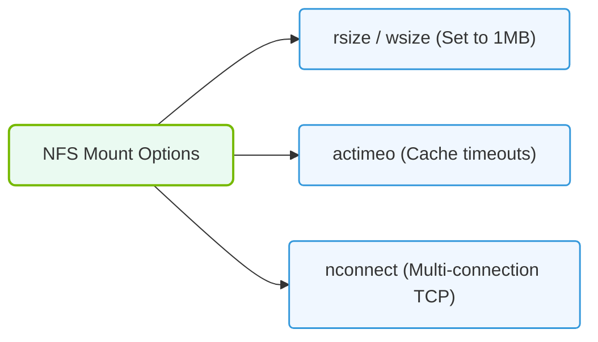

# 20.1c NFS tuning workarounds and why they are insufficient beyond 10 Gb/s

#### 🏷️ The AI Data Center Networking — Moving Petabytes Without Latency > 20 Parallel File Systems — Shared Storage for AI Clusters at Scale > 20.1 Why NFS Fails at Scale

## 📘 Context Introduction

Network File System (NFS) has been a reliable workhorse for shared storage in traditional data centers for decades. However, as AI workloads demand higher throughput — especially beyond 10 Gb/s network speeds — NFS begins to show its architectural limitations. Engineers often attempt to "tune" NFS with various workarounds to squeeze more performance, but these fixes are ultimately insufficient for modern AI infrastructure. This section explains the common tuning workarounds and why they break down at scale.

---

## ⚙️ Common NFS Tuning Workarounds

Engineers have developed several tuning techniques to improve NFS performance. Here are the most frequently used ones:

- **Increasing `rsize` and `wsize` (read/write buffer sizes)** — Setting these to larger values (e.g., 1 MB) to reduce the number of network round trips per I/O operation.
- **Enabling `noatime` mount option** — Disabling access time updates to reduce metadata write overhead.
- **Adjusting `nfsd` thread count** — Increasing the number of NFS server daemon threads to handle more concurrent requests.
- **Tuning TCP socket buffer sizes** — Increasing `rmem_max` and `wmem_max` to allow larger in-flight data.
- **Using `async` mount option** — Allowing the NFS client to return success before data is written to disk, improving write performance at the cost of data integrity risk.
- **Enabling `nconnect`** — Allowing multiple TCP connections per NFS mount to improve parallelism.
- **Increasing `timeo` and `retrans` values** — Making the client more tolerant of network latency and packet loss.

---

## 📊 Why These Workarounds Fail Beyond 10 Gb/s

The fundamental problem is that NFS was designed for local area networks with moderate throughput, not for the high-bandwidth, low-latency requirements of AI training clusters. Here is a breakdown of the key limitations:

### 🕵️ Protocol Overhead

- **Single-threaded metadata operations** — NFS relies heavily on a single metadata server path. Even with multiple `nfsd` threads, metadata operations (like file lookups and attribute checks) become a bottleneck.
- **Chatty protocol** — NFS requires multiple round trips for each file operation (e.g., GETATTR, LOOKUP, READ). At 10 Gb/s and above, the latency of these round trips dominates performance.
- **Locking overhead** — NFSv3 uses Network Lock Manager (NLM), which is notoriously slow. NFSv4 has improved locking but still suffers from contention in multi-client scenarios.

### 🛠️ Network Stack Limitations

- **TCP incast problem** — When many clients simultaneously request data from the same NFS server, TCP congestion control causes packet drops and retransmissions, severely degrading throughput.
- **Single network path** — NFS typically uses a single TCP connection per mount (even with `nconnect`, the parallelism is limited). This cannot saturate 25 Gb/s, 40 Gb/s, or 100 Gb/s links.
- **Kernel context switching** — Each NFS request requires context switches between user space and kernel space, adding microseconds of latency that become significant at high speeds.

### 📈 Scaling Constraints

| Workaround | Benefit at 1 Gb/s | Benefit at 10 Gb/s | Benefit at 40+ Gb/s |
|------------|-------------------|--------------------|----------------------|
| Larger rsize/wsize | ✅ Significant | ⚠️ Moderate | ❌ Negligible |
| More nfsd threads | ✅ Significant | ⚠️ Diminishing returns | ❌ Bottlenecked by CPU |
| async mount | ✅ Significant | ⚠️ Risk outweighs gain | ❌ Data corruption risk |
| nconnect | ✅ Some benefit | ⚠️ Marginal | ❌ TCP overhead dominates |
| TCP buffer tuning | ✅ Helpful | ⚠️ Minimal impact | ❌ Cannot overcome protocol limits |

---

### 📊 Visual Representation: NFS Mount Tuning Parameters
This diagram shows the parameters tuned in NFS mounts (rsize, wsize, actimeo) to attempt to mitigate standard performance bottlenecks.

## 🧠 The Real Problem: NFS Wasn't Built for AI

Beyond 10 Gb/s, the tuning workarounds hit a wall because:

- **NFS is a client-server protocol** — It cannot leverage parallel data paths or distributed metadata. AI workloads need parallel file systems (like Lustre, GPUDirect Storage, or WekaFS) that stripe data across multiple servers.
- **No data locality awareness** — NFS cannot schedule data placement based on which GPU or node will process it. This forces all data through a single server, creating a bottleneck.
- **No RDMA support** — NFS traditionally uses TCP/IP, which adds CPU overhead for checksumming and packet processing. Modern AI storage uses Remote Direct Memory Access (RDMA) to bypass the CPU entirely.
- **No native GPU integration** — NFS cannot directly transfer data to GPU memory. AI frameworks must copy data through the CPU, adding latency and wasting GPU cycles.

---

## ✅ What Engineers Should Do Instead

Instead of tuning NFS, consider these alternatives for AI infrastructure:

- **Use parallel file systems** — Lustre, GPUDirect Storage (GDS), or WekaFS that stripe data across multiple storage nodes and support RDMA.
- **Implement object storage for datasets** — Systems like MinIO or Ceph can provide higher aggregate throughput for large file reads.
- **Leverage NVIDIA Magnum IO** — A suite of technologies (including GPUDirect Storage and GPUDirect RDMA) designed specifically for AI workloads.
- **Consider NVMe over Fabrics (NVMe-oF)** — For block storage access with lower latency and higher parallelism than NFS.

---

## 📝 Key Takeaway

NFS tuning workarounds can squeeze out marginal gains at 1 Gb/s or 10 Gb/s, but they fundamentally cannot overcome the protocol's architectural limitations at higher speeds. For AI infrastructure operating beyond 10 Gb/s, engineers must adopt parallel, distributed storage solutions designed for the throughput and latency demands of modern GPU clusters.