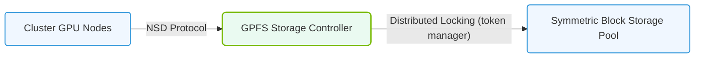

# 20.2d IBM Spectrum Scale (GPFS): enterprise parallel filesystem with global namespace

#### 🏷️ The AI Data Center Networking — Moving Petabytes Without Latency > 20 Parallel File Systems — Shared Storage for AI Clusters at Scale > 20.2 Parallel File System Architectures

---

## 🧠 Context Introduction

When you're training large AI models or processing massive datasets, you need a storage system that can keep up with hundreds or thousands of GPUs reading and writing data simultaneously. Traditional file systems (like NTFS or ext4) are designed for a single computer — they simply cannot handle this scale.

**IBM Spectrum Scale** (formerly known as GPFS — General Parallel File System) is an enterprise-grade **parallel file system** that solves this problem. It allows many servers (called nodes) to access the same files at the same time, at extremely high speeds, while presenting a single, unified view of all data — this is called a **global namespace**.

Think of it like a giant, shared hard drive that every server in your AI cluster can access instantly, no matter which physical server actually stores the data.

---

## ⚙️ What Makes Spectrum Scale Special?

- **Parallel Access**: Multiple servers can read/write the same file simultaneously without corruption.
- **Global Namespace**: All data appears in one logical directory tree, even if it's spread across many physical disks or locations.
- **High Performance**: Designed for petabyte-scale datasets and thousands of concurrent clients.
- **Data Resilience**: Built-in replication and recovery — no single point of failure.
- **Scalability**: Add more storage or compute nodes without downtime.

---

## 📊 Key Architecture Components

| Component | Role | Simple Analogy |
|-----------|------|----------------|
| **NSD (Network Shared Disk)** | The actual physical or virtual disk that stores data | Like a shelf in a warehouse |
| **Cluster** | A group of servers running Spectrum Scale together | The entire warehouse complex |
| **Node** | A single server in the cluster | One warehouse worker |
| **File System** | The logical view of all data across NSDs | The inventory catalog |
| **Quorum** | A set of nodes that decide cluster health | The management team |
| **Token Manager** | Coordinates which node can write to which part of a file | The traffic controller |

---

## 🛠️ How It Works (Simplified)

1. **Data is striped** across multiple NSDs (disks) for speed.
2. **Metadata** (information about files) is stored separately from file data.
3. **Tokens** are used to prevent conflicts — only one node can write to a specific byte range at a time.
4. **Clients** (servers running AI workloads) connect to the cluster and see the same file system.

---

## 🕵️ Key Features for AI Workloads

- **Concurrent Reads/Writes**: Multiple GPUs can read different parts of the same training dataset simultaneously.
- **Data Caching**: Frequently accessed data is cached in memory for faster access.
- **Snapshots**: Point-in-time copies for backup or checkpointing.
- **Information Lifecycle Management (ILM)**: Automatically move older data to cheaper storage tiers.
- **Encryption**: Data can be encrypted at rest and in transit.

---

### 📊 Visual Representation: GPFS Shared Network Disk (NSD) Architecture
This diagram displays IBM Spectrum Scale (GPFS), utilizing the NSD protocol to expose block storage directly to all cluster nodes.

## 🔍 Comparison: Spectrum Scale vs. Other Parallel File Systems

| Feature | IBM Spectrum Scale | Lustre | CephFS |
|---------|-------------------|--------|--------|
| **Global Namespace** | ✅ Yes — single view across sites | ✅ Yes | ✅ Yes |
| **POSIX Compliance** | ✅ Full | ✅ Full | ⚠️ Partial |
| **Ease of Management** | ✅ GUI + CLI tools | ⚠️ Requires expertise | ✅ Simple setup |
| **Data Replication** | ✅ Built-in synchronous/async | ❌ External tools needed | ✅ Built-in |
| **Best For** | Enterprise AI, HPC, mixed workloads | Large-scale HPC | Cloud-native, object + file |

---

## 🧩 Common Use Cases in AI Infrastructure

- **Training Data Storage**: Store petabytes of images, text, or video for model training.
- **Model Checkpointing**: Save training progress every few minutes without slowing down GPUs.
- **Multi-site Collaboration**: Teams in different data centers access the same dataset via the global namespace.
- **Inference Serving**: Serve models stored on Spectrum Scale to production inference servers.

---

## 📝 Simple Example Workflow

1. An engineer mounts the Spectrum Scale file system on all AI training nodes.
2. The training script reads data from a path like **/gpfs/training_data/imagenet/**.
3. Each GPU reads a different batch of images from the same directory simultaneously.
4. After training, the model is saved to **/gpfs/models/bert_v1.pt**.
5. Inference servers mount the same file system and load the model from the same path.

---

## ✅ Key Takeaways for New Engineers

- Spectrum Scale is **not** a single hard drive — it's a distributed system that acts like one.
- The **global namespace** means you don't need to know where data physically lives.
- It's designed for **high concurrency** — many readers and writers at once.
- Management is done through commands like **mmcrcluster** (create cluster), **mmcrfs** (create file system), and **mmmount** (mount file system).
- For AI, it eliminates the bottleneck of moving data to each GPU — the data comes to the GPU.

---

## 📚 Where to Learn More

- IBM Documentation: *IBM Spectrum Scale Administration Guide*
- Red Hat GPFS documentation (for open-source version)
- NVIDIA DGX SuperPOD reference architecture (often uses Spectrum Scale)

---

> 💡 **Pro Tip**: When starting with Spectrum Scale, focus on understanding **tokens** and **quorum** — these are the most common sources of confusion for new engineers. A healthy quorum means a healthy cluster.