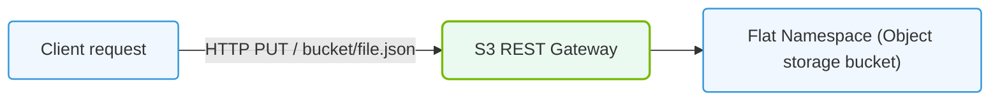

# 20.3a S3 API: the universal object storage protocol and its AI tooling ecosystem

#### 🏷️ The AI Data Center Networking — Moving Petabytes Without Latency > 20 Parallel File Systems — Shared Storage for AI Clusters at Scale > 20.3 Object Storage for AI Dataset Management

---

## 🌐 Context Introduction

In AI infrastructure, data is everything. Training a large language model or computer vision system requires moving, storing, and accessing massive datasets — often petabytes in size. Traditional file systems struggle with this scale. Enter object storage, and specifically the **S3 API** (Simple Storage Service API), originally created by Amazon Web Services. It has become the universal protocol for object storage across cloud and on-premises environments. For new engineers, think of S3 as a giant, globally accessible key-value store for files — where each file (object) lives in a bucket (container) and is accessed via a simple HTTP-based API. The AI tooling ecosystem has fully embraced S3, making it the backbone for dataset management, model checkpointing, and data pipelines.

---

## 📦 What is the S3 API?

The S3 API is a **RESTful web service interface** that allows you to store, retrieve, and manage data objects over HTTP/HTTPS. It is not a file system (no directories, no POSIX permissions), but a flat namespace of objects identified by unique keys.

- **Bucket** — a top-level container that holds objects. Bucket names must be globally unique across all users of the same S3 endpoint.
- **Object** — the actual data (file) plus metadata. Each object has a unique key (path-like string) within a bucket.
- **Key** — the identifier for an object, often structured like a file path (e.g., `datasets/imagenet/train/001.jpg`).
- **Endpoint** — the URL of the S3 service (e.g., `https://s3.us-east-1.amazonaws.com`).

---

## ⚙️ Why S3 Became the Universal Protocol

The S3 API is not just for AWS — it has been adopted by nearly every major storage vendor and open-source project. This universality is critical for AI workflows.

- **Vendor independence** — You can use the same API to talk to AWS S3, MinIO (self-hosted), Ceph, Google Cloud Storage, IBM Cloud Object Storage, or Dell EMC ECS.
- **Simplicity** — Only a handful of core operations: PUT, GET, DELETE, LIST. No mounting, no file handles, no locking.
- **Scalability** — Object storage scales horizontally to exabytes. No single point of failure.
- **HTTP-based** — Works over standard web protocols, making it easy to integrate with any programming language or tool.
- **Metadata-rich** — Each object can have custom metadata (key-value pairs) for tagging datasets, versions, or annotations.

---

## 🛠️ Core S3 API Operations for AI Workflows

| Operation | Description | AI Use Case |
|-----------|-------------|-------------|
| **PUT Object** | Upload a file to a bucket | Storing training datasets, model checkpoints |
| **GET Object** | Download a file from a bucket | Loading data into training jobs, inference |
| **DELETE Object** | Remove an object | Cleaning up old checkpoints or failed runs |
| **List Objects** | Enumerate objects in a bucket | Discovering available datasets or model versions |
| **Multipart Upload** | Upload large files in parts | Uploading terabytes of training data in parallel |
| **Copy Object** | Duplicate an object within or across buckets | Versioning datasets or replicating for redundancy |

---

## 🧠 The AI Tooling Ecosystem Built on S3

The AI community has built a rich ecosystem of tools that natively speak the S3 API. This means you can use the same storage backend for data ingestion, preprocessing, training, and deployment.

### 📊 Data Management Tools

- **DVC (Data Version Control)** — Uses S3 as a remote storage backend for versioning datasets and models. Commands like **dvc push** and **dvc pull** transfer data to/from S3 buckets.
- **LakeFS** — A Git-like version control system for data lakes that works on top of S3. Enables branching, committing, and rolling back datasets.
- **Apache Iceberg / Delta Lake** — Table formats that store metadata and data files in S3, enabling ACID transactions on object storage for AI pipelines.

### 🧪 Training Frameworks

- **PyTorch** — The **torchdata** library and **WebDataset** format can read training samples directly from S3 buckets using the S3 API.
- **TensorFlow** — The **tf.data** API supports reading from S3 via the **s3://** URI scheme.
- **Ray** — Distributed computing framework that uses S3 for storing datasets, checkpoints, and logs across clusters.

### 🗄️ Model Registry & Checkpointing

- **MLflow** — Stores model artifacts, metrics, and metadata in S3 buckets. The **mlflow artifacts** command uses the S3 API.
- **Kubeflow** — Pipelines store intermediate data and model outputs in S3-compatible storage.
- **NeMo (NVIDIA)** — Uses S3 for storing training checkpoints and vocabulary files. The **nemo checkpoint** tool can read/write directly to S3.

### 🔄 Data Pipeline Orchestration

- **Apache Airflow** — S3 hooks and operators allow you to move data between buckets and trigger training jobs.
- **Prefect** — Supports S3 as a storage backend for flow results and task outputs.
- **Argo Workflows** — Can mount S3 buckets as volumes using **s3fs** or access them via the API for artifact storage.

---

## 🕵️ How S3 Works with AI Infrastructure

For a new engineer, understanding the data flow is key. Here's a typical AI training pipeline using S3:

1. **Data Ingestion** — Raw data (images, text, logs) is uploaded to an S3 bucket using the **PUT Object** operation. Tools like **aws s3 cp** or **s3cmd** are used.
2. **Data Preprocessing** — A Spark or Ray job reads objects from S3 using **GET Object** with range requests for parallel reads. Processed data is written back to a different bucket or prefix.
3. **Training** — The training script reads mini-batches directly from S3 using the **s3://** URI. Frameworks like PyTorch use asynchronous prefetching to hide latency.
4. **Checkpointing** — Every N steps, the model saves its state (weights, optimizer state) to S3 using **PUT Object**. If the job fails, it resumes from the latest checkpoint.
5. **Model Deployment** — The final model artifact is stored in S3 and served via inference endpoints that read the model weights from the bucket.

---


### 📊 Visual Representation: S3 HTTP REST API Object Pipeline
This diagram displays object storage HTTP requests (GET/PUT), mapping URLs directly to unstructured storage buckets.




## 📈 Performance Considerations for AI Workloads

Object storage is not as fast as local NVMe or parallel file systems (like Lustre or GPUDirect Storage). However, for AI workloads, the trade-off is acceptable for many use cases.

| Factor | Impact on AI | Mitigation |
|--------|--------------|------------|
| **Latency** | Higher than local storage (10-50ms per request) | Use large object sizes (100MB+), batch requests, and prefetching |
| **Throughput** | Scales with number of parallel connections | Use multipart uploads and concurrent GET requests |
| **Consistency** | S3 is eventually consistent for some operations | Use versioning or read-after-write consistency (available in most S3 implementations) |
| **Cost** | Cheaper than block storage for cold data | Tier data to S3 for datasets, use parallel file systems for hot data |

---

## 🧩 Common S3-Compatible Storage Solutions for AI

| Solution | Type | Key Feature for AI |
|----------|------|--------------------|
| **AWS S3** | Public cloud | Global scale, 11 nines durability, integrated with SageMaker |
| **MinIO** | Self-hosted | High-performance, Kubernetes-native, supports GPU direct access |
| **Ceph RGW** | Open-source | Unified storage (block, file, object), large community |
| **Google Cloud Storage** | Public cloud | Uniform bucket-level access, integrated with Vertex AI |
| **Azure Blob Storage** | Public cloud | Supports NFS v3 over blob, hierarchical namespace |

---

## 🔐 Security & Access Control

- **IAM Policies** — Define who can access which buckets and objects. For example, a training job might have read-only access to the dataset bucket and write access to the checkpoint bucket.
- **Pre-signed URLs** — Generate time-limited URLs for temporary access. Useful for sharing datasets with collaborators or for web-based uploads.
- **Bucket Policies** — Set bucket-wide rules (e.g., enforce encryption, block public access).
- **Encryption** — S3 supports server-side encryption (SSE-S3, SSE-KMS) and client-side encryption for sensitive AI data.

---

## 🧪 Practical Example: AI Dataset Management with S3

For reference:

```
import boto3

# Create an S3 client
s3 = boto3.client('s3', endpoint_url='https://my-minio-server:9000')

# Upload a training dataset
s3.upload_file(
    Filename='./imagenet_train.tar.gz',
    Bucket='ai-datasets',
    Key='imagenet/2024/train.tar.gz'
)

# List all objects in the bucket
response = s3.list_objects_v2(Bucket='ai-datasets')
for obj in response.get('Contents', []):
    print(obj['Key'])

# Download a model checkpoint
s3.download_file(
    Bucket='ai-checkpoints',
    Key='llm/epoch_10.ckpt',
    Filename='./checkpoints/epoch_10.ckpt'
)
```

📤 **Output:** The script uploads a dataset, lists all objects in the bucket, and downloads a checkpoint file. No local file system mounting is required.

---

## ✅ Key Takeaways for New Engineers

- **S3 API is the lingua franca** of object storage for AI — learn it once, use it everywhere.
- **Buckets and objects** are the only concepts you need to understand. No directories, no permissions beyond bucket policies.
- **AI tooling loves S3** — from DVC to PyTorch to MLflow, everything speaks S3 natively.
- **Performance requires tuning** — use large objects, parallel connections, and prefetching to overcome latency.
- **Security is built-in** — IAM, pre-signed URLs, and encryption protect your AI data at rest and in transit.
- **Start with MinIO** for on-premises AI labs — it's free, fast, and 100% S3-compatible.

---

## 📚 Further Learning Path

1. Practice with **MinIO** — deploy it locally with Docker and upload/download files using the AWS CLI.
2. Integrate S3 with **DVC** to version a small dataset (e.g., 100 images).
3. Modify a PyTorch training script to read data from an S3 bucket using **boto3**.
4. Set up **MLflow** with an S3 artifact store and log a simple model.
5. Explore **LakeFS** to create branches of your dataset and experiment with different versions.

The S3 API is your gateway to scalable, cost-effective AI data management. Master it, and you'll be able to build data pipelines that span from your laptop to a multi-node GPU cluster.